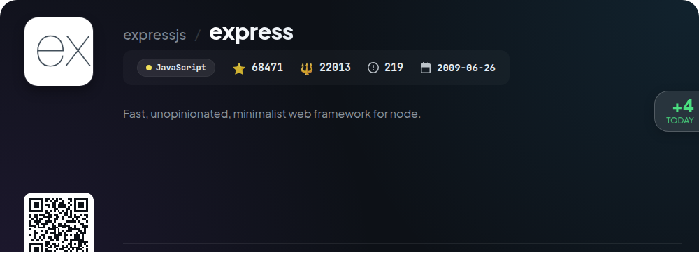
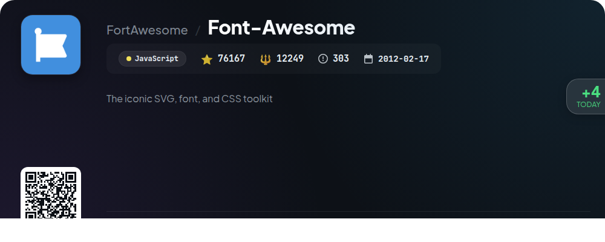

# 🌟 GitHub Trending Daily - 2026-01-03

> 📅 每日精选 GitHub 热门仓库 | 基于智能算法推荐

## 📊 Today's Highlights

| 统计项 | 数值 |
|--------|------|
| 📦 精选项目 | **10** 个 |
| ⏰ 更新时间 | 2026-01-03 06:40 UTC |

---

## 🌟 每日 Top 10 精选

### 1. [mock-repo-preview](https://github.com/test/mock-repo)

| 指标 | 值 |
|------|----|
| ⭐ Stars | **12345** |
| 🍴 Forks | **678** |
| 💻 Language | Rust |
| 🏷️ Tags | `rust` `trending` `mock` |

**📝 Description:** This is a mock repository generated because 'mock_mode' is enabled or API rate limit was reached.

### 2. [react](https://github.com/facebook/react)

| 指标 | 值 |
|------|----|
| ⭐ Stars | **241983** |
| 🍴 Forks | **50260** |
| 💻 Language | JavaScript |
| 🏷️ Tags | `declarative` `frontend` `javascript` `library` `react` |

**📝 Description:** The library for web and native user interfaces.

### 3. [javascript](https://github.com/airbnb/javascript)

| 指标 | 值 |
|------|----|
| ⭐ Stars | **148018** |
| 🍴 Forks | **26784** |
| 💻 Language | JavaScript |
| 🏷️ Tags | `arrow-functions` `es2015` `es2016` `es2017` `es2018` |

**📝 Description:** JavaScript Style Guide

### 4. [scrcpy](https://github.com/Genymobile/scrcpy)

| 指标 | 值 |
|------|----|
| ⭐ Stars | **133466** |
| 🍴 Forks | **12462** |
| 💻 Language | C |
| 🏷️ Tags | `android` `c` `ffmpeg` `libav` `mirroring` |

**📝 Description:** Display and control your Android device

### 5. [elasticsearch](https://github.com/elastic/elasticsearch)

| 指标 | 值 |
|------|----|
| ⭐ Stars | **75778** |
| 🍴 Forks | **25750** |
| 💻 Language | Java |
| 🏷️ Tags | `elasticsearch` `java` `search-engine` |

**📝 Description:** Free and Open Source, Distributed, RESTful Search Engine

### 6. [rust](https://github.com/rust-lang/rust)

| 指标 | 值 |
|------|----|
| ⭐ Stars | **109056** |
| 🍴 Forks | **14277** |
| 💻 Language | Rust |
| 🏷️ Tags | `compiler` `language` `rust` |

**📝 Description:** Empowering everyone to build reliable and efficient software.

### 7. [express](https://github.com/expressjs/express)

| 指标 | 值 |
|------|----|
| ⭐ Stars | **68470** |
| 🍴 Forks | **22008** |
| 💻 Language | JavaScript |
| 🏷️ Tags | `express` `javascript` `nodejs` `server` |

**📝 Description:** Fast, unopinionated, minimalist web framework for node.

### 8. [Font-Awesome](https://github.com/FortAwesome/Font-Awesome)

| 指标 | 值 |
|------|----|
| ⭐ Stars | **76166** |
| 🍴 Forks | **12249** |
| 💻 Language | JavaScript |
| 🏷️ Tags | `css` `font` `fontawesome` `icons` `svg-icons` |

**📝 Description:** The iconic SVG, font, and CSS toolkit

### 9. [Magisk](https://github.com/topjohnwu/Magisk)

| 指标 | 值 |
|------|----|
| ⭐ Stars | **57894** |
| 🍴 Forks | **16324** |
| 💻 Language | Rust |

**📝 Description:** The Magic Mask for Android

### 10. [hugo](https://github.com/gohugoio/hugo)

| 指标 | 值 |
|------|----|
| ⭐ Stars | **85730** |
| 🍴 Forks | **8159** |
| 💻 Language | Go |
| 🏷️ Tags | `blog-engine` `cms` `content-management-system` `documentation-tool` `go` |

**📝 Description:** The world’s fastest framework for building websites.

---

## 📡 RSS订阅

通过 RSS 订阅，第一时间获取每日精选项目：

- 🔔 [每日 Top 10 精选](../daily-top.xml)

---

*⚡ Powered by Smart Trending Algorithm | Generated at 2026-01-03 06:40:49 UTC*
