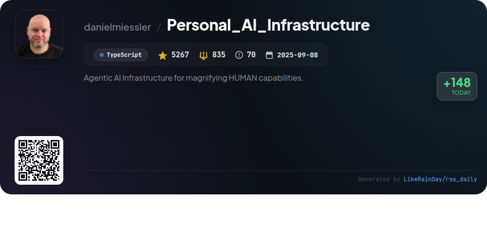
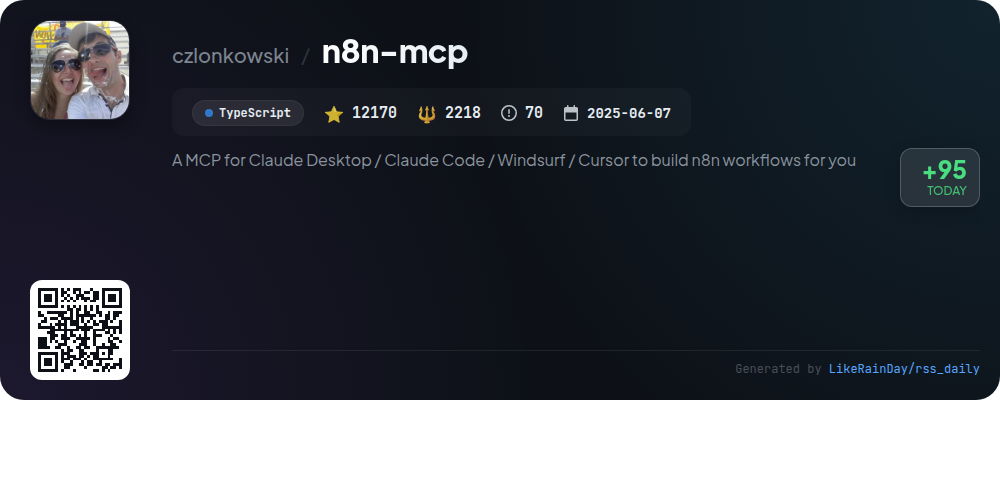
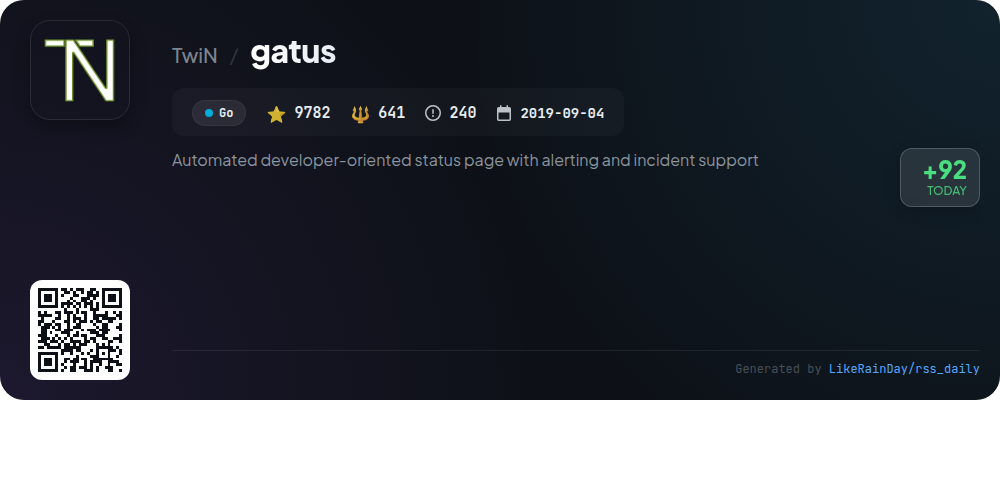

# 📊 🌟 GitHub Trending Daily - 2026-01-20

> > 📅 Daily Picks of GitHub Trending Repositories | Powered by Smart Algorithms

## 📋 Overview

**10** Projects | **176832** ⭐ | **23593** 🍴

**Top Languages:** `TypeScript` (5) · `Swift` (1) · `Rust` (1)

**Updated:** 2026-01-20 01:05 UTC

**Categories:**

- 🌟 Daily Top 10 (10 items)

---

## 🌟 Daily Top 10

### 1. [AionUi](https://github.com/iOfficeAI/AionUi)

> 🤖 **Why Recommend**  
> *AionUi is a free, open-source coworking platform for command-line AI tools like Gemini CLI, Claude Code, and Codex, featuring a user-friendly interface and multi-model support. With over 6,800 stars, it offers local data security, multi-session chat, smart file management, and real-time preview for various formats. Users can access AionUi remotely via WebUI mode, enabling seamless control from any device. It supports macOS, Windows, and Linux, making it a versatile solution for enhancing AI-driven workflows and automation tasks.*

- ⭐ 6821 stars
- 💻 TypeScript
- 📅 Updated: 2026-01-20

### 2. [gemini-voyager](https://github.com/Nagi-ovo/gemini-voyager)

> 🤖 **Why Recommend**  
> *An all-in-one enhancement suite for Google Gemini - timeline navigation, folder management, prompt library, and chat export in one powerful extension.. popular project, recently updated*

- ⭐ 1950 stars
- 🍴 58 forks
- 💻 TypeScript
- 📅 Updated: 2026-01-20

### 3. [nautilus_trader](https://github.com/nautechsystems/nautilus_trader)

> 🤖 **Why Recommend**  
> *NautilusTrader is a high-performance, open-source algorithmic trading platform built in Rust, designed for quantitative traders. It features an event-driven backtesting engine, allowing simultaneous testing of multiple strategies across various asset classes, including FX, equities, and crypto, with nanosecond resolution. Key highlights include seamless integration with diverse APIs, customizable components, and identical strategy code for backtesting and live trading. The platform prioritizes safety and performance, making it suitable for mission-critical trading applications.*

- ⭐ 18050 stars
- 💻 Rust
- 📅 Updated: 2026-01-20

### 4. [tambo](https://github.com/tambo-ai/tambo)

> 🤖 **Why Recommend**  
> *Tambo is a generative UI SDK for React that enables dynamic app development tailored to user needs. With a focus on adaptability, Tambo uses AI to determine which components to display based on user interactions. Key features include generative and interactable components, seamless MCP integrations, and support for multiple LLM providers. Developers can choose between Tambo Cloud, a hosted backend, or self-hosting options. Its pre-built component library and templates facilitate rapid deployment, making it ideal for creating intuitive user experiences.*

- ⭐ 2656 stars
- 💻 TypeScript
- 📅 Updated: 2026-01-20

### 5. [TaskExplorer](https://github.com/DavidXanatos/TaskExplorer)

> 🤖 **Why Recommend**  
> *TaskExplorer is a powerful task management tool designed for deep insights into running applications. It features a user-friendly interface that displays real-time process data without clutter, including Threads, Memory, Handles, and Sockets panels. Users can view detailed process information, edit memory, and monitor system performance via dynamic graphs. Built on the Qt Framework, it supports Windows 7 and above, with plans for a Linux version. TaskExplorer leverages the Process Hacker library for robust monitoring, making it ideal for developers and power users.*

- ⭐ 2452 stars
- 💻 C
- 📅 Updated: 2026-01-20

### 6. [Personal_AI_Infrastructure](https://github.com/danielmiessler/Personal_AI_Infrastructure)

> 🤖 **Why Recommend**  
> *Personal AI Infrastructure (PAI) is an open-source project aimed at enhancing human capabilities through personalized AI systems. Built in TypeScript, it focuses on activating individual potential by offering an Agentic AI that learns from user interactions and preferences. Key features include continuous learning, goal-oriented task execution, and a modular architecture with 23 self-contained Packs. PAI supports users from small business owners to developers, ensuring that advanced AI tools are accessible to everyone. With over 5,600 stars on GitHub, PAI represents a significant shift towards democratizing AI.*

- ⭐ 5267 stars
- 💻 TypeScript
- 📅 Updated: 2026-01-20

### 7. [bitchat](https://github.com/permissionlesstech/bitchat)

> 🤖 **Why Recommend**  
> *bitchat is a decentralized peer-to-peer messaging app that combines Bluetooth mesh networks for offline communication with the Nostr protocol for global connectivity. Key features include intelligent message routing, location-based channels using geohash coordinates, and end-to-end encryption for privacy. With no accounts or central servers, it offers an IRC-style command interface for ease of use. Designed for both iOS and macOS, bitchat prioritizes user privacy and supports emergency data wipe. The app is ideal for local communication and community engagement, even in disaster scenarios.*

- ⭐ 24364 stars
- 💻 Swift
- 📅 Updated: 2026-01-20

### 8. [n8n-mcp](https://github.com/czlonkowski/n8n-mcp)

> 🤖 **Why Recommend**  
> *n8n-MCP is a Model Context Protocol server designed to enhance AI assistants like Claude by providing structured access to n8n's extensive workflow automation capabilities. Key features include documentation and properties for 1,084 n8n nodes, comprehensive validation tools, and a library of 2,709 workflow templates. Users can quickly deploy n8n-MCP via hosted services, Docker, or local installation. It ensures robust workflow management, AI tool validation, and a focus on safety with best practices for production workflows, making automation seamless and efficient.*

- ⭐ 12170 stars
- 💻 TypeScript
- 📅 Updated: 2026-01-20

### 9. [gatus](https://github.com/TwiN/gatus)

> 🤖 **Why Recommend**  
> *Gatus is a developer-oriented automated status page for monitoring services, offering support for HTTP, ICMP, TCP, and DNS queries. Key features include customizable health checks with conditions, flexible alerting through integrations like Slack, PagerDuty, and Twilio, and a user-friendly dashboard. It allows for easy deployment via Docker and Kubernetes, with support for TLS encryption and metrics for Prometheus. Gatus is designed for proactive monitoring, ensuring you can address issues before they impact users. With over 9,700 stars on GitHub, it’s a popular choice for service monitoring.*

- ⭐ 9782 stars
- 💻 Go
- 📅 Updated: 2026-01-20

### 10. [llama.cpp](https://github.com/ggml-org/llama.cpp)

> 🤖 **Why Recommend**  
> *llama.cpp is a high-performance library for large language model (LLM) inference implemented in C/C++. It supports diverse hardware, including Apple Silicon and various GPU architectures, offering integer quantization for optimized memory usage. Key features include a simple CLI for model interaction, a lightweight REST API server, and support for numerous models like LLaMA and Mistral. Additionally, it enables multimodal capabilities and integrates with platforms like Hugging Face for model hosting. With over 93,320 stars, it stands as a prominent tool in the AI development landscape.*

- ⭐ 93320 stars
- 💻 C++
- 📅 Updated: 2026-01-20

---

## 📡 RSS Subscription

Subscribe via RSS to get daily trending updates:

- 🔔 [RSS XML] (../../daily-top.xml)
- 🔔 [Daily Report] (../../GITHUB_TODAY.md)
- 🔔 [Daily Top 10](../../daily-top.xml)

---

*⚡ Powered by Smart Trending Algorithm | Generated at 2026-01-20 01:05:55 UTC
