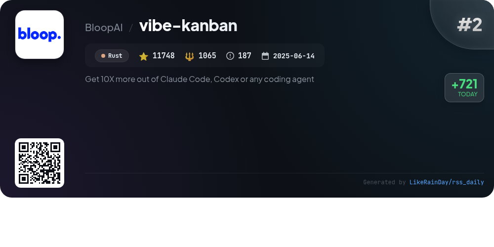
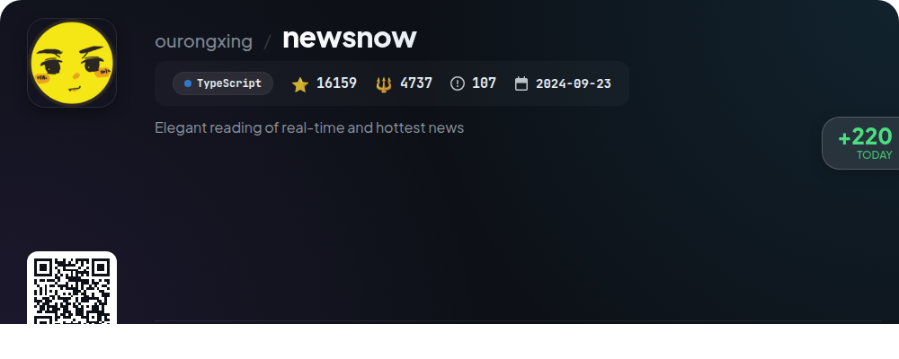
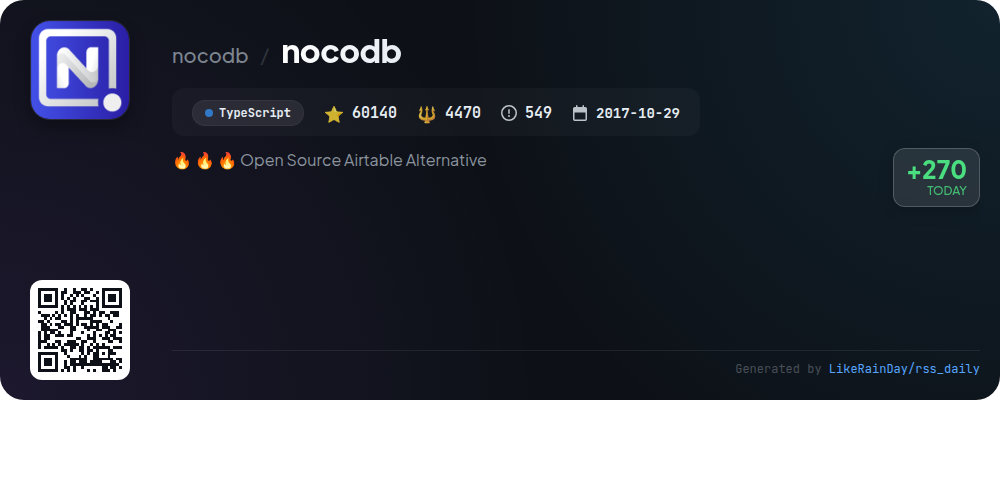
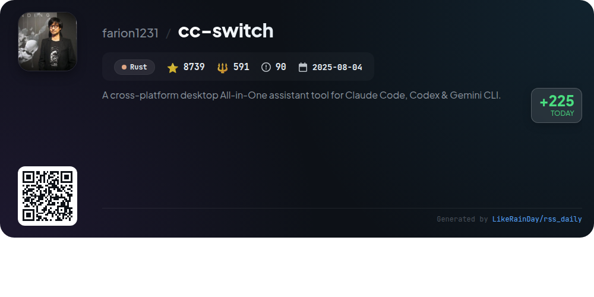
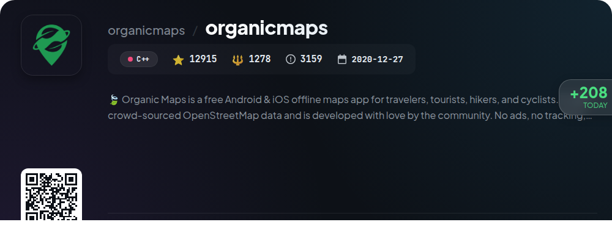
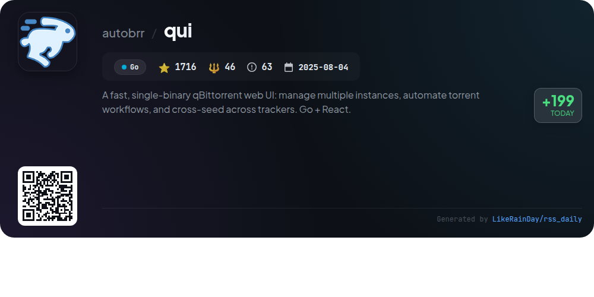
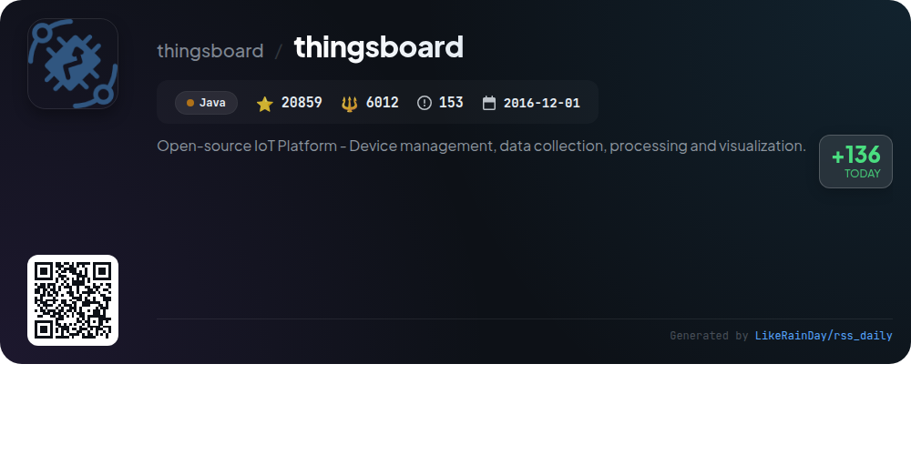
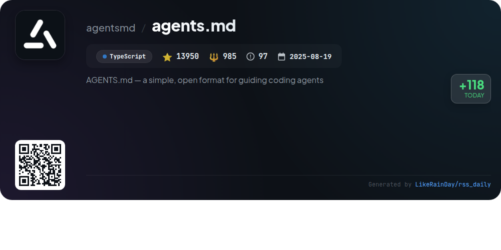
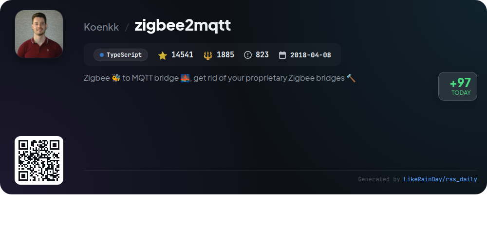

# 🌟 GitHub Trending Daily - 2026-01-03

> 📅 Daily Picks of GitHub Trending Repositories | Powered by Smart Algorithms

## 📊 Today's Highlights

| Metric | Value |
|--------|------|
| 📦 Total Repos | **10** |
| ⏰ Updated | 2026-01-03 13:56 UTC |

---

## 🌟 Daily Top 10

### 1. [memos](https://github.com/usememos/memos)

| Metric | Value |
|------|----|
| ⭐ Stars | **49434** |
| 🍴 Forks | **3566** |
| 💻 Language | Go |
| 🏷️ Tags | `docker` `foss` `go` `markdown` `memo` |
| 📈 Stars Today | **841** |

**📝 Description:** An open-source, self-hosted note-taking service. Your thoughts, your data, your control — no tracking, no ads, no subscription fees.

### 2. [vibe-kanban](https://github.com/BloopAI/vibe-kanban)

| Metric | Value |
|------|----|
| ⭐ Stars | **11683** |
| 🍴 Forks | **1052** |
| 💻 Language | Rust |
| 🏷️ Tags | `agent` `ai-agents` `kanban` `management` `task-manager` |
| 📈 Stars Today | **721** |

**📝 Description:** Get 10X more out of Claude Code, Codex or any coding agent

### 3. [newsnow](https://github.com/ourongxing/newsnow)

| Metric | Value |
|------|----|
| ⭐ Stars | **16191** |
| 🍴 Forks | **4742** |
| 💻 Language | TypeScript |
| 🏷️ Tags | `elegant` `news` |
| 📈 Stars Today | **314** |

**📝 Description:** Elegant reading of real-time and hottest news

### 4. [nocodb](https://github.com/nocodb/nocodb)

| Metric | Value |
|------|----|
| ⭐ Stars | **60105** |
| 🍴 Forks | **4469** |
| 💻 Language | TypeScript |
| 🏷️ Tags | `airtable` `airtable-alternative` `automatic-api` `hacktoberfest` `low-code` |
| 📈 Stars Today | **270** |

**📝 Description:** 🔥 🔥 🔥 Open Source Airtable Alternative

### 5. [cc-switch](https://github.com/farion1231/cc-switch)

| Metric | Value |
|------|----|
| ⭐ Stars | **8735** |
| 🍴 Forks | **590** |
| 💻 Language | Rust |
| 🏷️ Tags | `ai-tools` `claude-code` `codex` `deepseek-v3` `desktop-app` |
| 📈 Stars Today | **225** |

**📝 Description:** A cross-platform desktop All-in-One assistant tool for Claude Code, Codex & Gemini CLI.

### 6. [organicmaps](https://github.com/organicmaps/organicmaps)

| Metric | Value |
|------|----|
| ⭐ Stars | **12916** |
| 🍴 Forks | **1278** |
| 💻 Language | C++ |
| 🏷️ Tags | `android` `app` `cpp` `cyclists` `hacktoberfest` |
| 📈 Stars Today | **208** |

**📝 Description:** 🍃 Organic Maps is a free Android & iOS offline maps app for travelers, tourists, hikers, and cyclists. It uses crowd-sourced OpenStreetMap data and is developed with love by the community. No ads, no tracking, no data collection, no crapware. Please donate to support the development!

### 7. [qui](https://github.com/autobrr/qui)

| Metric | Value |
|------|----|
| ⭐ Stars | **1716** |
| 🍴 Forks | **47** |
| 💻 Language | Go |
| 🏷️ Tags | `cross-seed` `cross-seeding` `go` `golang` `libtorrent` |
| 📈 Stars Today | **199** |

**📝 Description:** A fast, single-binary qBittorrent web UI: manage multiple instances, automate torrent workflows, and cross-seed across trackers. Go + React.

### 8. [thingsboard](https://github.com/thingsboard/thingsboard)

| Metric | Value |
|------|----|
| ⭐ Stars | **20854** |
| 🍴 Forks | **6012** |
| 💻 Language | Java |
| 🏷️ Tags | `cloud` `coap` `dashboard` `iot` `iot-analytics` |
| 📈 Stars Today | **136** |

**📝 Description:** Open-source IoT Platform - Device management, data collection, processing and visualization.

### 9. [agents.md](https://github.com/agentsmd/agents.md)

| Metric | Value |
|------|----|
| ⭐ Stars | **13949** |
| 🍴 Forks | **985** |
| 💻 Language | TypeScript |
| 📈 Stars Today | **118** |

**📝 Description:** AGENTS.md — a simple, open format for guiding coding agents

### 10. [zigbee2mqtt](https://github.com/Koenkk/zigbee2mqtt)

| Metric | Value |
|------|----|
| ⭐ Stars | **14538** |
| 🍴 Forks | **1885** |
| 💻 Language | TypeScript |
| 🏷️ Tags | `hacktoberfest` |
| 📈 Stars Today | **97** |

**📝 Description:** Zigbee 🐝 to MQTT bridge 🌉, get rid of your proprietary Zigbee bridges 🔨

---

## 📡 RSS Subscription

Subscribe via RSS to get daily trending updates:

- 🔔 [RSS XML] (../../daily-top.xml)
- 🔔 [Daily Report] (../../GITHUB_TODAY.md)
- 🔔 [Daily Top 10](../../daily-top.xml)

---

*⚡ Powered by Smart Trending Algorithm | Generated at 2026-01-03 13:56:13 UTC
