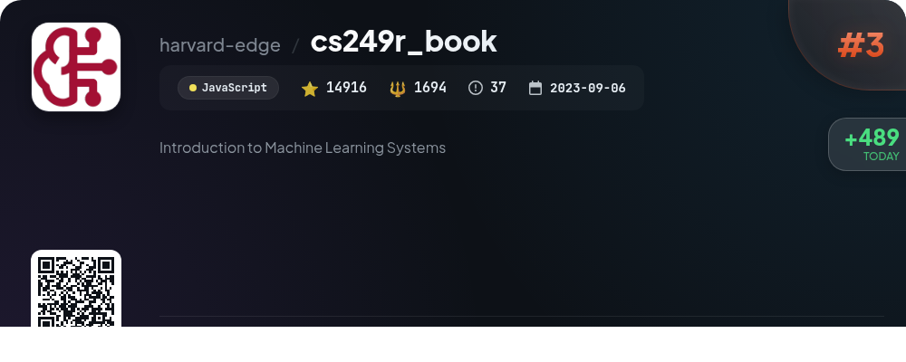
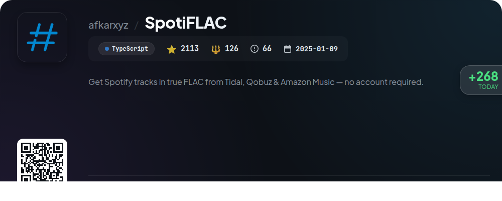
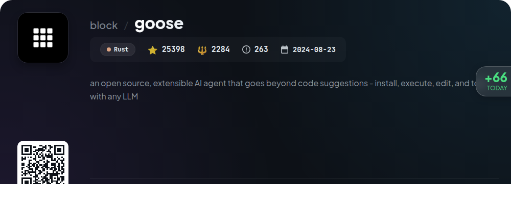

# 🌟 GitHub Trending Daily - 2026-01-03

> 📅 Daily Picks of GitHub Trending Repositories | Powered by Smart Algorithms

## 📊 Today's Highlights

| Metric | Value |
|--------|------|
| 📦 Total Repos | **10** |
| ⏰ Updated | 2026-01-03 09:12 UTC |

---

## 🌟 Daily Top 10

### 1. [vibe-kanban](https://github.com/BloopAI/vibe-kanban)

| Metric | Value |
|------|----|
| ⭐ Stars | **11548** |
| 🍴 Forks | **1040** |
| 💻 Language | Rust |
| 🏷️ Tags | `agent` `ai-agents` `kanban` `management` `task-manager` |
| 📈 Stars Today | **721** |

**📝 Description:** Get 10X more out of Claude Code, Codex or any coding agent

### 2. [memos](https://github.com/usememos/memos)

| Metric | Value |
|------|----|
| ⭐ Stars | **49089** |
| 🍴 Forks | **3551** |
| 💻 Language | Go |
| 🏷️ Tags | `docker` `foss` `go` `markdown` `memo` |
| 📈 Stars Today | **661** |

**📝 Description:** An open-source, self-hosted note-taking service. Your thoughts, your data, your control — no tracking, no ads, no subscription fees.

### 3. [cs249r_book](https://github.com/harvard-edge/cs249r_book)

| Metric | Value |
|------|----|
| ⭐ Stars | **14916** |
| 🍴 Forks | **1694** |
| 💻 Language | JavaScript |
| 🏷️ Tags | `artificial-intelligence` `cloud-ml` `computer-systems` `courseware` `deep-learning` |
| 📈 Stars Today | **489** |

**📝 Description:** Introduction to Machine Learning Systems

### 4. [SpotiFLAC](https://github.com/afkarxyz/SpotiFLAC)

| Metric | Value |
|------|----|
| ⭐ Stars | **2113** |
| 🍴 Forks | **126** |
| 💻 Language | TypeScript |
| 🏷️ Tags | `spotify` `spotify-downloader` `wails` |
| 📈 Stars Today | **268** |

**📝 Description:** Get Spotify tracks in true FLAC from Tidal, Qobuz & Amazon Music — no account required.

### 5. [newsnow](https://github.com/ourongxing/newsnow)

| Metric | Value |
|------|----|
| ⭐ Stars | **16139** |
| 🍴 Forks | **4731** |
| 💻 Language | TypeScript |
| 🏷️ Tags | `elegant` `news` |
| 📈 Stars Today | **220** |

**📝 Description:** Elegant reading of real-time and hottest news

### 6. [organicmaps](https://github.com/organicmaps/organicmaps)

| Metric | Value |
|------|----|
| ⭐ Stars | **12915** |
| 🍴 Forks | **1278** |
| 💻 Language | C++ |
| 🏷️ Tags | `android` `app` `cpp` `cyclists` `hacktoberfest` |
| 📈 Stars Today | **208** |

**📝 Description:** 🍃 Organic Maps is a free Android & iOS offline maps app for travelers, tourists, hikers, and cyclists. It uses crowd-sourced OpenStreetMap data and is developed with love by the community. No ads, no tracking, no data collection, no crapware. Please donate to support the development!

### 7. [qui](https://github.com/autobrr/qui)

| Metric | Value |
|------|----|
| ⭐ Stars | **1709** |
| 🍴 Forks | **44** |
| 💻 Language | Go |
| 🏷️ Tags | `cross-seed` `cross-seeding` `go` `golang` `libtorrent` |
| 📈 Stars Today | **199** |

**📝 Description:** A fast, single-binary qBittorrent web UI: manage multiple instances, automate torrent workflows, and cross-seed across trackers. Go + React.

### 8. [nocodb](https://github.com/nocodb/nocodb)

| Metric | Value |
|------|----|
| ⭐ Stars | **59991** |
| 🍴 Forks | **4460** |
| 💻 Language | TypeScript |
| 🏷️ Tags | `airtable` `airtable-alternative` `automatic-api` `hacktoberfest` `low-code` |
| 📈 Stars Today | **112** |

**📝 Description:** 🔥 🔥 🔥 Open Source Airtable Alternative

### 9. [goose](https://github.com/block/goose)

| Metric | Value |
|------|----|
| ⭐ Stars | **25398** |
| 🍴 Forks | **2284** |
| 💻 Language | Rust |
| 🏷️ Tags | `mcp` |
| 📈 Stars Today | **66** |

**📝 Description:** an open source, extensible AI agent that goes beyond code suggestions - install, execute, edit, and test with any LLM

### 10. [scrcpy](https://github.com/Genymobile/scrcpy)

| Metric | Value |
|------|----|
| ⭐ Stars | **133473** |
| 🍴 Forks | **12464** |
| 💻 Language | C |
| 🏷️ Tags | `android` `c` `ffmpeg` `libav` `mirroring` |
| 📈 Stars Today | **65** |

**📝 Description:** Display and control your Android device

---

## 📡 RSS Subscription

Subscribe via RSS to get daily trending updates:

- 🔔 [RSS XML] (../../daily-top.xml)
- 🔔 [Daily Report] (../../GITHUB_TODAY.md)
- 🔔 [Daily Top 10](../../daily-top.xml)

---

*⚡ Powered by Smart Trending Algorithm | Generated at 2026-01-03 09:12:30 UTC
