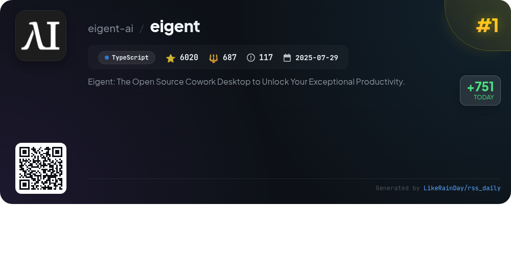
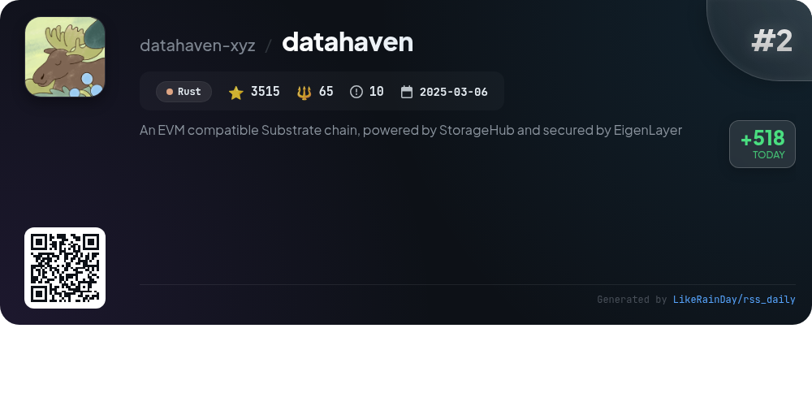
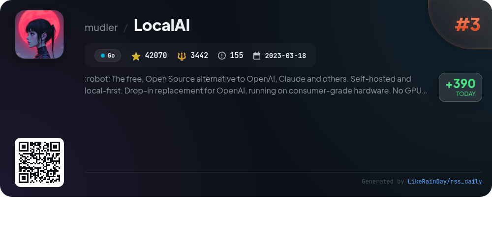
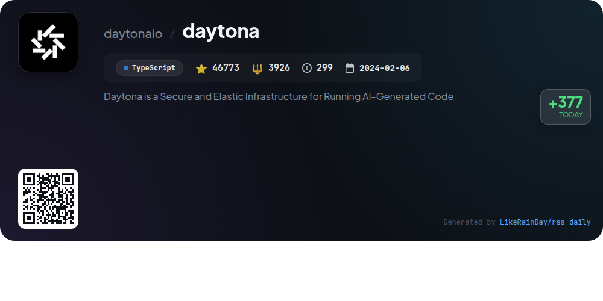
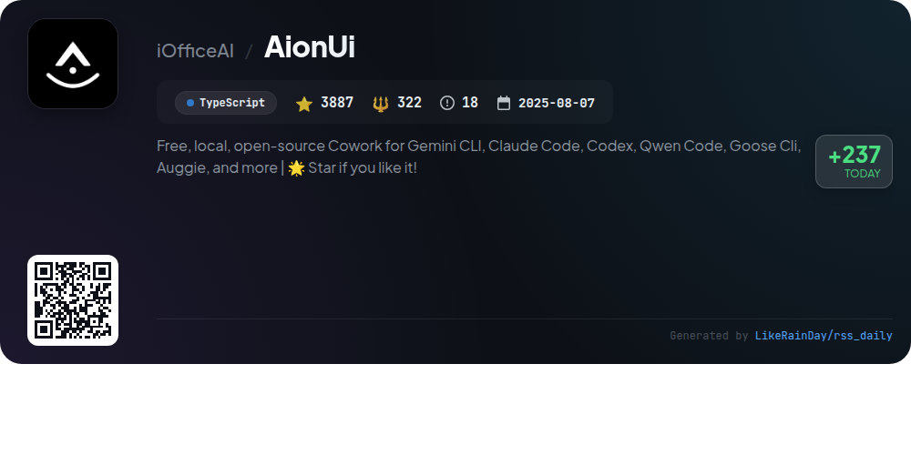
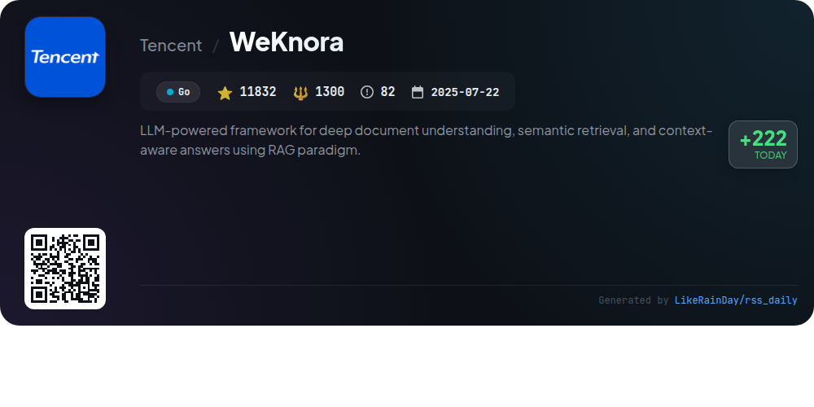
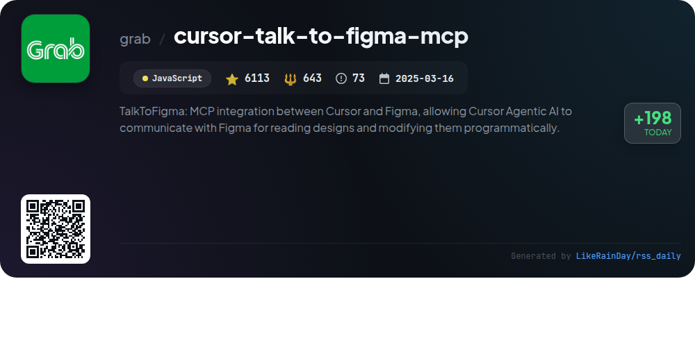
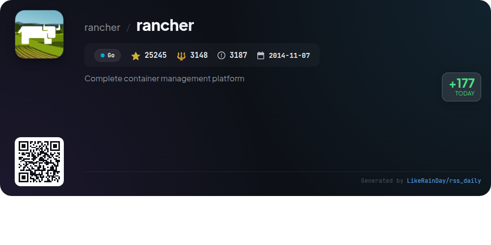
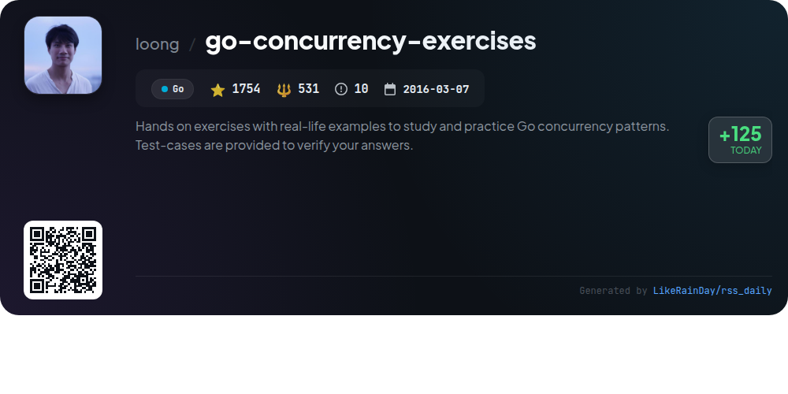

# 📊 🌟 GitHub Trending Daily - 2026-01-16

> > 📅 Daily Picks of GitHub Trending Repositories | Powered by Smart Algorithms

## 📋 Overview

**10** Projects | **164767** ⭐ | **16079** 🍴

**Top Languages:** `Go` (4) · `TypeScript` (3) · `JavaScript` (2)

**Updated:** 2026-01-16 01:07 UTC

**Categories:**

- 🌟 Daily Top 10 (10 items)

---

## 🌟 Daily Top 10

### 1. [eigent](https://github.com/eigent-ai/eigent)

> 🤖 **Why Recommend**  
> *Eigent is an open-source cowork desktop application designed to enhance productivity through a customizable AI workforce. Key features include a multi-agent system for parallel task execution, zero setup requirements, local deployment for data privacy, and enterprise-level functionalities like SSO and access control. It supports comprehensive model integration and offers seamless MCP tools for enhanced capabilities. Ideal for automating complex workflows, Eigent fosters a transparent, community-driven ecosystem, ensuring users can build and deploy their unique AI solutions efficiently.*

- ⭐ 6020 stars
- 💻 TypeScript
- 📅 Updated: 2026-01-16

### 2. [datahaven](https://github.com/datahaven-xyz/datahaven)

> 🤖 **Why Recommend**  
> *DataHaven is an AI-first decentralized storage network built on an EVM-compatible Substrate chain, leveraging StorageHub and secured by EigenLayer's restaking protocol. Key features include verifiable storage through Merkle trees, a dual provider network with Main Storage Providers (MSPs) and Backup Storage Providers (BSPs), and robust security mechanisms with slashing for misbehavior. It supports Ethereum smart contracts, offers trustless cross-chain bridging via Snowbridge, and is suitable for AI, IoT, and Real World Asset applications.*

- ⭐ 3515 stars
- 💻 Rust
- 📅 Updated: 2026-01-16

### 3. [LocalAI](https://github.com/mudler/LocalAI)

> 🤖 **Why Recommend**  
> *LocalAI is an open-source, self-hosted AI platform designed as a free alternative to OpenAI, Claude, and others, functioning seamlessly on consumer-grade hardware without the need for a GPU. It supports multiple model families, including text, audio, image, and video generation, alongside voice cloning and decentralized inference. Key features include a drop-in replacement for OpenAI's API, support for various AI backends, and a user-friendly WebUI. With over 41,000 stars on GitHub, LocalAI fosters a strong community and offers extensive documentation for quick setup and integration.*

- ⭐ 41913 stars
- 💻 Go
- 📅 Updated: 2026-01-16

### 4. [daytona](https://github.com/daytonaio/daytona)

> 🤖 **Why Recommend**  
> *Daytona is a secure, elastic infrastructure designed for executing AI-generated code, built with TypeScript. Key features include lightning-fast sandbox creation (under 90ms), isolated runtimes to ensure security, massive parallelization for concurrent workflows, and programmatic control via APIs. It supports OCI/Docker images, allowing for extensive customization. Users can easily create and manage sandboxes using the Python or TypeScript SDKs. With over 46,000 stars on GitHub, Daytona offers a robust solution for developers looking to safely run AI-driven applications.*

- ⭐ 46773 stars
- 💻 TypeScript
- 📅 Updated: 2026-01-15

### 5. [AionUi](https://github.com/iOfficeAI/AionUi)

> 🤖 **Why Recommend**  
> *AionUi is a free, open-source platform designed for seamless collaboration with command-line AI tools like Gemini CLI, Claude Code, Codex, and more. It features a user-friendly graphical interface, automatic detection of installed CLI tools, and robust local data security. Key highlights include multi-agent support, smart file management, real-time previews for various formats, and the ability to run multiple tasks in parallel. AionUi also offers a WebUI mode for remote access, ensuring flexibility and efficiency in AI-driven workflows across macOS, Windows, and Linux.*

- ⭐ 3887 stars
- 💻 TypeScript
- 📅 Updated: 2026-01-16

### 6. [WeKnora](https://github.com/Tencent/WeKnora)

> 🤖 **Why Recommend**  
> *WeKnora is a powerful LLM-based framework designed for deep document understanding and semantic retrieval using the Retrieval-Augmented Generation (RAG) paradigm. Key features include a versatile Agent Mode for intelligent Q&A, support for multi-type knowledge bases, and precise document parsing from various formats. It employs hybrid retrieval strategies, integrates web search, and offers customizable components for enhanced flexibility. With robust security measures and user-friendly interfaces, WeKnora is ideal for applications in enterprise knowledge management, academic research, and technical support.*

- ⭐ 11832 stars
- 💻 Go
- 📅 Updated: 2026-01-16

### 7. [cursor-talk-to-figma-mcp](https://github.com/grab/cursor-talk-to-figma-mcp)

> 🤖 **Why Recommend**  
> *Cursor Talk to Figma MCP integrates Cursor AI with Figma, enabling programmatic design manipulation. Key features include a TypeScript MCP server, a Figma plugin for seamless communication, and a WebSocket server for real-time interaction. Users can perform tasks like bulk text replacement, propagate instance overrides, and modify designs through various MCP tools. The project supports automatic layout adjustments, style modifications, and advanced prototyping features. With over 6,100 stars, it streamlines design workflows and enhances collaboration between AI and design tools.*

- ⭐ 6113 stars
- 💻 JavaScript
- 📅 Updated: 2026-01-16

### 8. [rancher](https://github.com/rancher/rancher)

> 🤖 **Why Recommend**  
> *Rancher is an open-source container management platform designed for organizations deploying containers in production. It simplifies running Kubernetes across various environments, meeting IT requirements while empowering DevOps teams. Key features include easy installation, support for multiple operating systems, and a comprehensive documentation resource. With over 25,000 stars on GitHub, Rancher fosters community engagement through forums and Slack. The project is maintained under the Apache License 2.0 and provides a robust solution for modern container orchestration needs.*

- ⭐ 25245 stars
- 💻 Go
- 📅 Updated: 2026-01-15

### 9. [awesome-copilot](https://github.com/github/awesome-copilot)

> 🤖 **Why Recommend**  
> *Awesome Copilot is a community-driven repository designed to enhance the GitHub Copilot experience with tailored instructions, prompts, and configurations. It features specialized agents for various workflows, task-specific prompts for coding and documentation, and coding standards to ensure best practices. Key highlights include curated collections of related prompts and instructions, as well as an MCP Server for easy integration into development environments. With over 17,000 stars, it serves as a valuable resource for developers seeking to maximize productivity and leverage AI capabilities effectively.*

- ⭐ 17715 stars
- 💻 JavaScript
- 📅 Updated: 2026-01-16

### 10. [go-concurrency-exercises](https://github.com/loong/go-concurrency-exercises)

> 🤖 **Why Recommend**  
> *The "go-concurrency-exercises" project offers hands-on exercises to study and practice Go concurrency patterns through a practical approach. Users can solve challenges by editing `main.go` and verify solutions with provided test cases. Key exercises include limiting crawlers, implementing producer-consumer models, handling race conditions, and gracefully managing service interruptions. With 1,754 stars, this repository emphasizes learning by doing, making it an invaluable resource for Go developers. Join the community on Discord or Slack for support and code reviews.*

- ⭐ 1754 stars
- 💻 Go
- 📅 Updated: 2026-01-15

---

## 📡 RSS Subscription

Subscribe via RSS to get daily trending updates:

- 🔔 [RSS XML] (../../daily-top.xml)
- 🔔 [Daily Report] (../../GITHUB_TODAY.md)
- 🔔 [Daily Top 10](../../daily-top.xml)

---

*⚡ Powered by Smart Trending Algorithm | Generated at 2026-01-16 01:07:43 UTC
