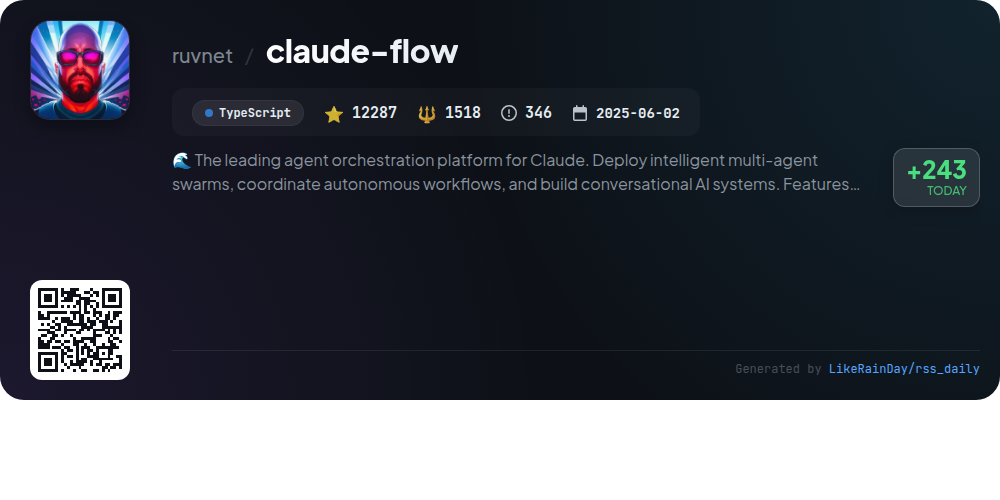

# 📊 🌟 GitHub Trending Daily - 2026-01-17

> > 📅 Daily Picks of GitHub Trending Repositories | Powered by Smart Algorithms

## 📋 Overview

**10** Projects | **134860** ⭐ | **10579** 🍴

**Top Languages:** `TypeScript` (6) · `Go` (3) · `Rust` (1)

**Updated:** 2026-01-17 12:26 UTC

**Categories:**

- 🌟 Daily Top 10 (10 items)

---

## 🌟 Daily Top 10

### 1. [eigent](https://github.com/eigent-ai/eigent)

> 🤖 **Why Recommend**  
> *Eigent is an open-source cowork desktop application designed to enhance productivity through a customizable AI workforce. Key features include zero-setup local deployment, multi-agent coordination for complex workflows, and enterprise-level security with SSO access control. It supports various AI models and integrates with tools like Notion and Google Suite via the Model Context Protocol (MCP). With human-in-the-loop capabilities, Eigent ensures seamless task execution while prioritizing user privacy. Join the community and unlock exceptional productivity with Eigent.*

- ⭐ 7942 stars
- 💻 TypeScript
- 📅 Updated: 2026-01-17

### 2. [AionUi](https://github.com/iOfficeAI/AionUi)

> 🤖 **Why Recommend**  
> *AionUi is a free, open-source coworking platform designed for seamless integration with command-line AI tools like Gemini CLI, Claude Code, and Codex. Featuring a user-friendly graphical interface, it supports multi-agent collaboration, local data security, and intelligent file management. Key highlights include real-time previews across 9+ formats, parallel processing for multiple tasks, and a customizable WebUI for remote access. AionUi is cross-platform, available on macOS, Windows, and Linux, making it an ideal choice for enhancing AI office automation workflows.*

- ⭐ 4559 stars
- 💻 TypeScript
- 📅 Updated: 2026-01-17

### 3. [Handy](https://github.com/cjpais/Handy)

> 🤖 **Why Recommend**  
> *Handy is a free, open-source speech-to-text application designed for offline use, built with Tauri (Rust + React/TypeScript). It prioritizes privacy by processing audio locally, ensuring users' voices remain on their devices. Key features include configurable keyboard shortcuts, support for Whisper and Parakeet models for transcription, and compatibility across Windows, macOS, and Linux. Handy aims to be an extensible tool, allowing users to contribute and customize their experience while providing a straightforward interface for seamless transcription into any text field.*

- ⭐ 11998 stars
- 💻 TypeScript
- 📅 Updated: 2026-01-17

### 4. [puck](https://github.com/puckeditor/puck)

> 🤖 **Why Recommend**  
> *Puck is an open-source visual editor for React.js, designed to create modular and customizable drag-and-drop experiences without vendor lock-in. Built with TypeScript, it seamlessly integrates into various React environments, including Next.js. Key features include a flexible component system, real-time editing, and easy data management. Puck offers quick-start recipes for popular frameworks, a supportive community on Discord, and extensive documentation. Licensed under MIT, it is suitable for both commercial and internal applications.*

- ⭐ 11191 stars
- 💻 TypeScript
- 📅 Updated: 2026-01-17

### 5. [cc-switch](https://github.com/farion1231/cc-switch)

> 🤖 **Why Recommend**  
> *cc-switch is a cross-platform desktop assistant tool for Claude Code, Codex, and Gemini CLI, built with Rust and Tauri. It offers seamless provider management, allowing users to switch between AI APIs effortlessly. Key features include an upgraded SQLite + JSON architecture, skills and prompts management, and a redesigned UI with multilingual support. The tool integrates with various API relay services like PackyCode and AIGoCode, providing users with enhanced coding experiences. With over 11,000 stars, cc-switch is a robust solution for developers seeking flexibility and efficiency in AI coding.*

- ⭐ 11873 stars
- 💻 Rust
- 📅 Updated: 2026-01-17

### 6. [SpotiFLAC](https://github.com/afkarxyz/SpotiFLAC)

> 🤖 **Why Recommend**  
> *SpotiFLAC is a free, open-source tool that allows users to download Spotify tracks in true FLAC format from Tidal, Qobuz, and Amazon Music without requiring an account. Built in TypeScript, it supports Windows, macOS, and Linux. Key features include reverse engineering of the Spotify Web Player for track retrieval, and fetching audio through third-party APIs. It's designed for educational and private use, with a focus on user privacy. The project has gained significant traction with over 3,338 stars on GitHub, highlighting its popularity and utility in the music downloading community.*

- ⭐ 3338 stars
- 💻 TypeScript
- 📅 Updated: 2026-01-17

### 7. [LocalAI](https://github.com/mudler/LocalAI)

> 🤖 **Why Recommend**  
> *LocalAI is a free, open-source alternative to OpenAI, designed for self-hosting on consumer-grade hardware without requiring a GPU. It serves as a drop-in replacement for OpenAI API, supporting various model families for text, audio, video, and image generation. Key features include text generation, voice cloning, decentralized P2P inference, and a user-friendly WebUI. LocalAI supports multiple backends like llama.cpp and transformers, enabling versatile AI applications. With over 42,100 stars on GitHub, it's a robust solution for local AI inferencing.*

- ⭐ 42100 stars
- 💻 Go
- 📅 Updated: 2026-01-17

### 8. [claude-flow](https://github.com/ruvnet/claude-flow)

> 🤖 **Why Recommend**  
> *Claude-Flow is a premier agent orchestration platform that enables the deployment of intelligent multi-agent swarms for autonomous workflows and conversational AI systems. Key features include over 54 specialized agents for various tasks, enterprise-grade security, fault-tolerant consensus mechanisms, and seamless integration with Claude Code via the MCP protocol. It offers self-learning capabilities through the ReasoningBank, allowing agents to adapt and improve over time. With high performance, extensibility, and support for multiple LLM providers, Claude-Flow is ideal for complex software engineering tasks.*

- ⭐ 12287 stars
- 💻 TypeScript
- 📅 Updated: 2026-01-17

### 9. [juicefs](https://github.com/juicedata/juicefs)

> 🤖 **Why Recommend**  
> *JuiceFS is a high-performance distributed POSIX file system built on Redis and S3, designed for cloud-native environments. It offers full POSIX and Hadoop compatibility, an S3-compatible interface, and a Kubernetes CSI Driver, enabling seamless integration with existing applications. Key features include strong consistency, data encryption, global file locks, and support for multiple object storage services. JuiceFS allows efficient use of massive cloud storage for big data and AI applications, achieving low latency and high throughput. With over 12,900 stars on GitHub, it is production-ready and widely adopted.*

- ⭐ 12987 stars
- 💻 Go
- 📅 Updated: 2026-01-17

### 10. [waveterm](https://github.com/wavetermdev/waveterm)

> 🤖 **Why Recommend**  
> *WaveTerm is an open-source, cross-platform terminal designed to enhance workflows by integrating traditional terminal functionalities with graphical capabilities like file previews and AI assistance. Key features include a flexible drag-and-drop interface, built-in code editor, rich file previews, context-aware AI assistance, and secure secret storage. It supports seamless file management and remote connections, running on macOS, Linux, and Windows. With a focus on improving developer efficiency, WaveTerm centralizes tools to minimize context switching. Explore more at www.waveterm.dev.*

- ⭐ 16585 stars
- 💻 Go
- 📅 Updated: 2026-01-17

---

## 📡 RSS Subscription

Subscribe via RSS to get daily trending updates:

- 🔔 [RSS XML] (../../daily-top.xml)
- 🔔 [Daily Report] (../../GITHUB_TODAY.md)
- 🔔 [Daily Top 10](../../daily-top.xml)

---

*⚡ Powered by Smart Trending Algorithm | Generated at 2026-01-17 12:26:52 UTC
