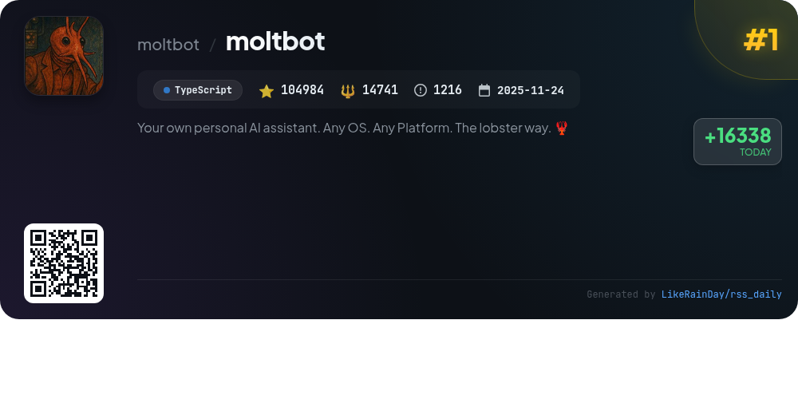
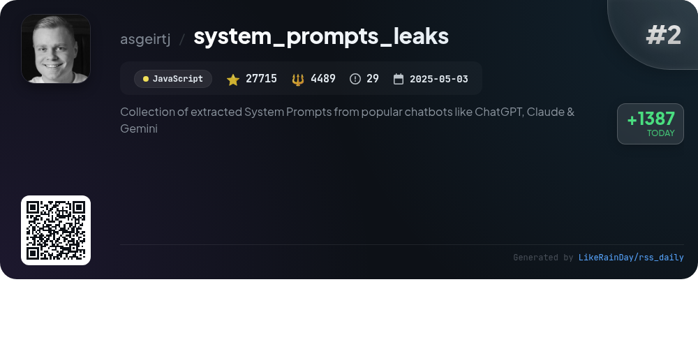
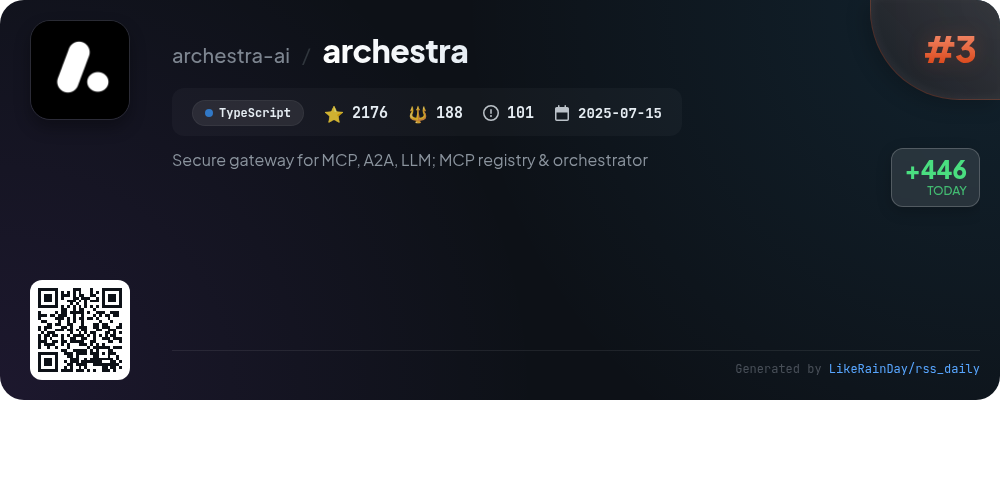
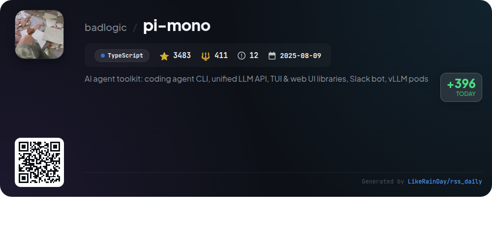
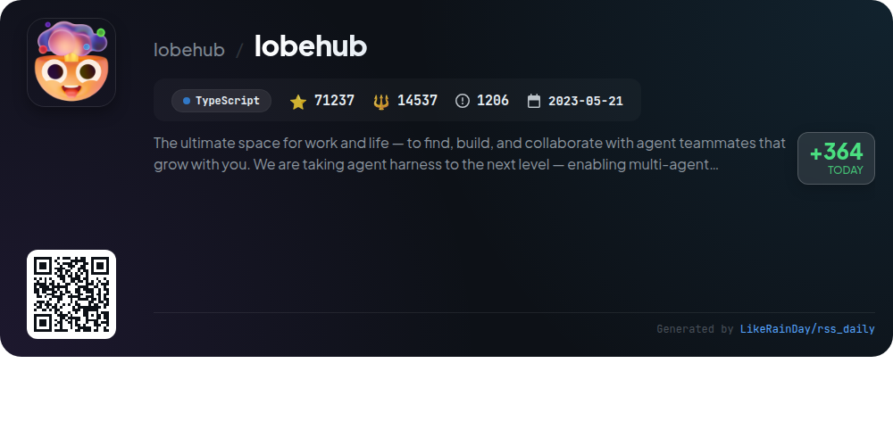
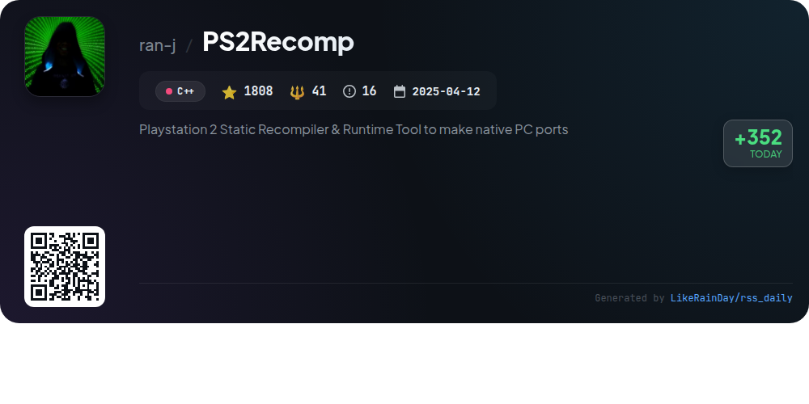
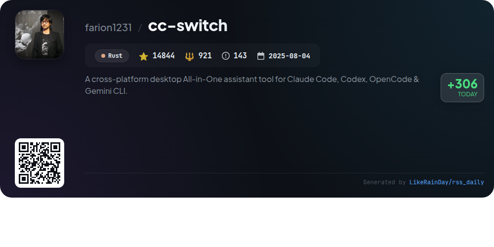
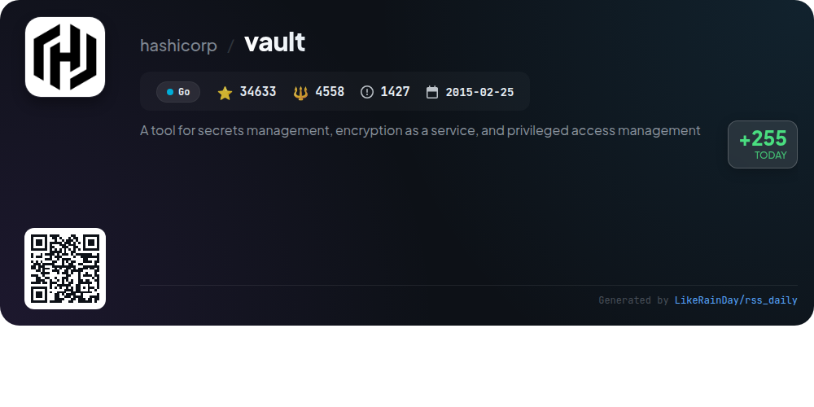
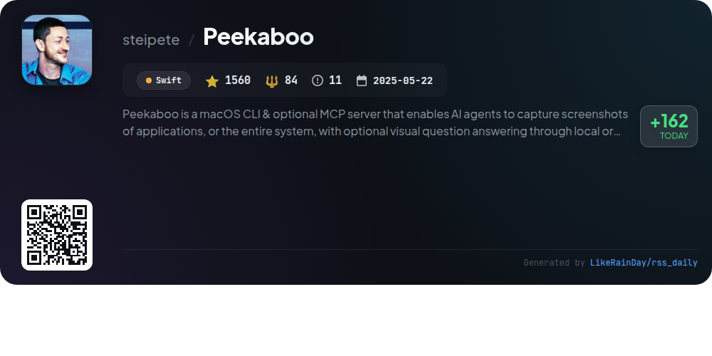
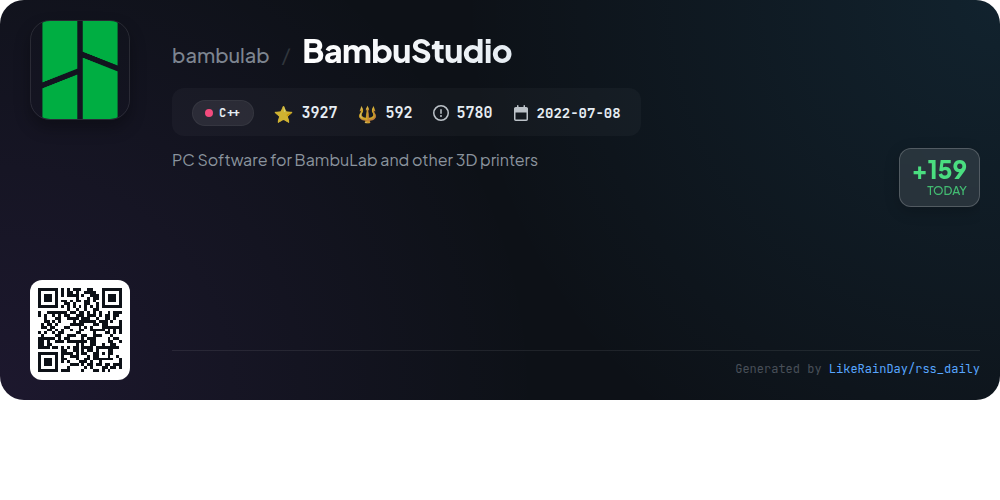

# 📊 🌟 GitHub Trending Daily - 2026-01-30

> > 📅 Daily Picks of GitHub Trending Repositories | Powered by Smart Algorithms

## 📋 Overview

**10** Projects | **266367** ⭐ | **40562** 🍴

**Top Languages:** `TypeScript` (4) · `C++` (2) · `Swift` (1)

**Updated:** 2026-01-30 02:38 UTC

**Categories:**

- 🌟 Daily Top 10 (10 items)

---

## 🌟 Daily Top 10

### 1. [moltbot](https://github.com/moltbot/moltbot)

> 🤖 **Why Recommend**  
> *Moltbot is a personal AI assistant that operates on any platform or OS, designed for seamless interaction across channels like WhatsApp, Telegram, Discord, and more. With features including a local-first gateway, multi-channel inbox, voice wake capabilities, and live canvas, it provides a fast, always-on experience. Users can manage subscriptions to models from Anthropic and OpenAI. The onboarding wizard simplifies setup, while companion apps enhance functionality on macOS, iOS, and Android. Ideal for those seeking a customizable, efficient AI assistant.*

- ⭐ 104984 stars
- 💻 TypeScript
- 📅 Updated: 2026-01-30

### 2. [system_prompts_leaks](https://github.com/asgeirtj/system_prompts_leaks)

> 🤖 **Why Recommend**  
> *system_prompts_leaks is a popular GitHub repository featuring a comprehensive collection of extracted system prompts from leading chatbots like ChatGPT, Claude, and Gemini. With over 27,700 stars, this project allows users to explore and contribute to a diverse range of system messages and developer prompts. Key highlights include an open invitation for pull requests, fostering community collaboration, and a visual star history chart to track its popularity. This JavaScript-based project serves as a valuable resource for developers and researchers in the AI chatbot domain.*

- ⭐ 27715 stars
- 💻 JavaScript
- 📅 Updated: 2026-01-30

### 3. [archestra](https://github.com/archestra-ai/archestra)

> 🤖 **Why Recommend**  
> *Archestra is a secure, MCP-native AI platform designed to streamline AI utilization in organizations. Key features include a centralized MCP orchestrator for managing servers, a private MCP registry for secure sharing, and robust observability tools for monitoring usage and performance. It offers dynamic cost optimization, reducing AI expenses by up to 96%. With built-in security measures to prevent data exfiltration and prompt injections, Archestra ensures safe deployment for developers while providing management with comprehensive visibility into AI adoption.*

- ⭐ 2176 stars
- 💻 TypeScript
- 📅 Updated: 2026-01-30

### 4. [pi-mono](https://github.com/badlogic/pi-mono)

> 🤖 **Why Recommend**  
> *pi-mono is an AI agent toolkit featuring a coding agent CLI, a unified LLM API, and various UI libraries for both terminal and web applications. Key components include the multi-provider LLM API for seamless integration with platforms like OpenAI and Google, a Slack bot for message delegation, and a CLI for managing vLLM deployments on GPU pods. With robust tools for agent runtime and state management, pi-mono facilitates efficient AI agent development and deployment. The project, built in TypeScript, has garnered 3,483 stars on GitHub.*

- ⭐ 3483 stars
- 💻 TypeScript
- 📅 Updated: 2026-01-30

### 5. [lobehub](https://github.com/lobehub/lobehub)

> 🤖 **Why Recommend**  
> *LobeHub is an innovative platform designed for seamless collaboration between humans and AI agents, allowing users to find, build, and work with personalized agent teams. Key features include the Agent Builder for easy team creation, Agent Groups for collaborative workflows, and Personal Memory for tailored interactions. Additional services encompass a plugin system, multi-model support, and real-time internet access. LobeHub aims to redefine productivity with its robust infrastructure, enabling users to manage projects, schedule tasks, and engage in dynamic conversations, all while ensuring privacy and customization.*

- ⭐ 71237 stars
- 💻 TypeScript
- 📅 Updated: 2026-01-30

### 6. [PS2Recomp](https://github.com/ran-j/PS2Recomp)

> 🤖 **Why Recommend**  
> *PS2Recomp is a PlayStation 2 static recompiler designed to convert PS2 ELF binaries into C++ code for native execution on modern platforms. Key features include translation of MIPS R5900 instructions, support for 128-bit MMI instructions, configurable output options via TOML files, and function stubbing. The tool parses ELF files, decodes instructions, and generates a runtime for execution. It requires CMake and a C++20 compatible compiler. While still experimental, PS2Recomp enables the development of PC ports without traditional emulation.*

- ⭐ 1808 stars
- 💻 C++
- 📅 Updated: 2026-01-30

### 7. [cc-switch](https://github.com/farion1231/cc-switch)

> 🤖 **Why Recommend**  
> *cc-switch is a cross-platform desktop assistant tool designed for Claude Code, Codex, and Gemini CLI, built with Rust and Tauri. It boasts an intuitive UI, SQLite + JSON dual-layer architecture, and robust provider management, enabling seamless switching between AI configurations. Key features include Gemini CLI integration, skills and prompts management, and an MCP management system. With support for multiple languages and extensive customization options, cc-switch enhances coding efficiency. The project is actively maintained and sponsored by various AI service providers.*

- ⭐ 14844 stars
- 💻 Rust
- 📅 Updated: 2026-01-30

### 8. [vault](https://github.com/hashicorp/vault)

> 🤖 **Why Recommend**  
> *Vault is a robust tool for secrets management, encryption as a service, and privileged access management, developed in Go with over 34,600 stars on GitHub. It securely stores secrets like API keys and passwords, offers dynamic secret generation, and provides data encryption capabilities. Key features include lease management for secrets, automatic revocation, and detailed audit logs for access tracking. Vault is ideal for modern applications requiring secure access to multiple secrets, enhancing security and simplifying compliance. Comprehensive documentation and tutorials are available on its website.*

- ⭐ 34633 stars
- 💻 Go
- 📅 Updated: 2026-01-30

### 9. [Peekaboo](https://github.com/steipete/Peekaboo)

> 🤖 **Why Recommend**  
> *Peekaboo is a powerful macOS CLI and optional MCP server designed for AI-driven automation and screen capture. It enables pixel-accurate screenshots of applications or the entire system, supports natural-language commands for complete GUI automation, and integrates multiple AI models, including GPT-5.1 and Claude 4.x. Key features include menu discovery, structured JSON outputs, and configurable workflows, making it suitable for advanced macOS users. With version 3 in beta, Peekaboo enhances multi-screen support and native agent flows, streamlining automation tasks with precision.*

- ⭐ 1560 stars
- 💻 Swift
- 📅 Updated: 2026-01-30

### 10. [BambuStudio](https://github.com/bambulab/BambuStudio)

> 🤖 **Why Recommend**  
> *BambuStudio is an advanced slicing software designed for BambuLab and other 3D printers, featuring a user-friendly interface and optimized slicing algorithms. Key functionalities include basic slicing and GCode viewing, multi-plate management, remote monitoring, and advanced cooling logic. It supports multiple material printing, customized supports, and offers global and object-level slicing parameters. BambuStudio is available for Windows, macOS, and Linux, with comprehensive documentation and a community-driven approach. The software is based on PrusaSlicer and licensed under the GNU Affero General Public License.*

- ⭐ 3927 stars
- 💻 C++
- 📅 Updated: 2026-01-30

---

## 📡 RSS Subscription

Subscribe via RSS to get daily trending updates:

- 🔔 [RSS XML] (../../daily-top.xml)
- 🔔 [Daily Report] (../../GITHUB_TODAY.md)
- 🔔 [Daily Top 10](../../daily-top.xml)

---

*⚡ Powered by Smart Trending Algorithm | Generated at 2026-01-30 02:38:04 UTC
