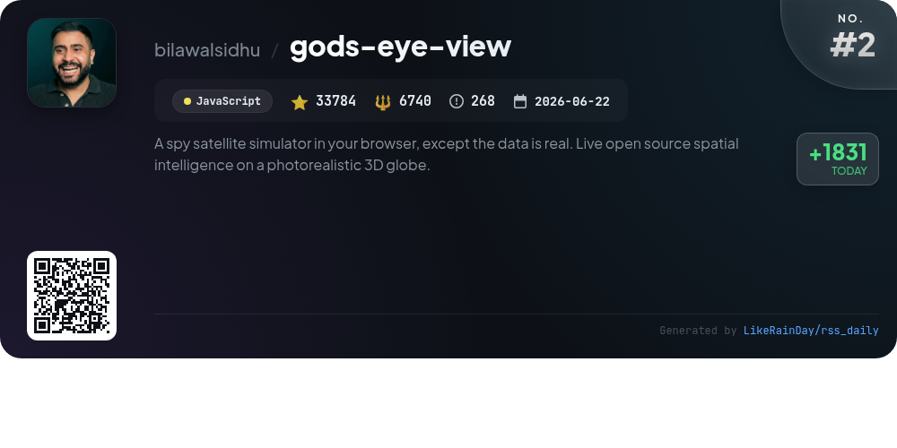
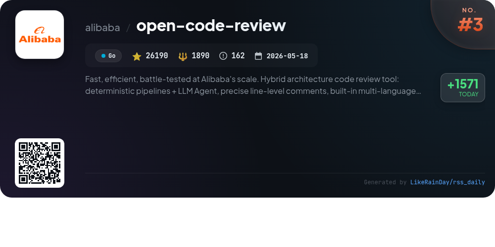
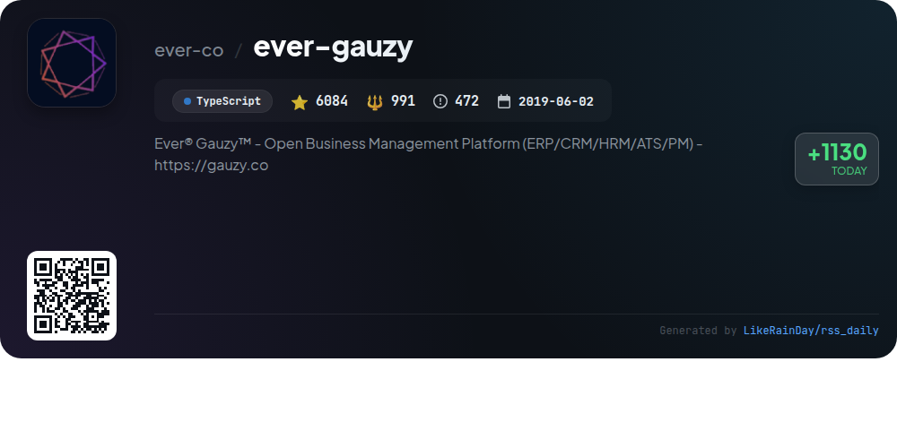
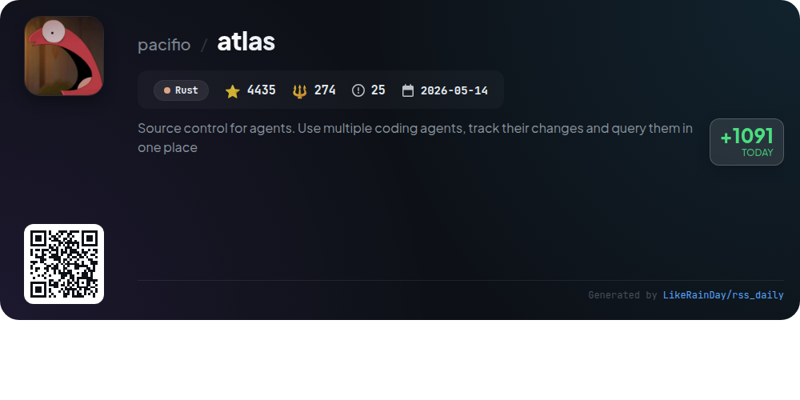
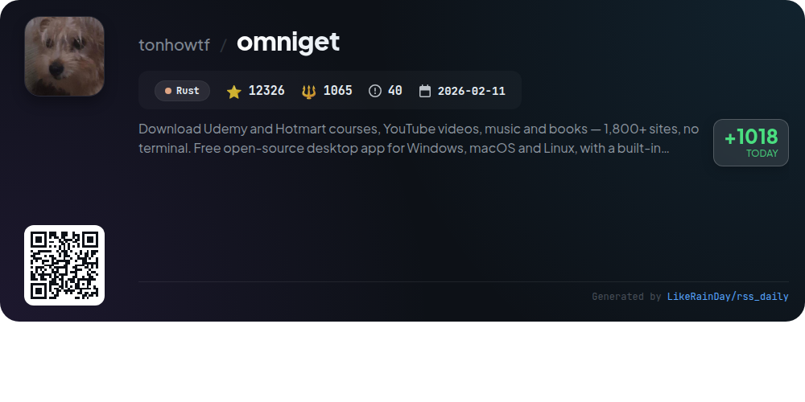
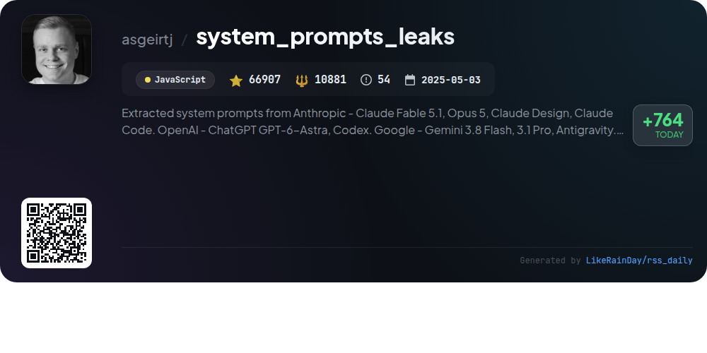
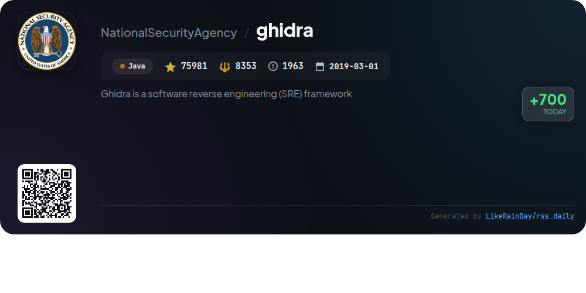
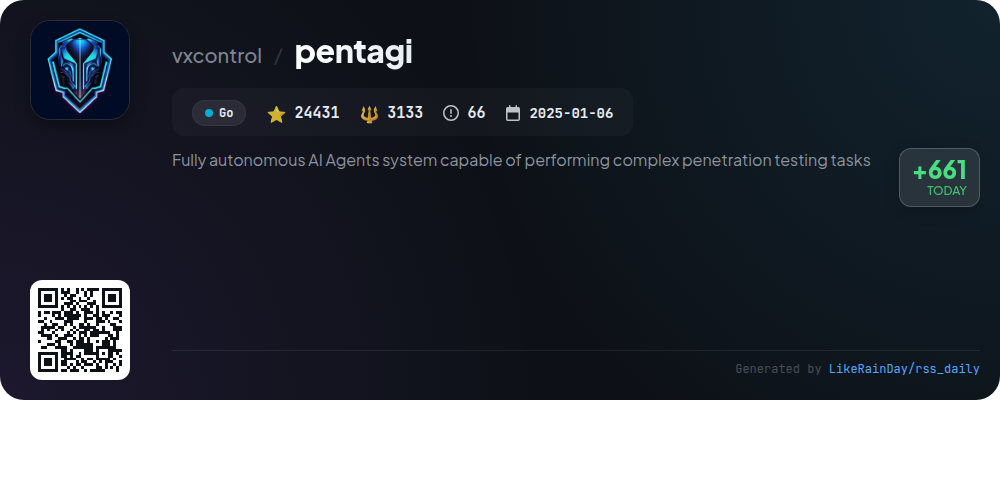
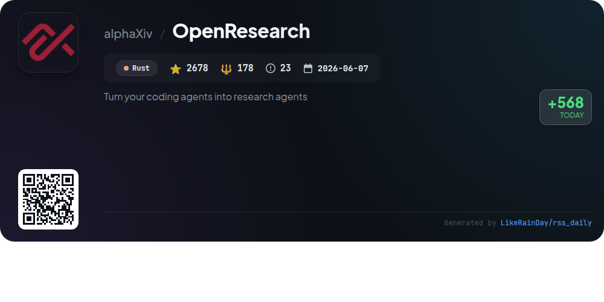

# 📊 🌟 GitHub Trending Daily - 2026-09-15

> > 📅 Daily Picks of GitHub Trending Repositories | Powered by Smart Algorithms

## 📋 Overview

**10** Projects | **285175** ⭐ | **36912** 🍴

**Top Languages:** `Rust` (3) · `Go` (2) · `JavaScript` (2)

**Updated:** 2026-09-15 04:27 UTC

**Categories:**

- 🌟 Daily Top 10 (10 items)

---

## 🌟 Daily Top 10

### 1. [colibri](https://github.com/JustVugg/colibri)

> 🤖 **Why Recommend**  
> *Colibrì is a lightweight inference engine designed to run frontier Mixture-of-Experts (MoE) models (744B to 2.8T parameters) on consumer hardware using pure C, with zero dependencies. Key features include treating VRAM, RAM, and storage as a unified memory hierarchy, enabling seamless expert streaming from disk. It supports nine model families, including GLM-5.2 and Kimi K3, all accessed via a single front end. Colibrì emphasizes performance optimization, reproducibility, and accessibility, allowing users to run large models without relying on expensive hardware. The project fosters open research and experimentation in AI inference.*

- ⭐ 32359 stars
- 💻 C
- 📅 Updated: 2026-09-15

### 2. [gods-eye-view](https://github.com/bilawalsidhu/gods-eye-view)

> 🤖 **Why Recommend**  
> *God's Eye View is an open-source spy satellite simulator that runs in your browser, offering real-time spatial intelligence on a photorealistic 3D globe. Key features include live tracking of aircraft, ships, satellites, and earthquakes, enhanced with hands-free voice control powered by AI. Users can explore public data from various layers, such as live traffic and CCTV feeds, without needing API keys. The platform supports interactive cockpit views, voice annotations, and cinematic scene capture, making it an invaluable tool for geospatial exploration and analysis.*

- ⭐ 33784 stars
- 💻 JavaScript
- 📅 Updated: 2026-09-15

### 3. [open-code-review](https://github.com/alibaba/open-code-review)

> 🤖 **Why Recommend**  
> *Fast, efficient, battle-tested at Alibaba's scale. Hybrid architecture code review tool: deterministic pipelines + LLM Agent, precise line-level comme. popular project, actively maintained, recently updated*

- ⭐ 26190 stars
- 🍴 1890 forks
- 💻 Go
- 📅 Updated: 2026-09-15

### 4. [ever-gauzy](https://github.com/ever-co/ever-gauzy)

> 🤖 **Why Recommend**  
> *Ever® Gauzy™ is an open-source Business Management Platform designed for collaborative and on-demand economies, featuring robust modules for Enterprise Resource Planning (ERP), Customer Relationship Management (CRM), Human Resource Management (HRM), Applicant Tracking, and Project Management. Key highlights include comprehensive time-tracking, financial management, and multi-organization capabilities, alongside a headless API for seamless integration. With an active community and extensive documentation, it serves businesses of all sizes, providing tools for HR, sales, and productivity management. Explore more at gauzy.co.*

- ⭐ 6084 stars
- 💻 TypeScript
- 📅 Updated: 2026-09-15

### 5. [atlas](https://github.com/pacifio/atlas)

> 🤖 **Why Recommend**  
> *Atlas is a source control platform for coding agents, enabling users to track changes, manage multi-agent sessions, and query past interactions seamlessly. Key features include detailed checkpoint recording that links commits to agent sessions, shared memory across agents for context continuity, and local resolution of project components. It supports agents like Claude Code and Codex running in parallel, ensuring efficient collaboration. With a focus on privacy, all data remains on-device unless users opt for synchronization. The project is built in Rust and is primarily designed for macOS.*

- ⭐ 4435 stars
- 💻 Rust
- 📅 Updated: 2026-09-15

### 6. [omniget](https://github.com/tonhowtf/omniget)

> 🤖 **Why Recommend**  
> *OmniGet is a free, open-source desktop app for Windows, macOS, and Linux, enabling users to download content from over 1,800 sites, including Udemy, Hotmart, YouTube, and more. Key features include a built-in course player, PDF/EPUB reader, and music library, all powered by yt-dlp. Users can seamlessly download courses, videos, and audio without terminal commands. The app supports advanced tools for transcription, conversion, and organization of media, ensuring all files remain locally stored without ads or telemetry.*

- ⭐ 12326 stars
- 💻 Rust
- 📅 Updated: 2026-09-15

### 7. [system_prompts_leaks](https://github.com/asgeirtj/system_prompts_leaks)

> 🤖 **Why Recommend**  
> *The "system_prompts_leaks" GitHub project provides a comprehensive repository of leaked system prompts from major AI models, including Anthropic's Claude, OpenAI's ChatGPT, Google's Gemini, and xAI's Grok. With over 66,900 stars, it features verbatim captures of hidden instructions that guide AI interactions. Regular updates ensure access to the latest prompts across various models and integrations, facilitating insights into AI behavior. Notable applications include interactive storytelling and live dashboards, making it a valuable resource for developers and researchers in AI.*

- ⭐ 66907 stars
- 💻 JavaScript
- 📅 Updated: 2026-09-15

### 8. [ghidra](https://github.com/NationalSecurityAgency/ghidra)

> 🤖 **Why Recommend**  
> *Ghidra is a powerful open-source software reverse engineering (SRE) framework developed by the NSA. It offers a comprehensive suite of tools for analyzing compiled code across various platforms, including disassembly, decompilation, and graphing. Ghidra supports multiple processor instruction sets and executable formats, enabling both interactive and automated analysis. Users can extend its functionality with custom scripts in Java or Python. Designed to facilitate complex SRE tasks, Ghidra enhances cybersecurity efforts by providing deep insights into potential vulnerabilities.*

- ⭐ 75981 stars
- 💻 Java
- 📅 Updated: 2026-09-15

### 9. [pentagi](https://github.com/vxcontrol/pentagi)

> 🤖 **Why Recommend**  
> *PentAGI is a cutting-edge, fully autonomous AI agent system designed for complex penetration testing tasks. Key features include a secure and isolated Docker environment, a built-in suite of 20+ professional security tools, and powerful LLM integration with support for multiple providers. The system offers advanced memory management, detailed reporting, and comprehensive monitoring through Grafana and Prometheus. With scalable microservices architecture, PentAGI enables efficient task execution, real-time observation, and a modern web interface, making it ideal for security professionals and researchers.*

- ⭐ 24431 stars
- 💻 Go
- 📅 Updated: 2026-09-15

### 10. [OpenResearch](https://github.com/alphaXiv/OpenResearch)

> 🤖 **Why Recommend**  
> *OpenResearch is a Rust-based platform designed to transform coding agents into research agents capable of literature review, hypothesis development, and experimental execution. Key features include parallel exploration with independent agent sessions, reproducible experiments tracked in a git-native structure, and flexible compute options—running locally or via managed services. It supports various coding agents like Claude Code and Codex, ensuring local ownership of projects and data. Autonomously, OpenResearch can propose ideas, execute experiments, and analyze results, enhancing research efficiency.*

- ⭐ 2678 stars
- 💻 Rust
- 📅 Updated: 2026-09-15

---

## 📡 RSS Subscription

Subscribe via RSS to get daily trending updates:

- 🔔 [RSS XML] (../../daily-top.xml)
- 🔔 [Daily Report] (../../GITHUB_TODAY.md)
- 🔔 [Daily Top 10](../../daily-top.xml)

---

*⚡ Powered by Smart Trending Algorithm | Generated at 2026-09-15 04:27:38 UTC
