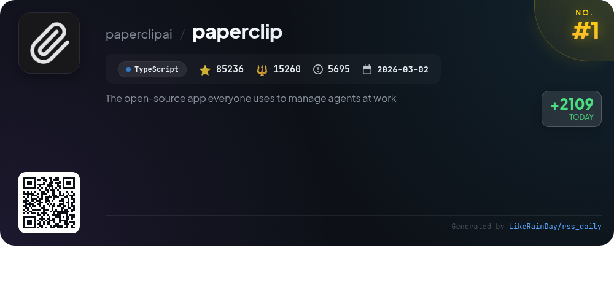
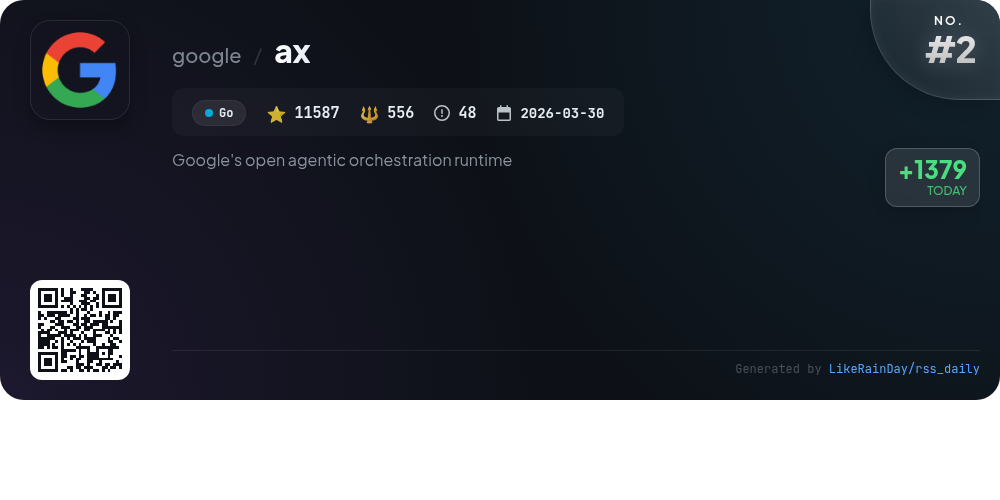
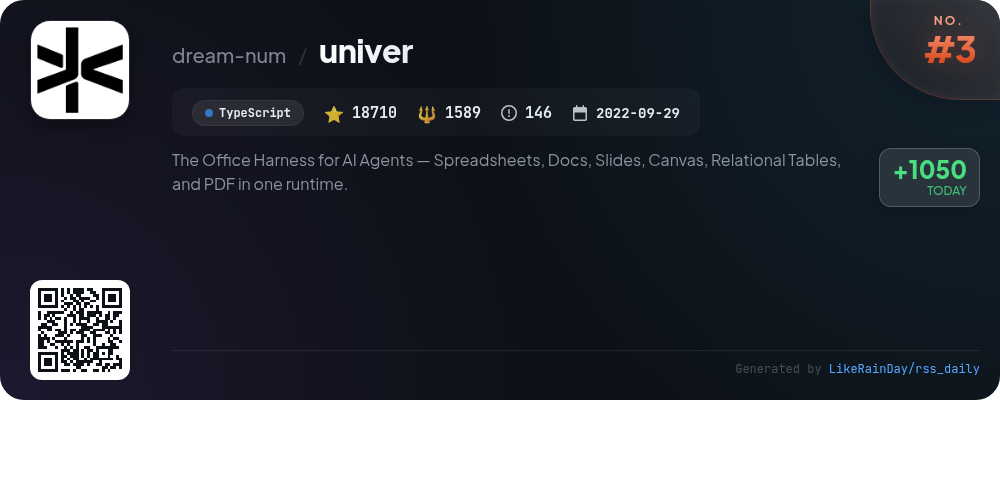
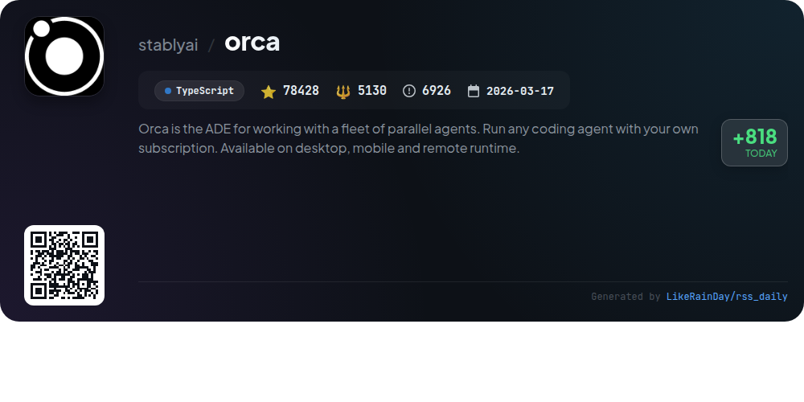
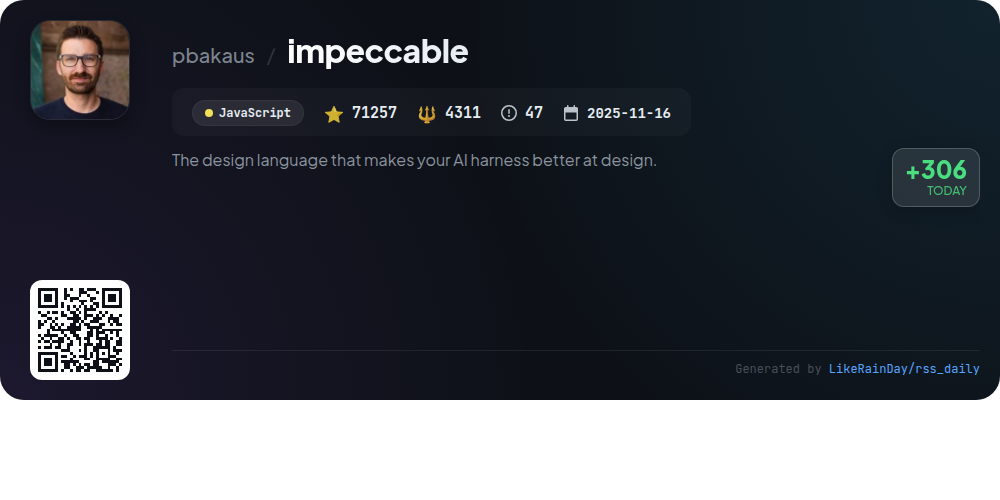
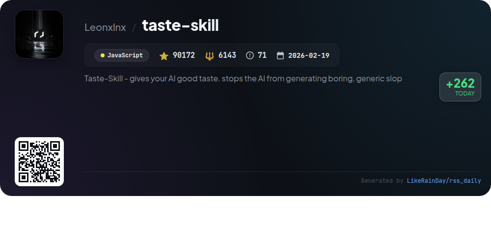
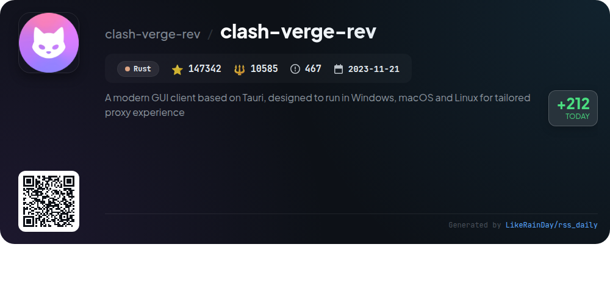
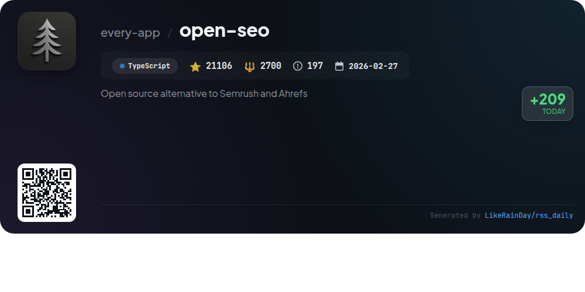
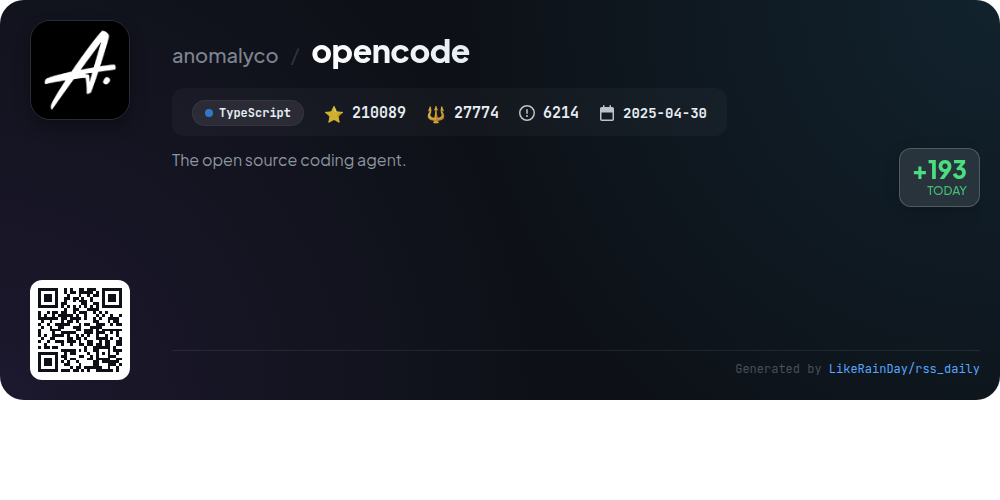

# 📊 🌟 GitHub Trending Daily - 2026-09-26

> > 📅 Daily Picks of GitHub Trending Repositories | Powered by Smart Algorithms

## 📋 Overview

**10** Projects | **741061** ⭐ | **76743** 🍴

**Top Languages:** `TypeScript` (5) · `Rust` (2) · `JavaScript` (2)

**Updated:** 2026-09-26 04:33 UTC

**Categories:**

- 🌟 Daily Top 10 (10 items)

---

## 🌟 Daily Top 10

### 1. [paperclip](https://github.com/paperclipai/paperclip)

> 🤖 **Why Recommend**  
> *Paperclip is an open-source application designed for managing AI agents in the workplace, boasting over 85,000 stars on GitHub. Built with TypeScript, it provides a comprehensive orchestration system for teams of AI agents. Key features include goal alignment, cost control, and an org chart for agent management. Users can easily define goals, assign tasks, and monitor budgets from a unified dashboard. It supports various agents like OpenClaw and Claude and offers multi-organization capabilities with complete data isolation. Ideal for businesses seeking to automate and optimize operations.*

- ⭐ 85236 stars
- 💻 TypeScript
- 📅 Updated: 2026-09-26

### 2. [ax](https://github.com/google/ax)

> 🤖 **Why Recommend**  
> *AX is Google's open-source orchestration runtime designed for high-throughput management of autonomous agent workloads in Kubernetes. It allows users to declare agentic tasks using YAML manifests, providing features like isolated sandboxes for untrusted code execution (`Task`), pre-configured workspaces (`Workspace`), and model configurations (`Model`). Users can easily apply configurations, watch task statuses, and interact with running agents via `ax ssh`. With support for billions of tasks per cluster, AX streamlines complex workflows, making it ideal for modern cloud-native environments.*

- ⭐ 11587 stars
- 💻 Go
- 📅 Updated: 2026-09-26

### 3. [univer](https://github.com/dream-num/univer)

> 🤖 **Why Recommend**  
> *Univer is an open-source SDK for building office applications, integrating spreadsheets, documents, presentations, and relational tables in a customizable runtime. With a plugin architecture and a unified Facade API, it enables seamless embedding of editing capabilities into SaaS products and supports both browser and Node.js environments. Key features include a high-performance formula engine, canvas-based rendering for complex documents, and headless operation for AI workflows. Developers can create collaborative tools, leveraging AI integration for enhanced productivity.*

- ⭐ 18710 stars
- 💻 TypeScript
- 📅 Updated: 2026-09-26

### 4. [hydradb](https://github.com/hydra-db/hydradb)

> 🤖 **Why Recommend**  
> *HydraDB is a high-performance distributed graph database built on object storage, developed in Rust. It features durable storage via S3-compatible systems, snapshot consistency for queries using OpenCypher, and Neo4j-compatible Bolt connectivity. Its architecture separates storage and compute, allowing independent scaling of data nodes and indexers. Key highlights include safe writer handoff, consistent reads, and a rich query API. HydraDB supports path procedures and extensive observability, making it suitable for scalable applications. With over 7,134 stars on GitHub, it's a robust choice for modern graph databases.*

- ⭐ 7134 stars
- 💻 Rust
- 📅 Updated: 2026-09-26

### 5. [orca](https://github.com/stablyai/orca)

> 🤖 **Why Recommend**  
> *Orca is an advanced development environment (ADE) designed for managing a fleet of parallel coding agents, allowing users to run Codex, ClaudeCode, OpenCode, and others in isolated worktrees. Key features include a mobile companion for remote monitoring, terminal splits with WebGL, and integrated GitHub/Linear task management. Users benefit from drag-and-drop file support, SSH worktrees for remote execution, and a powerful CLI for scripting workflows. With support for multiple platforms (macOS, Windows, Linux) and a vibrant community, Orca enhances productivity for developers and AI builders alike.*

- ⭐ 78428 stars
- 💻 TypeScript
- 📅 Updated: 2026-09-26

### 6. [impeccable](https://github.com/pbakaus/impeccable)

> 🤖 **Why Recommend**  
> *Impeccable is a design language tool for AI coding agents, enhancing frontend design with 24 commands and 61 deterministic detector rules. Key features include a streamlined setup process with `/impeccable init`, a shared design vocabulary, and live browser iteration. It helps ensure high-quality designs by conducting audits, critiques, and optimizations. The CLI supports various AI tools like Claude Code and GitHub Copilot, making it versatile for modern development workflows. Full documentation is available at impeccable.style.*

- ⭐ 71257 stars
- 💻 JavaScript
- 📅 Updated: 2026-09-26

### 7. [taste-skill](https://github.com/Leonxlnx/taste-skill)

> 🤖 **Why Recommend**  
> *Taste-Skill is an open-source JavaScript framework designed to enhance AI-generated frontends, preventing bland outputs. It offers portable **Agent Skills** for improved layout, typography, and motion, alongside image-generation capabilities for web and mobile designs. Key features include adjustable design parameters, multiple specialized skills, and compatibility with major coding agents like ChatGPT and Codex. Supported by Kimi AI and other sponsors, Taste-Skill ensures high-quality, visually appealing interfaces while maintaining flexibility across various frameworks. With over 90,000 stars, it’s a popular choice for developers seeking to elevate their AI projects.*

- ⭐ 90172 stars
- 💻 JavaScript
- 📅 Updated: 2026-09-26

### 8. [clash-verge-rev](https://github.com/clash-verge-rev/clash-verge-rev)

> 🤖 **Why Recommend**  
> *Clash Verge Rev is a modern GUI client for tailored proxy experiences, built on Tauri and supporting Windows, macOS, and Linux. With over 147,000 stars, it features a sleek interface with customizable themes, proxy group management, and visual node editing. It integrates the powerful Clash.Meta kernel, offers configuration file enhancements, and supports system proxy modes. Key services include WebDav for backup and synchronization, along with a strong focus on user privacy, ensuring no data collection. Comprehensive documentation is available for installation and troubleshooting.*

- ⭐ 147342 stars
- 💻 Rust
- 📅 Updated: 2026-09-26

### 9. [open-seo](https://github.com/every-app/open-seo)

> 🤖 **Why Recommend**  
> *OpenSEO is an open-source SEO tool designed as an affordable alternative to Semrush and Ahrefs, featuring a pay-as-you-go model. With over 21,000 stars on GitHub, it offers essential workflows like keyword research, rank tracking, and site audits, all through a modern, user-friendly interface. Users can integrate AI agents for enhanced functionality, utilizing pre-built and customizable skills. OpenSEO supports self-hosting via Docker or Cloudflare and requires a DataForSEO API key for data access. A hosted version is also available for $10/month.*

- ⭐ 21106 stars
- 💻 TypeScript
- 📅 Updated: 2026-09-26

### 10. [opencode](https://github.com/anomalyco/opencode)

> 🤖 **Why Recommend**  
> *OpenCode is an open-source AI coding agent designed to enhance software development. With over 210,000 stars on GitHub, it features two built-in agents: a full-access "build" agent for development and a "plan" agent for code exploration. Users can easily install OpenCode via various package managers or as a desktop application across platforms. It offers a user-friendly interface and extensive documentation for configuration. Join the community on Discord for support and collaboration. For more information, visit [opencode.ai](https://opencode.ai).*

- ⭐ 210089 stars
- 💻 TypeScript
- 📅 Updated: 2026-09-26

---

## 📡 RSS Subscription

Subscribe via RSS to get daily trending updates:

- 🔔 [RSS XML] (../../daily-top.xml)
- 🔔 [Daily Report] (../../GITHUB_TODAY.md)
- 🔔 [Daily Top 10](../../daily-top.xml)

---

*⚡ Powered by Smart Trending Algorithm | Generated at 2026-09-26 04:33:56 UTC
