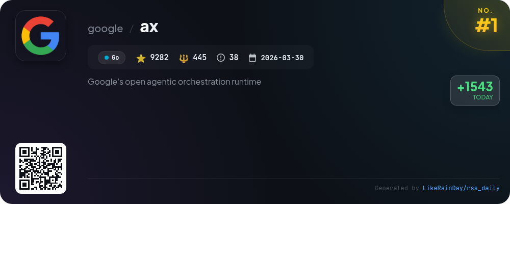
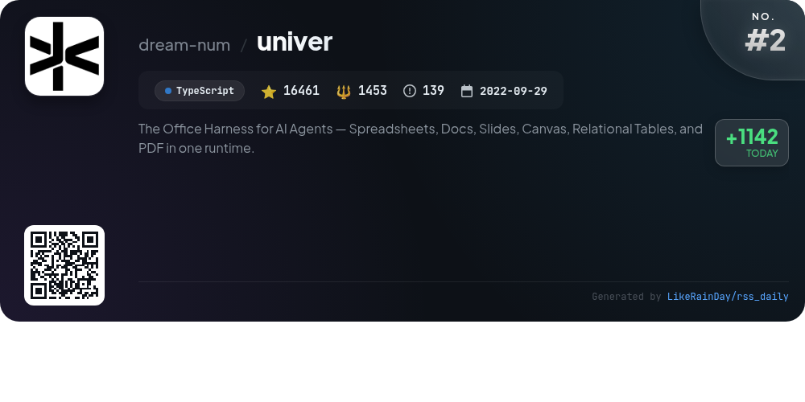
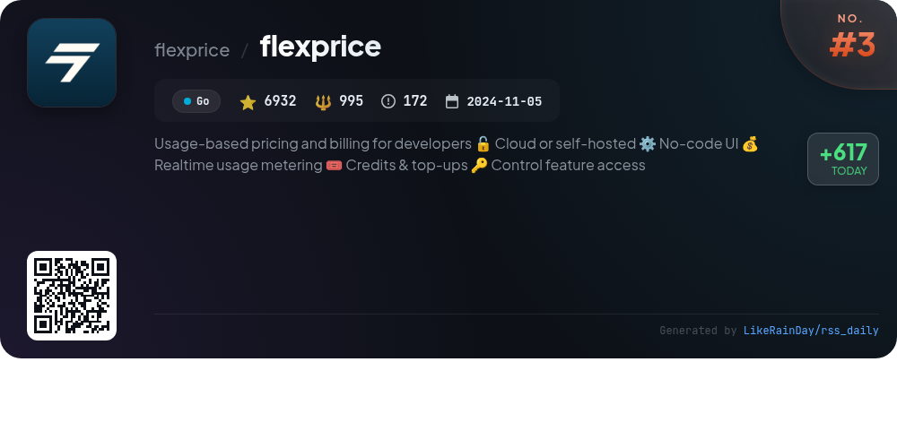
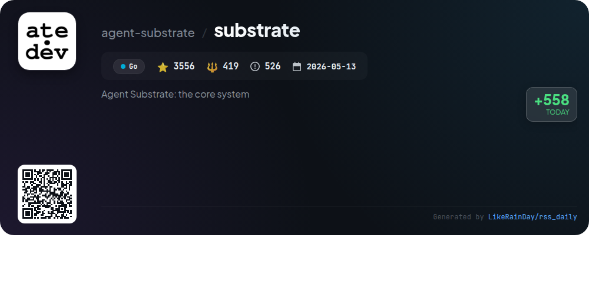
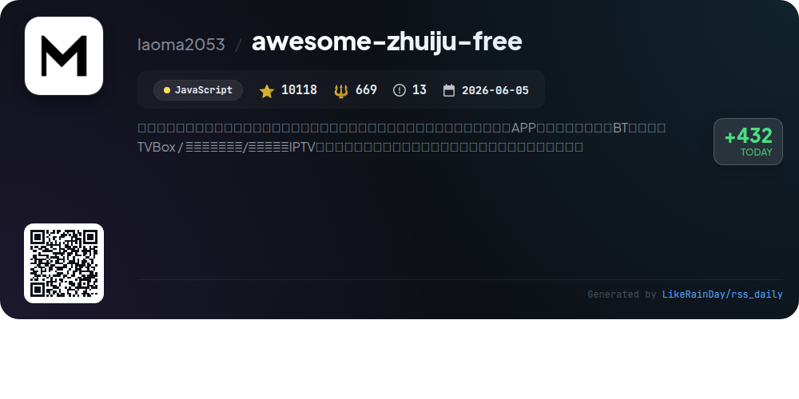
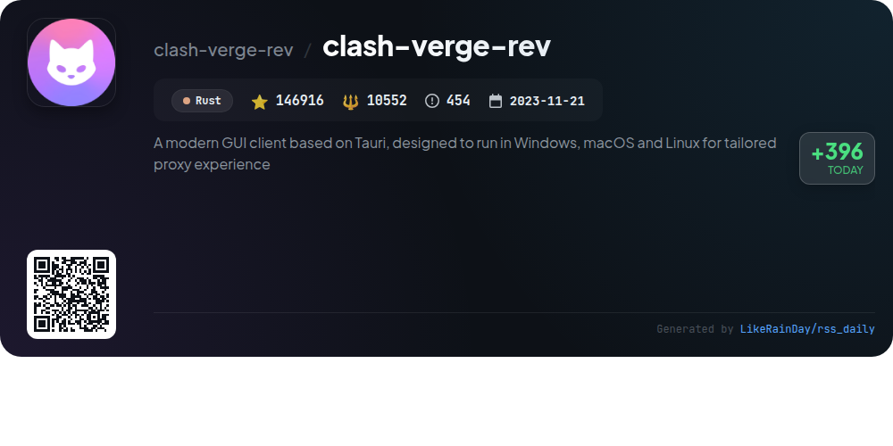
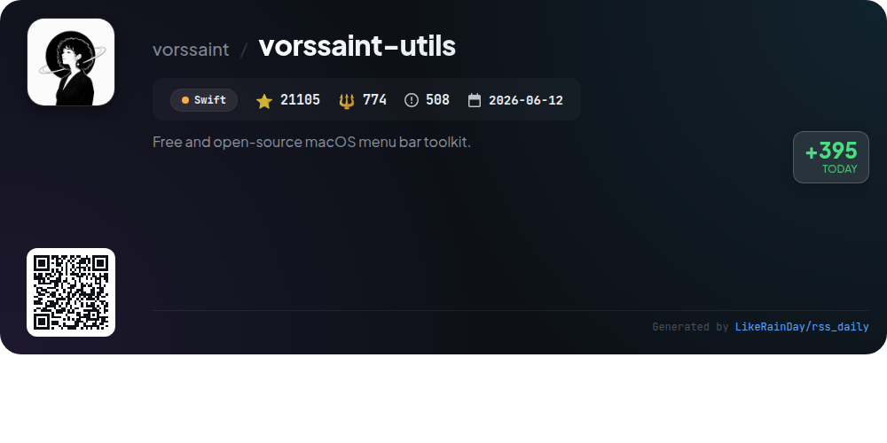
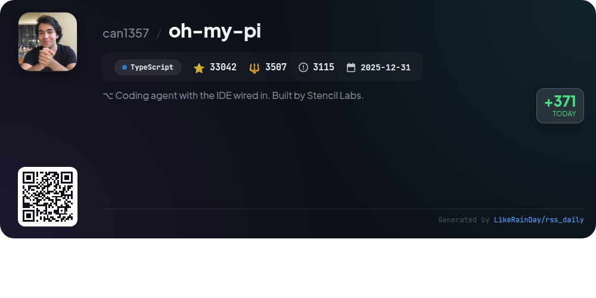
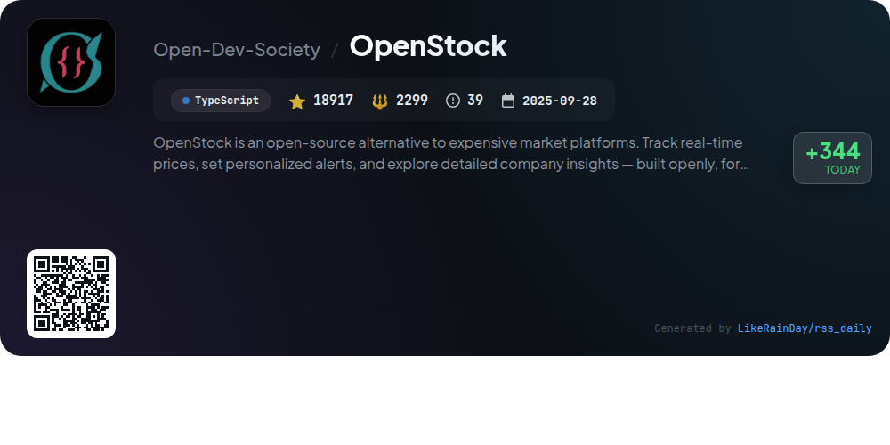
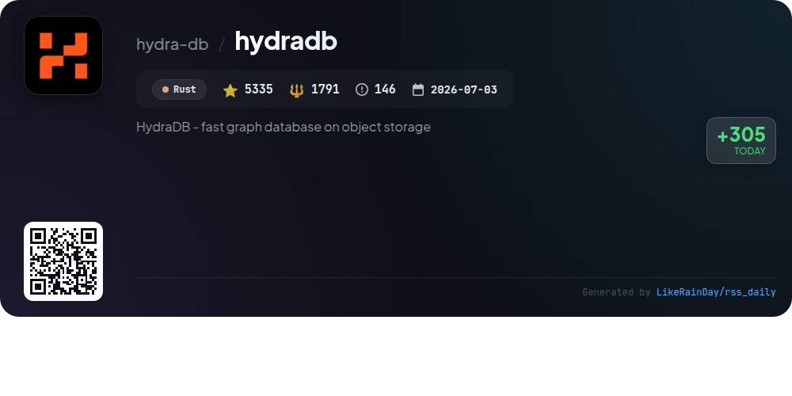

# 📊 🌟 GitHub Trending Daily - 2026-09-24

> > 📅 Daily Picks of GitHub Trending Repositories | Powered by Smart Algorithms

## 📋 Overview

**10** Projects | **271664** ⭐ | **22904** 🍴

**Top Languages:** `Go` (3) · `TypeScript` (3) · `Rust` (2)

**Updated:** 2026-09-24 04:16 UTC

**Categories:**

- 🌟 Daily Top 10 (10 items)

---

## 🌟 Daily Top 10

### 1. [ax](https://github.com/google/ax)

> 🤖 **Why Recommend**  
> *AX is Google's high-throughput orchestration runtime designed for managing billions of autonomous agent workloads in a Kubernetes cluster. It provides a declarative approach to define agent tasks using YAML manifests, enabling isolation, resource management, and sandboxed execution. Core features include `Task` for running untrusted code, `Workspace` for pre-configured environments, `Gateway` for controlling network access, and `Model` for managing AI model credentials. AX simplifies task management with commands for applying, monitoring, and debugging tasks, all while supporting seamless integration with Kubernetes contexts.*

- ⭐ 9282 stars
- 💻 Go
- 📅 Updated: 2026-09-24

### 2. [univer](https://github.com/dream-num/univer)

> 🤖 **Why Recommend**  
> *Univer is an open-source SDK designed for creating office applications, seamlessly integrating spreadsheets, documents, and presentations within your product. With over 16,000 stars on GitHub, it offers a customizable, high-performance framework featuring a plugin architecture, canvas-based rendering, and a unified Facade API for both browser and Node.js environments. Key capabilities include collaborative editing, server-side processing, and extensible UI components. Ideal for embedding productivity tools in SaaS applications, Univer supports AI agents and enhances workflows through programmatic editing and real-time collaboration.*

- ⭐ 16461 stars
- 💻 TypeScript
- 📅 Updated: 2026-09-24

### 3. [flexprice](https://github.com/flexprice/flexprice)

> 🤖 **Why Recommend**  
> *Flexprice is an open-source billing solution designed for AI-native and SaaS companies, enabling flexible usage-based, credit-based, and hybrid pricing models. Key features include real-time usage metering, automated invoicing, credit management, and feature access control. Its API-first design allows easy integration with existing tools, ensuring developers can focus on product features rather than billing complexities. Flexprice supports seamless data flow with payment processors and CRMs, providing transparency and flexibility without vendor lock-in. With 6,932 stars on GitHub, it offers a robust foundation for scalable monetization.*

- ⭐ 6932 stars
- 💻 Go
- 📅 Updated: 2026-09-24

### 4. [substrate](https://github.com/agent-substrate/substrate)

> 🤖 **Why Recommend**  
> *Agent Substrate is a secure agent execution runtime designed for high-density sandbox management, capable of running millions of agents with sub-500ms resume times and over 500 activations per second. It supports multiple sandbox technologies like microVMs and gVisor, optimizing Kubernetes for agent lifecycle management. Key features include high-performance actor teleportation, state persistence, and agent multiplexing. The system is framework agnostic, supporting various agent types, and offers robust infrastructure provisioning. Currently in early development, it is not yet production-ready.*

- ⭐ 3556 stars
- 💻 Go
- 📅 Updated: 2026-09-24

### 5. [awesome-zhuiju-free](https://github.com/laoma2053/awesome-zhuiju-free)

> 🤖 **Why Recommend**  
> *Awesome Zhuiju Free is an open-source platform providing a curated, ad-free guide to streaming resources. Key features include daily automated checks for resource availability, a wide range of categories such as online films, apps, cloud search, subtitles, IPTV sources, and open-source projects. With over 11,000 stars, it fosters community-driven maintenance and allows users to submit or report resources. The project aims to enhance the streaming experience while ensuring transparency about content access and safety.*

- ⭐ 10118 stars
- 💻 JavaScript
- 📅 Updated: 2026-09-24

### 6. [clash-verge-rev](https://github.com/clash-verge-rev/clash-verge-rev)

> 🤖 **Why Recommend**  
> *Clash Verge Rev is a modern GUI client built on Tauri for an optimized proxy experience across Windows, macOS, and Linux. With over 146,000 stars, it offers a sleek interface, customizable themes, and supports the Clash.Meta core for advanced proxy management. Key features include configuration file management, visual node editing, and system proxy settings. It ensures user privacy by storing data locally and provides support for various languages. Users can download stable releases from the GitHub release page, making it accessible for everyday use.*

- ⭐ 146916 stars
- 💻 Rust
- 📅 Updated: 2026-09-24

### 7. [vorssaint-utils](https://github.com/vorssaint/vorssaint-utils)

> 🤖 **Why Recommend**  
> *Vorssaint is a free, open-source macOS menu bar toolkit designed to replace multiple paid apps with one versatile solution. Key features include a per-app volume mixer, system monitor, enhanced app switcher, clipboard history, and extensive window management tools. Users can customize their experience by installing only the features they need, ensuring a lightweight and efficient interface. With a focus on privacy, Vorssaint operates locally without analytics or tracking. It supports macOS 14 and Apple Silicon, making it an essential utility for modern Mac users.*

- ⭐ 21105 stars
- 💻 Swift
- 📅 Updated: 2026-09-24

### 8. [oh-my-pi](https://github.com/can1357/oh-my-pi)

> 🤖 **Why Recommend**  
> *Oh-My-Pi is a powerful coding agent developed by Stencil Labs, designed for seamless integration with IDEs. It boasts over 60 providers, 31 built-in tools, and advanced features like LSP support, real-time debugging, and collaborative sessions. Users can execute code, manage memory, and perform structured code edits effortlessly. Key functionalities include a persistent Python environment, time-traveling rule injections, and efficient task distribution across subagents. With a focus on developer productivity, Oh-My-Pi enhances coding workflows while maintaining a terminal-first experience. Visit [omp.sh](https://omp.sh) for more details.*

- ⭐ 33042 stars
- 💻 TypeScript
- 📅 Updated: 2026-09-24

### 9. [OpenStock](https://github.com/Open-Dev-Society/OpenStock)

> 🤖 **Why Recommend**  
> *OpenStock is an open-source stock market platform designed as a free alternative to costly services. Key features include real-time price tracking, personalized alerts, and detailed company insights. Built with Next.js and TypeScript, it offers user authentication, a customizable watchlist, and integration with Finnhub for market data and TradingView for visualizations. The app supports over 30 international exchanges and emphasizes community involvement and accessibility, ensuring that knowledge and tools remain open for everyone.*

- ⭐ 18917 stars
- 💻 TypeScript
- 📅 Updated: 2026-09-24

### 10. [hydradb](https://github.com/hydra-db/hydradb)

> 🤖 **Why Recommend**  
> *HydraDB is a high-performance, distributed graph database built in Rust, leveraging object storage for durability and scalability. Key features include OpenCypher query support, GraphBLAS traversal, and Neo4j-compatible Bolt connectivity. Its architecture separates storage and compute, with data nodes handling queries and mutations while indexers build immutable traversal indexes. The system ensures consistent reads through SlateDB snapshots and supports S3-compatible object storage. HydraDB also provides an extensive HTTP API, making integration seamless for applications.*

- ⭐ 5335 stars
- 💻 Rust
- 📅 Updated: 2026-09-24

---

## 📡 RSS Subscription

Subscribe via RSS to get daily trending updates:

- 🔔 [RSS XML] (../../daily-top.xml)
- 🔔 [Daily Report] (../../GITHUB_TODAY.md)
- 🔔 [Daily Top 10](../../daily-top.xml)

---

*⚡ Powered by Smart Trending Algorithm | Generated at 2026-09-24 04:16:11 UTC
