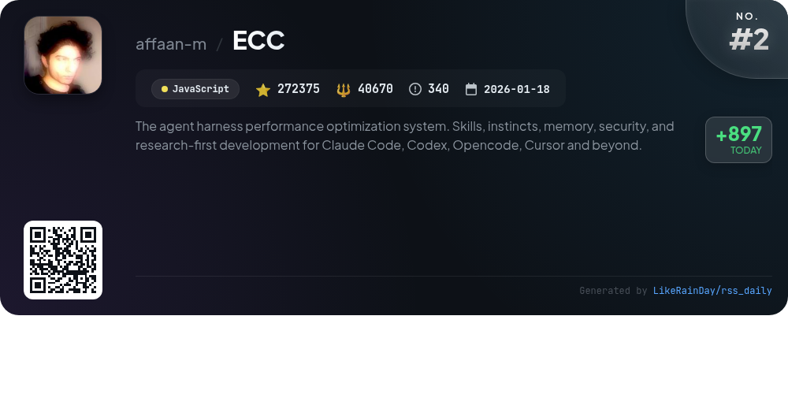
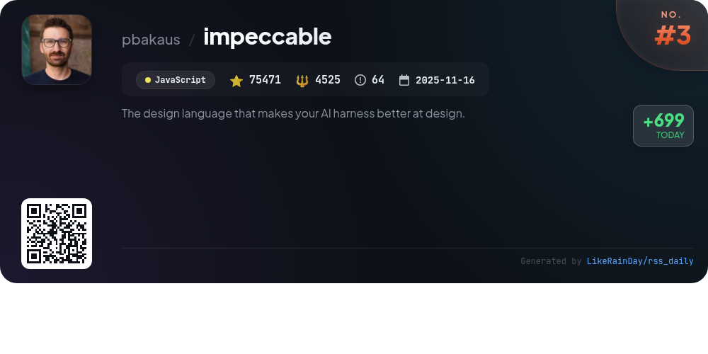
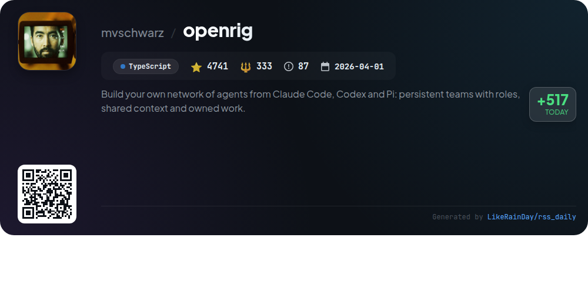
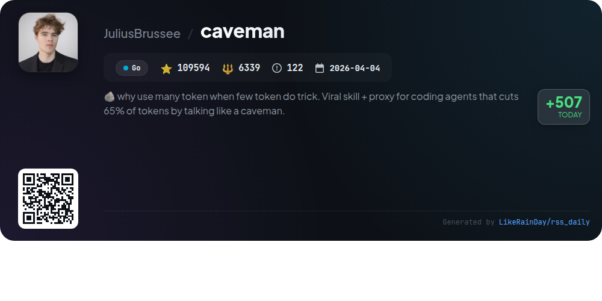
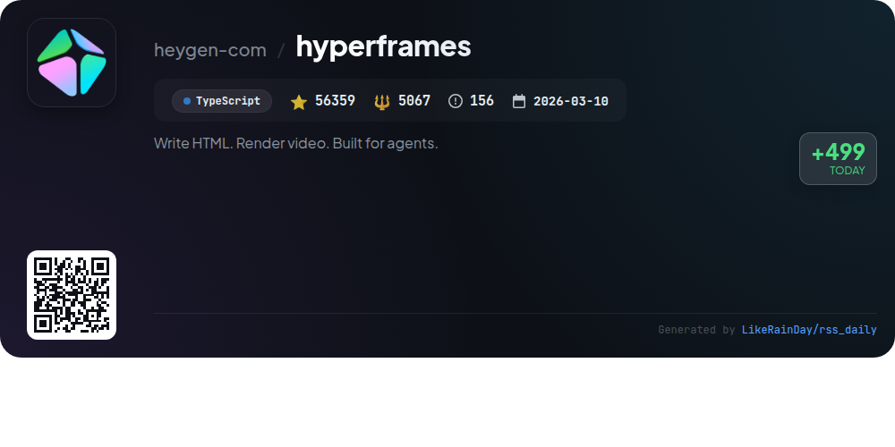
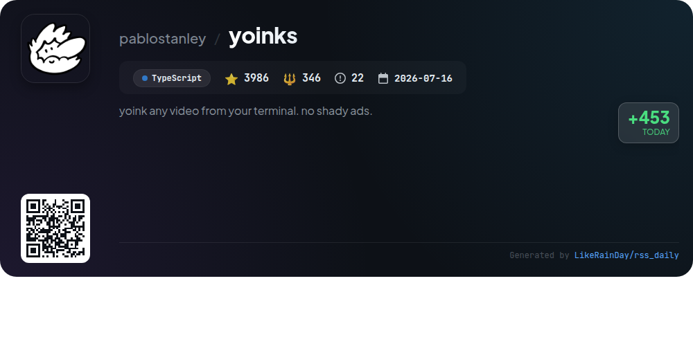
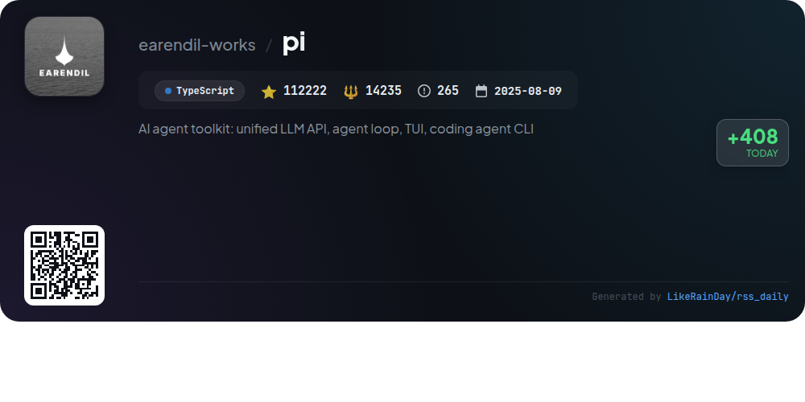
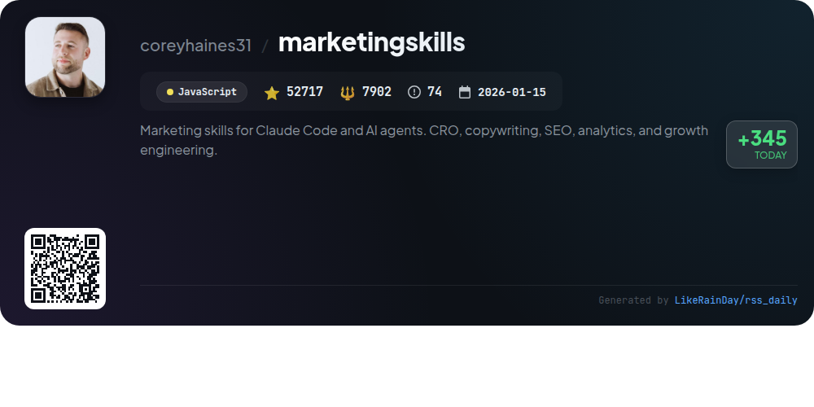
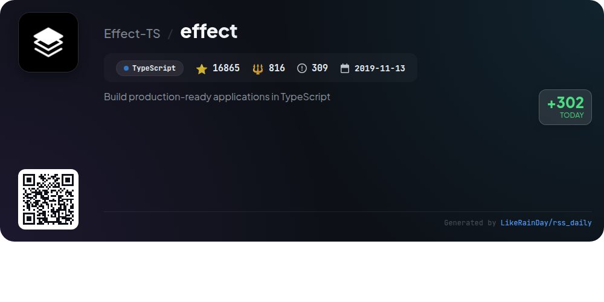

# 📊 🌟 GitHub Trending Daily - 2026-10-04

> > 📅 Daily Picks of GitHub Trending Repositories | Powered by Smart Algorithms

## 📋 Overview

**10** Projects | **858021** ⭐ | **88489** 🍴

**Top Languages:** `TypeScript` (5) · `JavaScript` (4) · `Go` (1)

**Updated:** 2026-10-04 05:25 UTC

**Categories:**

- 🌟 Daily Top 10 (10 items)

---

## 🌟 Daily Top 10

### 1. [ponytail](https://github.com/DietrichGebert/ponytail)

> 🤖 **Why Recommend**  
> *Ponytail is a JavaScript project designed to optimize AI code generation by emulating the approach of a lazy senior developer, producing leaner and more efficient code. With 153,691 stars, it reduces code size by up to 94%, cuts costs by 20%, and accelerates development by 27%, all while maintaining safety and necessary validations. It integrates seamlessly with 20 AI agents, allowing users to set intensity levels for code generation. Key commands include `/ponytail-review` for auditing code and `/ponytail-gain` for performance metrics. The project emphasizes minimalism and efficiency in programming.*

- ⭐ 153691 stars
- 💻 JavaScript
- 📅 Updated: 2026-10-04

### 2. [ECC](https://github.com/affaan-m/ECC)

> 🤖 **Why Recommend**  
> *ECC is a powerful performance optimization system designed for coding agents like Claude Code, Codex, and others. With 68 specialized agents and 293 reusable skills, ECC facilitates structured workflows, including test-driven development, code review, and security audits. Key features include memory persistence, automated hook execution, and an integrated security scanner (AgentShield). It supports multiple platforms and offers guided setup, ensuring efficient code management and collaboration. The project is open-source under the MIT license and actively maintained, boasting over 272,000 stars on GitHub.*

- ⭐ 272375 stars
- 💻 JavaScript
- 📅 Updated: 2026-10-04

### 3. [impeccable](https://github.com/pbakaus/impeccable)

> 🤖 **Why Recommend**  
> *Impeccable is a JavaScript design language tool that enhances AI coding agents' frontend design capabilities. With 24 commands and 61 deterministic detector rules, it streamlines design processes through a single command interface (`/impeccable`). Key features include a comprehensive setup flow, live browser iteration, and commands for critique, audit, and polish. Impeccable integrates with various AI tools like GitHub Copilot, Codex, and Claude Code, ensuring efficient design quality checks and context-based guidance. Full documentation is available at impeccable.style.*

- ⭐ 75471 stars
- 💻 JavaScript
- 📅 Updated: 2026-10-04

### 4. [openrig](https://github.com/mvschwarz/openrig)

> 🤖 **Why Recommend**  
> *OpenRig is an open-source framework designed for building and managing networks of AI coding agents like Claude Code and Codex. It enables users to define multi-agent topologies in YAML, boot teams with a single command, and communicate across agents seamlessly. Key features include a terminal UI for monitoring agent states, snapshot and restore capabilities, and integration with Slack. OpenRig allows for persistent collaboration, task management, and shared context, making it a robust solution for organizing AI-assisted development workflows.*

- ⭐ 4741 stars
- 💻 TypeScript
- 📅 Updated: 2026-10-04

### 5. [caveman](https://github.com/JuliusBrussee/caveman)

> 🤖 **Why Recommend**  
> *Caveman is a Go-based GitHub project designed to optimize AI coding agents by reducing token usage by up to 65%. It features a unique skill that simplifies responses to a "caveman" style, minimizing unnecessary words while maintaining clarity. The proxy service compresses what agents read, effectively cutting costs on both ends. With easy installation via a single command, Caveman supports over 30 agents, offers middleware for custom applications, and has been positively reviewed by JetBrains and Adobe Research. It has gained significant traction, achieving over 109,000 stars on GitHub.*

- ⭐ 109594 stars
- 💻 Go
- 📅 Updated: 2026-10-04

### 6. [hyperframes](https://github.com/heygen-com/hyperframes)

> 🤖 **Why Recommend**  
> *HyperFrames is an open-source framework that transforms HTML, CSS, and media into deterministic MP4 videos, designed for AI coding agents and developers. Key features include a CLI for local rendering, a robust set of 21 skills for video creation, and seamless integration with animation libraries like GSAP and Lottie. The platform supports AWS Lambda for distributed rendering and offers a comprehensive catalog of reusable components. With a focus on HTML-native authoring, HyperFrames ensures consistent output, making it ideal for automated content pipelines and creative projects. Explore more at hyperframes.dev.*

- ⭐ 56359 stars
- 💻 TypeScript
- 📅 Updated: 2026-10-04

### 7. [yoinks](https://github.com/pablostanley/yoinks)

> 🤖 **Why Recommend**  
> *yoink any video from your terminal. no shady ads.. popular project, actively maintained, recently updated*

- ⭐ 3986 stars
- 🍴 346 forks
- 💻 TypeScript
- 📅 Updated: 2026-10-04

### 8. [pi](https://github.com/earendil-works/pi)

> 🤖 **Why Recommend**  
> *Pi is an extensible AI agent toolkit designed for personalized workflows, featuring a unified LLM API, an agent loop, and a coding agent CLI. With robust customization options, users can adapt Pi through extensions, skills, and prompt templates, sharing them via npm. It supports interactive use, automation, and RPC control, along with a TypeScript SDK for app development. Key services include standalone applications for state management, telemetry, and durable conversations. Pi prioritizes user permission management and offers integration with various AI providers.*

- ⭐ 112222 stars
- 💻 TypeScript
- 📅 Updated: 2026-10-04

### 9. [marketingskills](https://github.com/coreyhaines31/marketingskills)

> 🤖 **Why Recommend**  
> *Marketingskills is a JavaScript repository designed to enhance AI agents like Claude Code and OpenAI Codex with specialized marketing capabilities. With over 52,717 stars, it provides skills for conversion optimization, copywriting, SEO, analytics, and growth engineering. Users can install skills via CLI or plugins, making it accessible for various agents. Key features include a structured skill system, cross-referencing capabilities, and hands-on support through Corey Haines' agency. The project fosters collaboration and welcomes contributions, making it a valuable resource for technical marketers and founders.*

- ⭐ 52717 stars
- 💻 JavaScript
- 📅 Updated: 2026-10-04

### 10. [effect](https://github.com/Effect-TS/effect)

> 🤖 **Why Recommend**  
> *Effect is a TypeScript library designed for building robust and maintainable production-ready applications. It offers key features such as typed error handling, dependency injection, structured concurrency, scheduling, tracing, and unified schema validation. As a long-term support (LTS) release, Effect 4.x ensures at least three years of ongoing support with bug and security fixes. The monorepo includes various integration packages for platforms like Node.js, Deno, and SQL clients for multiple databases. Community support is available through Discord and dedicated resources.*

- ⭐ 16865 stars
- 💻 TypeScript
- 📅 Updated: 2026-10-04

---

## 📡 RSS Subscription

Subscribe via RSS to get daily trending updates:

- 🔔 [RSS XML] (../../daily-top.xml)
- 🔔 [Daily Report] (../../GITHUB_TODAY.md)
- 🔔 [Daily Top 10](../../daily-top.xml)

---

*⚡ Powered by Smart Trending Algorithm | Generated at 2026-10-04 05:25:13 UTC
