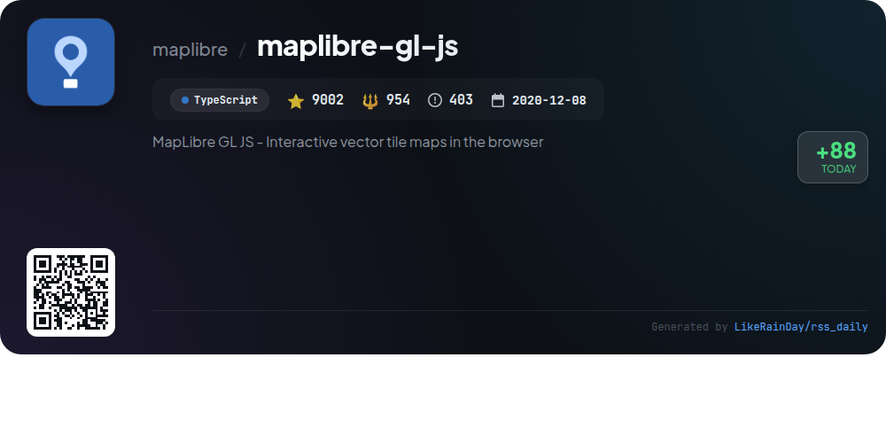

# 📊 🌟 GitHub Trending Daily - 2026-01-03

> > 📅 每日精选 GitHub 热门仓库 | 基于智能算法推荐

## 📋 Overview

**10** 个项目 | **221929** ⭐ | **25569** 🍴

**热门语言:** `TypeScript` (6) · `Rust` (2) · `Go` (1)

**更新时间:** 2026-01-03 18:37 UTC

**分类分布:**

- 🌟 每日 Top 10 精选 (10 项)

---

## 🌟 每日 Top 10 精选

### 1. [memos](https://github.com/usememos/memos)

> 🤖 **推荐理由**  
> *Memos is an open-source, self-hosted note-taking service prioritizing user control and privacy. Enjoy no ads, tracking, or fees. Features include easy demo access, comprehensive documentation, and Docker support.*

- ⭐ 49801 stars
- 💻 Go
- 📅 Updated: 2026-01-03

### 2. [vibe-kanban](https://github.com/BloopAI/vibe-kanban)

> 🤖 **推荐理由**  
> *Vibe Kanban enhances productivity with coding agents like Claude Code and Codex, offering a streamlined workflow and powerful features to maximize coding efficiency.*

- ⭐ 11835 stars
- 💻 Rust
- 📅 Updated: 2026-01-03

### 3. [newsnow](https://github.com/ourongxing/newsnow)

> 🤖 **推荐理由**  
> *newsnow offers an elegant UI for real-time trending news, GitHub OAuth login, customizable caching, adaptive scraping intervals, and supports MCP servers for optimal performance.*

- ⭐ 16237 stars
- 💻 TypeScript
- 📅 Updated: 2026-01-03

### 4. [nocodb](https://github.com/nocodb/nocodb)

> 🤖 **推荐理由**  
> *NocoDB is an open-source alternative to Airtable, enabling fast and easy online database creation. Key features include community support, extensive documentation, and integration options.*

- ⭐ 60187 stars
- 💻 TypeScript
- 📅 Updated: 2026-01-03

### 5. [cc-switch](https://github.com/farion1231/cc-switch)

> 🤖 **推荐理由**  
> *cc-switch is a cross-platform desktop assistant for Claude Code, Codex, and Gemini CLI. Built with Rust and Tauri, it supports Windows, macOS, and Linux, offering seamless integration and usability.*

- ⭐ 8774 stars
- 💻 Rust
- 📅 Updated: 2026-01-03

### 6. [thingsboard](https://github.com/thingsboard/thingsboard)

> 🤖 **推荐理由**  
> *ThingsBoard is an open-source IoT platform for device management, data collection, processing, and visualization. It supports on-premise, cloud, and live demo installations.*

- ⭐ 20863 stars
- 💻 Java
- 📅 Updated: 2026-01-03

### 7. [agents.md](https://github.com/agentsmd/agents.md)

> 🤖 **推荐理由**  
> *AGENTS.md is an open format for guiding coding agents, offering structured context and instructions for project setup, testing, and development, enhancing AI-assisted coding efficiency.*

- ⭐ 13978 stars
- 💻 TypeScript
- 📅 Updated: 2026-01-03

### 8. [zigbee2mqtt](https://github.com/Koenkk/zigbee2mqtt)

> 🤖 **推荐理由**  
> *Zigbee2MQTT is an open-source bridge that connects Zigbee devices to MQTT, eliminating the need for proprietary hubs. It supports numerous devices, offers reliable communication, and is actively maintained.*

- ⭐ 14541 stars
- 💻 TypeScript
- 📅 Updated: 2026-01-03

### 9. [nuclear](https://github.com/nukeop/nuclear)

> 🤖 **推荐理由**  
> *Nuclear is a streaming music player that finds free music, featuring a powerful plugin system, theming support, and an upcoming rewrite for better performance and auto-updates.*

- ⭐ 16711 stars
- 💻 TypeScript
- 📅 Updated: 2026-01-03

### 10. [maplibre-gl-js](https://github.com/maplibre/maplibre-gl-js)

> 🤖 **推荐理由**  
> *MapLibre GL JS offers interactive vector tile maps in the browser, built with TypeScript. Key features include high customization, performance, and open-source collaboration. Over 9000 stars.*

- ⭐ 9002 stars
- 💻 TypeScript
- 📅 Updated: 2026-01-03

---

## 📡 RSS订阅

通过 RSS 订阅，第一时间获取每日精选项目：

- 🔔 [RSS 订阅源] (../../daily-top.xml)
- 🔔 [每日简报] (../../GITHUB_TODAY_CN.md)
- 🔔 [每日 Top 10 精选](../../daily-top.xml)

---

*⚡ Powered by Smart Trending Algorithm | Generated at 2026-01-03 18:37:55 UTC
