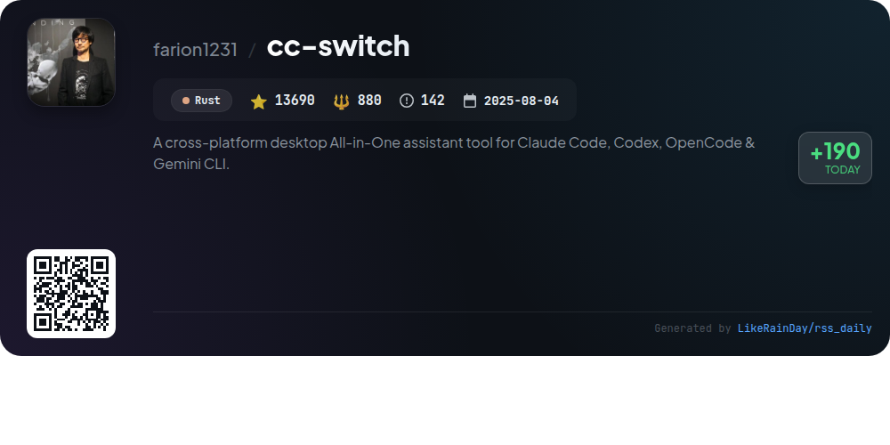
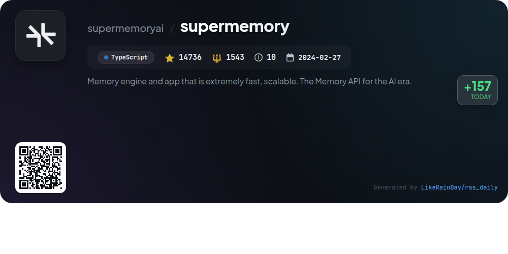
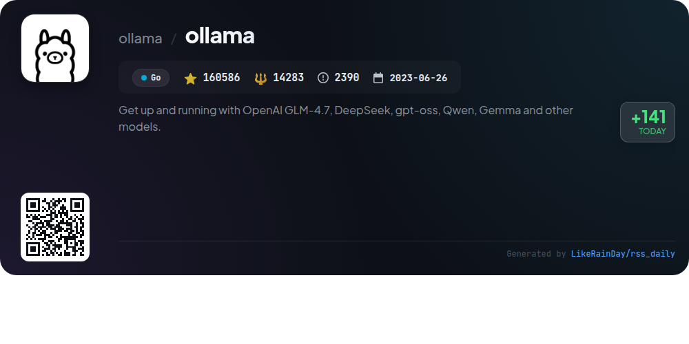
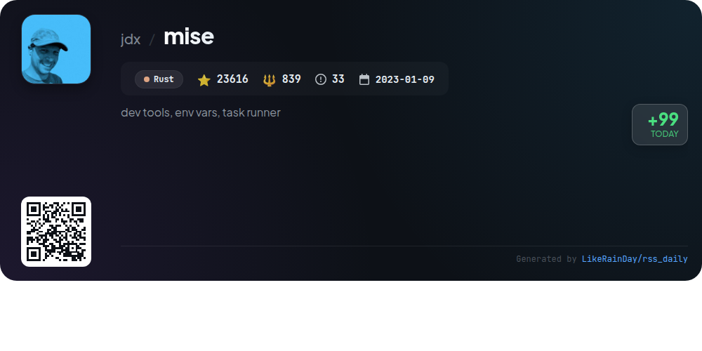
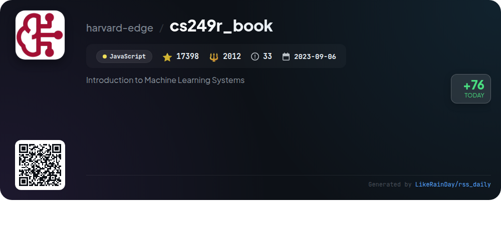
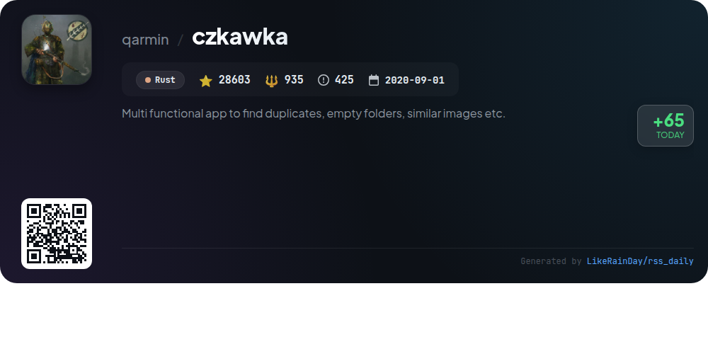

# 📊 🌟 GitHub Trending Daily - 2026-01-26

> > 📅 每日精选 GitHub 热门仓库 | 基于智能算法推荐

## 📋 Overview

**10** 个项目 | **390253** ⭐ | **34198** 🍴

**热门语言:** `Rust` (5) · `TypeScript` (2) · `Go` (2)

**更新时间:** 2026-01-26 02:29 UTC

**分类分布:**

- 🌟 每日 Top 10 精选 (10 项)

---

## 🌟 每日 Top 10 精选

### 1. [remotion](https://github.com/remotion-dev/remotion)

> 🤖 **推荐理由**  
> *Remotion is a powerful framework for programmatically creating videos using React and TypeScript, boasting over 30,000 stars on GitHub. It allows developers to leverage web technologies like CSS, Canvas, and SVG alongside React's component-based architecture to craft dynamic video content. Key features include reusable components, fast refresh, and integration with existing APIs. Users can easily get started with `npx create-video@latest`. Explore creations like GitHub Unwrapped and more in the Remotion Showcase. Documentation is available at remotion.dev/docs.*

- ⭐ 30749 stars
- 💻 TypeScript
- 📅 Updated: 2026-01-26

### 2. [goose](https://github.com/block/goose)

> 🤖 **推荐理由**  
> *Goose is an open-source AI agent designed to automate engineering tasks, offering capabilities beyond mere code suggestions. Built in Rust, it can autonomously build projects, execute and debug code, orchestrate workflows, and interact with APIs. Goose supports any LLM, allowing for multi-model configurations to optimize performance and costs. Available as both a desktop app and CLI, it seamlessly integrates with MCP servers. Ideal for developers looking to enhance productivity, Goose provides a flexible, extensible solution for various development needs.*

- ⭐ 28891 stars
- 💻 Rust
- 📅 Updated: 2026-01-26

### 3. [res-downloader](https://github.com/putyy/res-downloader)

> 🤖 **推荐理由**  
> *res-downloader is a cross-platform resource downloading tool built with Go and Wails, supporting Windows, macOS, and Linux. It allows users to easily download various types of content, including videos, audio, images, and live streams, from popular platforms like Douyin, Kuaishou, and QQ Music. Key features include a user-friendly interface, proxy settings for restricted access, and extensive resource type support. The tool is designed for simplicity, making resource extraction accessible to all users, while adhering to legal usage guidelines.*

- ⭐ 14518 stars
- 💻 Go
- 📅 Updated: 2026-01-26

### 4. [cc-switch](https://github.com/farion1231/cc-switch)

> 🤖 **推荐理由**  
> *cc-switch is a cross-platform desktop assistant tool for Claude Code, Codex, and Gemini CLI, built with Rust and Tauri. It features a dual-layer architecture for data management, a redesigned UI, and multi-language support (English, Chinese, Japanese). Key functionalities include seamless provider switching, skills and prompts management, and MCP server integration. Users benefit from API latency testing, auto-sync capabilities, and cloud sync setup. The project is actively supported by various partners, ensuring efficient AI coding experiences. With over 13,690 stars, it demonstrates strong community engagement.*

- ⭐ 13690 stars
- 💻 Rust
- 📅 Updated: 2026-01-26

### 5. [codex](https://github.com/openai/codex)

> 🤖 **推荐理由**  
> *Codex is a lightweight coding agent from OpenAI that operates locally in your terminal, designed for efficient coding assistance. With over 57,000 stars on GitHub, it can be easily installed via npm or Homebrew. Key features include integration with popular IDEs like VS Code, and the option to use it alongside your ChatGPT plan for enhanced functionality. Codex is written in Rust, ensuring performance and reliability. For cloud-based services, users can explore Codex Web at chatgpt.com/codex. Comprehensive documentation and contribution guidelines are available.*

- ⭐ 57466 stars
- 💻 Rust
- 📅 Updated: 2026-01-26

### 6. [supermemory](https://github.com/supermemoryai/supermemory)

> 🤖 **推荐理由**  
> *Supermemory is a fast and scalable memory engine designed as an AI second brain for organizing and saving crucial information. Key features include the ability to add memories from various formats (URLs, PDFs, text), chat with stored content, and seamless integration with major AI tools via Supermemory MCP. The project offers a browser extension for direct memory saving and a Raycast extension for efficient memory management. With over 14,736 stars on GitHub, Supermemory supports self-hosting and provides extensive API access for developers.*

- ⭐ 14736 stars
- 💻 TypeScript
- 📅 Updated: 2026-01-26

### 7. [ollama](https://github.com/ollama/ollama)

> 🤖 **推荐理由**  
> *Ollama is a powerful framework for running and managing large language models locally, including OpenAI GLM-4.7, DeepSeek, gpt-oss, and more. With seamless installation across macOS, Windows, and Linux, it supports a wide range of models through simple commands. Key features include model customization via Modelfiles, a REST API for integration, and community libraries such as ollama-python and ollama-js. Ollama also offers extensive community support, Docker compatibility, and various integrations, making it ideal for developers and researchers working with AI models.*

- ⭐ 160586 stars
- 💻 Go
- 📅 Updated: 2026-01-26

### 8. [mise](https://github.com/jdx/mise)

> 🤖 **推荐理由**  
> *Mise is a powerful development tool written in Rust, designed to streamline environment management, task execution, and tool installation. With over 23,600 stars on GitHub, it allows users to manage multiple programming languages and tools like Node.js, Python, and Terraform, similar to asdf or nvm. Mise also simplifies environment variable management per project directory, akin to direnv, and provides a task runner for building and testing projects. Its user-friendly features and robust documentation make it an essential tool for developers seeking efficiency in their workflows.*

- ⭐ 23616 stars
- 💻 Rust
- 📅 Updated: 2026-01-26

### 9. [cs249r_book](https://github.com/harvard-edge/cs249r_book)

> 🤖 **推荐理由**  
> *The cs249r_book project is an open-source resource for learning AI engineering, focusing on the design and deployment of machine learning systems. It features an interactive textbook, TinyTorch framework for building ML applications, and hands-on hardware kits for real-world deployment on devices like Arduino and Raspberry Pi. With over 17,000 stars, the project emphasizes practical learning through co-labs and benchmarking, aiming to establish AI engineering as a foundational discipline. A hardcopy edition is expected in 2026, further expanding its educational reach.*

- ⭐ 17398 stars
- 💻 JavaScript
- 📅 Updated: 2026-01-26

### 10. [czkawka](https://github.com/qarmin/czkawka)

> 🤖 **推荐理由**  
> *Czkawka is a powerful, multi-functional app designed in Rust to efficiently find and remove unnecessary files, including duplicates, empty folders, and similar images. With over 28,600 stars, it offers a memory-safe and fast solution across multiple platforms (Linux, Windows, macOS, FreeBSD). Core features include a user-friendly GUI (Krokiet), a CLI for automation, multilingual support, and various tools for file management, such as video optimization and Exif metadata removal. It prioritizes user privacy by not collecting any data and is open-source and free from ads.*

- ⭐ 28603 stars
- 💻 Rust
- 📅 Updated: 2026-01-26

---

## 📡 RSS订阅

通过 RSS 订阅，第一时间获取每日精选项目：

- 🔔 [RSS 订阅源] (../../daily-top.xml)
- 🔔 [每日简报] (../../GITHUB_TODAY_CN.md)
- 🔔 [每日 Top 10 精选](../../daily-top.xml)

---

*⚡ Powered by Smart Trending Algorithm | Generated at 2026-01-26 02:29:24 UTC
