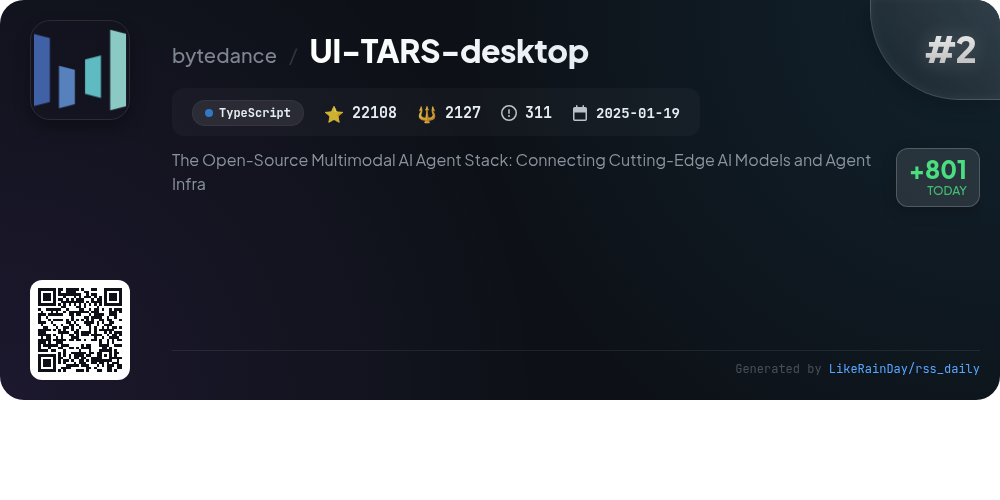
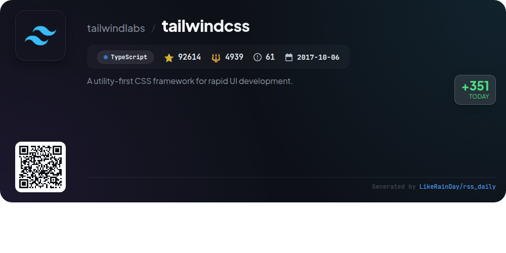
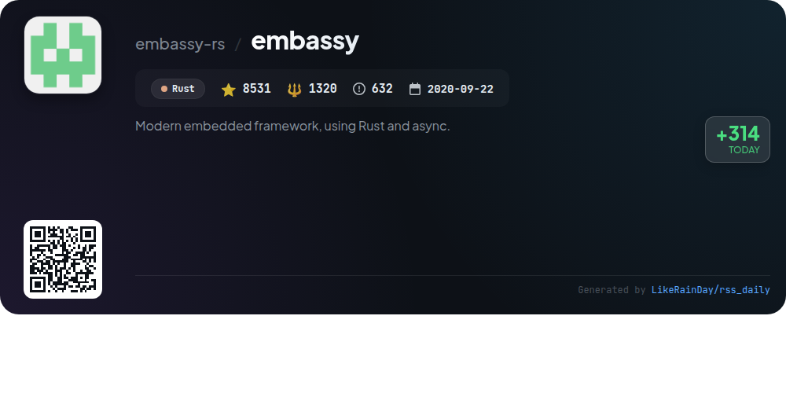
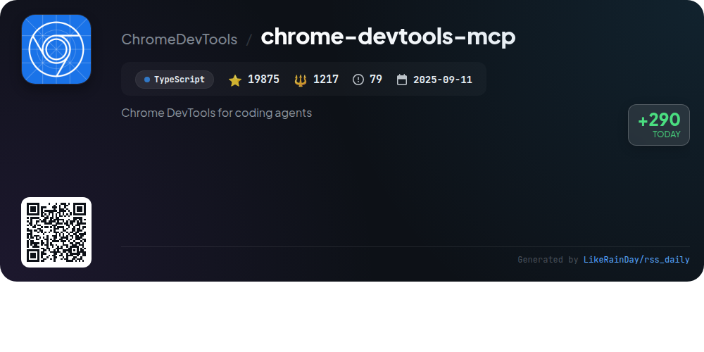
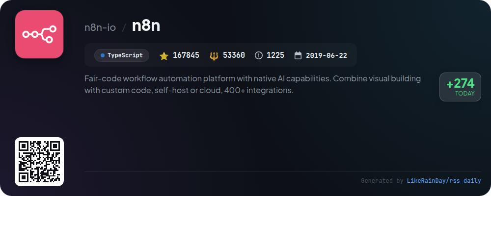
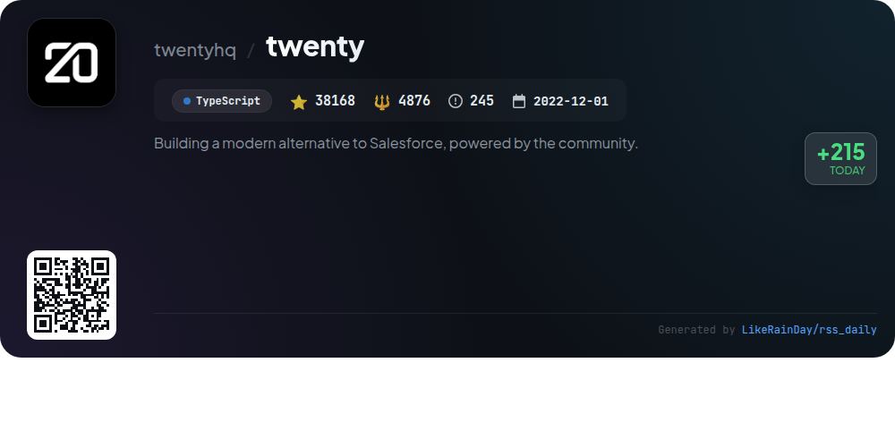
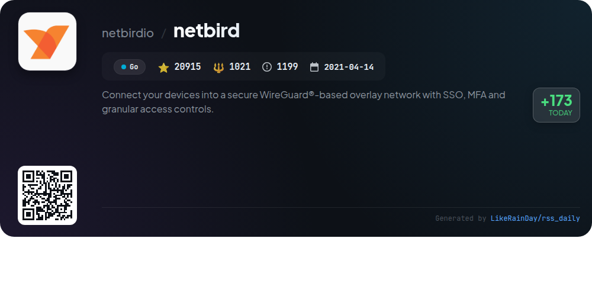
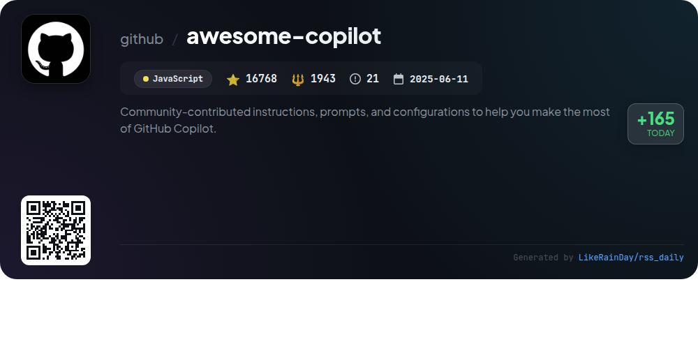

# 📊 🌟 GitHub Trending Daily - 2026-01-10

> > 📅 每日精选 GitHub 热门仓库 | 基于智能算法推荐

## 📋 Overview

**10** 个项目 | **459549** ⭐ | **76575** 🍴

**热门语言:** `TypeScript` (7) · `Rust` (1) · `JavaScript` (1)

**更新时间:** 2026-01-10 12:27 UTC

**分类分布:**

- 🌟 每日 Top 10 精选 (10 项)

---

## 🌟 每日 Top 10 精选

### 1. [opencode](https://github.com/anomalyco/opencode)

> 🤖 **推荐理由**  
> *OpenCode is an open-source AI coding agent built with TypeScript, boasting over 58,600 stars on GitHub. It features a unique dual-agent system, allowing users to switch between a full-access development agent and a read-only planning agent for safe code exploration. The project supports multiple installation methods, including desktop applications for macOS, Windows, and Linux. Designed for terminal enthusiasts, OpenCode emphasizes flexibility with provider-agnostic model support and a client/server architecture. Join the community on Discord for collaboration and updates.*

- ⭐ 58625 stars
- 💻 TypeScript
- 📅 Updated: 2026-01-10

### 2. [UI-TARS-desktop](https://github.com/bytedance/UI-TARS-desktop)

> 🤖 **推荐理由**  
> *UI-TARS-desktop is an open-source multimodal AI agent stack designed to enhance user experience through advanced GUI automation. Key features include natural language control powered by Vision-Language models, precise mouse and keyboard interactions, and cross-platform support for Windows, MacOS, and browsers. The application enables both local and remote operations, offering real-time feedback and visual recognition capabilities. With a focus on seamless integration with various tools, UI-TARS-desktop aims to simplify complex tasks and improve productivity.*

- ⭐ 22108 stars
- 💻 TypeScript
- 📅 Updated: 2026-01-10

### 3. [ConvertX](https://github.com/C4illin/ConvertX)

> 🤖 **推荐理由**  
> *ConvertX is a self-hosted online file converter supporting over 1000 formats, built with TypeScript, Bun, and Elysia. Key features include batch file processing, password protection, and multi-account support. It integrates various converters like Inkscape, FFmpeg, and LibreOffice for diverse file types including images, documents, and videos. The project is actively maintained with 14,100 stars on GitHub, offering Docker images for easy deployment. Ideal for users needing a robust, customizable file conversion solution.*

- ⭐ 14100 stars
- 💻 TypeScript
- 📅 Updated: 2026-01-10

### 4. [tailwindcss](https://github.com/tailwindlabs/tailwindcss)

> 🤖 **推荐理由**  
> *Tailwind CSS is a utility-first CSS framework designed for rapid UI development. With over 92,600 stars on GitHub, it empowers developers to build custom user interfaces efficiently using a set of pre-defined utility classes. Key features include responsive design, customization options, and a robust plugin ecosystem. The framework is built in TypeScript and offers extensive documentation for ease of use. Community support is available through GitHub discussions, and contributions are encouraged via a structured process. For more information, visit tailwindcss.com.*

- ⭐ 92614 stars
- 💻 TypeScript
- 📅 Updated: 2026-01-10

### 5. [embassy](https://github.com/embassy-rs/embassy)

> 🤖 **推荐理由**  
> *Embassy is a modern embedded framework for building safe, efficient applications in Rust, leveraging async programming for improved multitasking. Key features include hardware abstraction layers for various microcontrollers (STM32, nRF, RP2040, etc.), a robust networking stack (TCP, UDP, DHCP), Bluetooth support, and low-power operation with automatic core sleep. The framework eliminates the need for traditional RTOS, enabling simpler and faster development. With extensive documentation and examples, Embassy streamlines embedded programming while ensuring energy efficiency and real-time readiness.*

- ⭐ 8531 stars
- 💻 Rust
- 📅 Updated: 2026-01-10

### 6. [chrome-devtools-mcp](https://github.com/ChromeDevTools/chrome-devtools-mcp)

> 🤖 **推荐理由**  
> *Chrome DevTools MCP is a TypeScript-based project enabling coding agents like Gemini and Copilot to control and inspect live Chrome browsers. With 19,875 stars on GitHub, it serves as a Model-Context-Protocol server, facilitating reliable automation, in-depth debugging, and performance analysis through Chrome DevTools. Key features include performance insights, advanced browser debugging, and seamless automation with Puppeteer. It supports various configurations for different MCP clients and allows connecting to running Chrome instances for enhanced testing and debugging capabilities.*

- ⭐ 19875 stars
- 💻 TypeScript
- 📅 Updated: 2026-01-10

### 7. [n8n](https://github.com/n8n-io/n8n)

> 🤖 **推荐理由**  
> *n8n is a fair-code workflow automation platform designed for technical teams, combining the flexibility of code with the ease of a no-code interface. It boasts over 400 integrations and native AI capabilities, enabling users to create powerful automations while retaining full data control. Key features include the ability to write custom code, self-host or utilize cloud services, and access enterprise-level functionalities like advanced permissions and SSO. With an active community and extensive resources, n8n is ideal for building tailored workflows efficiently.*

- ⭐ 167845 stars
- 💻 TypeScript
- 📅 Updated: 2026-01-10

### 8. [twenty](https://github.com/twentyhq/twenty)

> 🤖 **推荐理由**  
> *Twenty is an open-source CRM designed as a modern alternative to Salesforce, emphasizing community-driven development. Key features include customizable layouts, object and field management, role-based permissions, and workflow automation. The platform supports integration with emails, calendar events, and files, providing a cohesive user experience inspired by tools like Notion and Airtable. Built with TypeScript and a robust tech stack including NestJS and PostgreSQL, Twenty fosters a collaborative ecosystem for developers. Join the community via Discord and contribute to its growth.*

- ⭐ 38168 stars
- 💻 TypeScript
- 📅 Updated: 2026-01-10

### 9. [netbird](https://github.com/netbirdio/netbird)

> 🤖 **推荐理由**  
> *NetBird is an open-source project that enables secure connections between devices using a WireGuard®-based overlay network, featuring Single Sign-On (SSO), Multi-Factor Authentication (MFA), and granular access controls. Key features include peer-to-peer connectivity, automatic configuration, a user-friendly admin UI, activity logging, and support for various platforms (Linux, Mac, Windows, iOS, Android). NetBird simplifies remote access management while enhancing security through device posture checks and public API integration. Join the community for support and resources at netbird.io.*

- ⭐ 20915 stars
- 💻 Go
- 📅 Updated: 2026-01-10

### 10. [awesome-copilot](https://github.com/github/awesome-copilot)

> 🤖 **推荐理由**  
> *Awesome Copilot is a community-driven repository designed to enhance your GitHub Copilot experience with specialized agents, prompts, and instructions. Key features include custom agents for specific workflows, task-focused prompts for coding and documentation, and comprehensive instructions for coding standards. The MCP Server enables easy integration of these resources into your editor. With over 16,000 stars, it offers curated collections and continuous updates, promoting productivity and best practices across various programming domains. Contributions are welcomed to expand this toolkit.*

- ⭐ 16768 stars
- 💻 JavaScript
- 📅 Updated: 2026-01-10

---

## 📡 RSS订阅

通过 RSS 订阅，第一时间获取每日精选项目：

- 🔔 [RSS 订阅源] (../../daily-top.xml)
- 🔔 [每日简报] (../../GITHUB_TODAY_CN.md)
- 🔔 [每日 Top 10 精选](../../daily-top.xml)

---

*⚡ Powered by Smart Trending Algorithm | Generated at 2026-01-10 12:27:14 UTC
