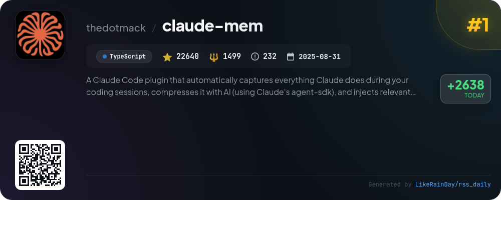
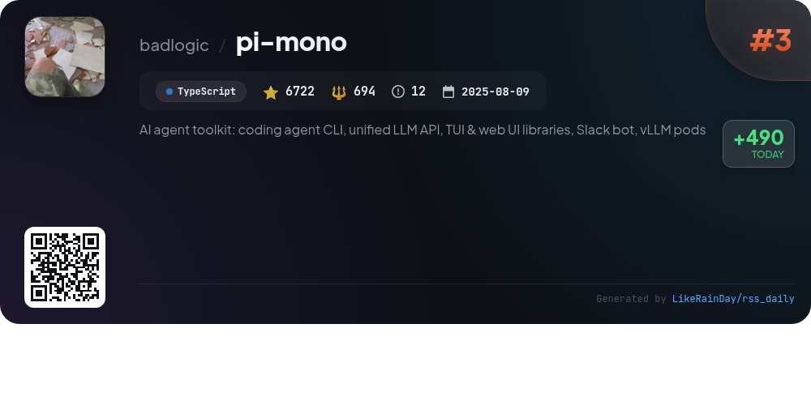
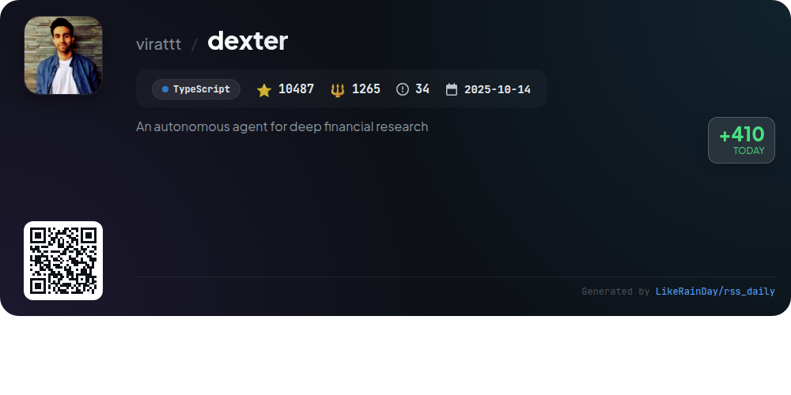
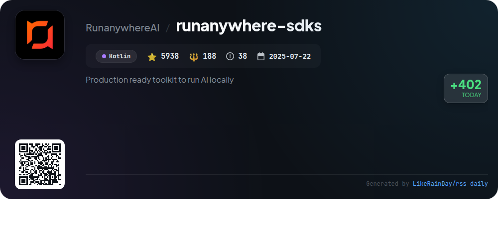
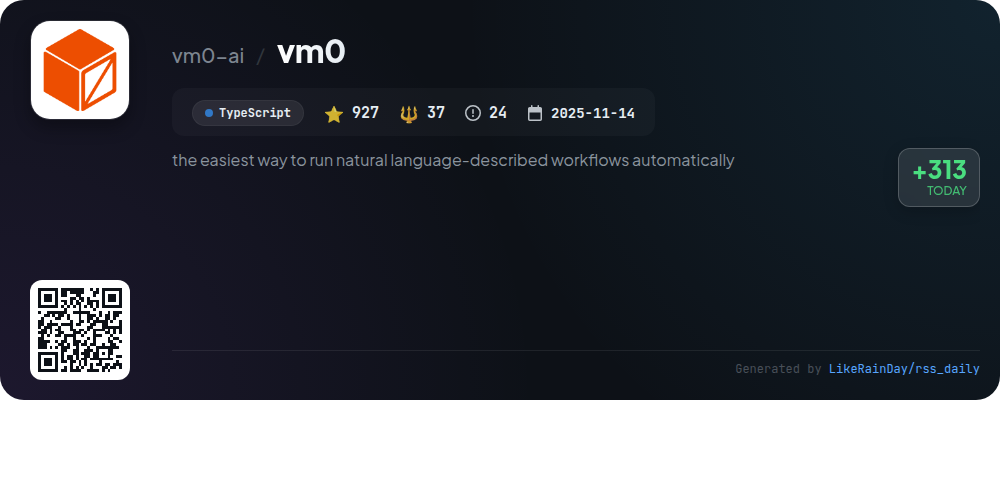
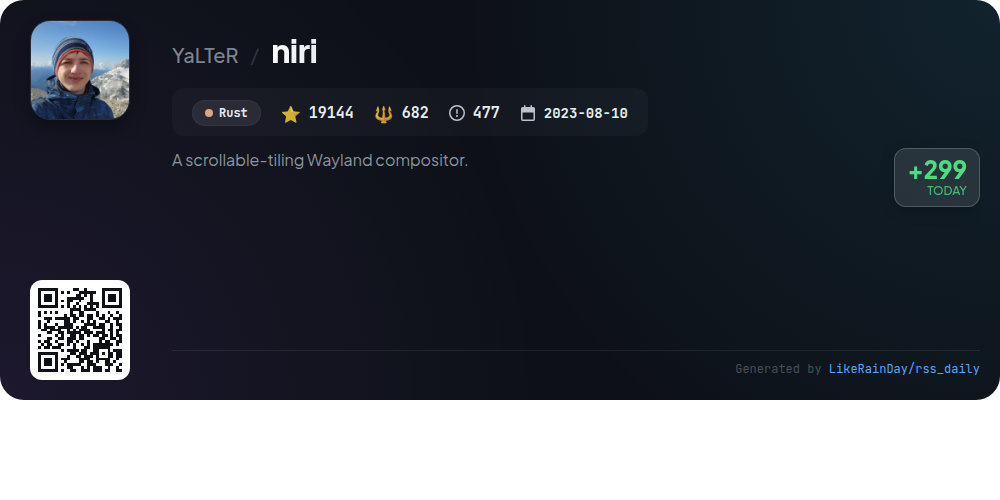
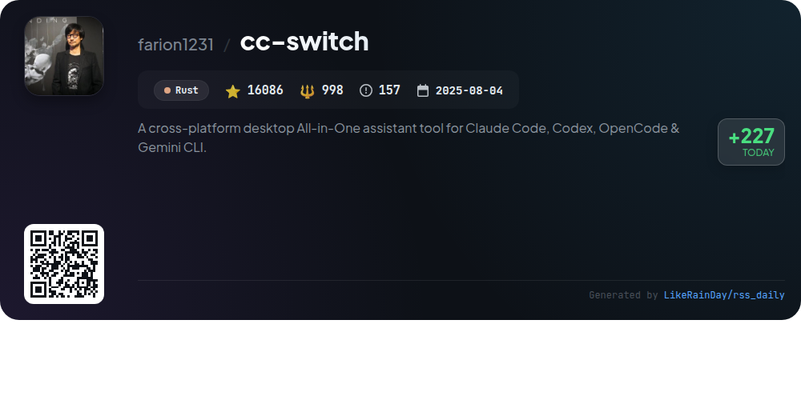
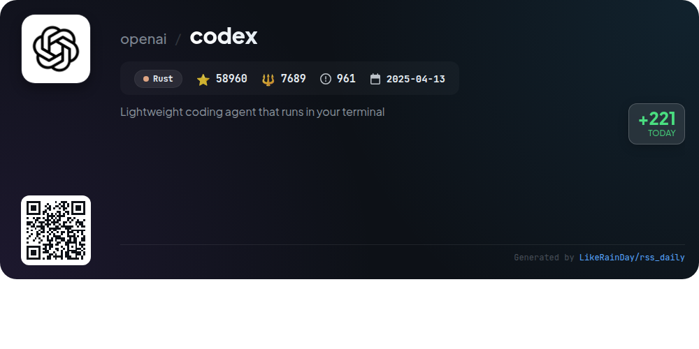

# 📊 🌟 GitHub Trending Daily - 2026-02-05

> > 📅 每日精选 GitHub 热门仓库 | 基于智能算法推荐

## 📋 Overview

**10** 个项目 | **168768** ⭐ | **15765** 🍴

**热门语言:** `TypeScript` (6) · `Rust` (3) · `Kotlin` (1)

**更新时间:** 2026-02-05 02:41 UTC

**分类分布:**

- 🌟 每日 Top 10 精选 (10 项)

---

## 🌟 每日 Top 10 精选

### 1. [claude-mem](https://github.com/thedotmack/claude-mem)

> 🤖 **推荐理由**  
> *Claude-Mem is a TypeScript-based plugin for Claude Code that captures and compresses coding session data, enhancing continuity in future sessions. Key features include persistent memory for context retention, a skill-based search tool for querying project history, and a web viewer UI for real-time memory access. It offers privacy controls, automatic operation, and citations for past observations. With 22,640 stars, it supports various languages and provides a beta channel for experimental features. Ideal for developers seeking efficient memory management in coding workflows.*

- ⭐ 22640 stars
- 💻 TypeScript
- 📅 Updated: 2026-02-05

### 2. [UI-TARS-desktop](https://github.com/bytedance/UI-TARS-desktop)

> 🤖 **推荐理由**  
> *UI-TARS-desktop is an open-source multimodal AI agent stack designed to enhance user interaction through advanced AI models. With over 26,000 stars on GitHub, it offers a native GUI agent that supports natural language control, visual recognition, and precise mouse/keyboard operations across platforms (Windows, MacOS, Browser). Key features include one-click CLI execution, hybrid browser control, event stream integration, and real-time feedback. The project also includes local and remote operators for seamless automation, making it ideal for various applications in task completion and GUI management.*

- ⭐ 26196 stars
- 💻 TypeScript
- 📅 Updated: 2026-02-05

### 3. [pi-mono](https://github.com/badlogic/pi-mono)

> 🤖 **推荐理由**  
> *pi-mono is an AI agent toolkit designed for building and managing AI agents and LLM deployments. Key features include a unified LLM API supporting multiple providers (OpenAI, Anthropic, Google, etc.), an interactive coding agent CLI, Slack bot integration for message delegation, and UI libraries for terminal and web applications. The toolkit also offers CLI management for vLLM deployments on GPU pods. With over 6,700 stars on GitHub, pi-mono is a robust solution for developers looking to leverage AI capabilities efficiently.*

- ⭐ 6722 stars
- 💻 TypeScript
- 📅 Updated: 2026-02-05

### 4. [dexter](https://github.com/virattt/dexter)

> 🤖 **推荐理由**  
> *Dexter is an autonomous financial research agent designed to analyze complex financial questions through intelligent task planning and real-time market data. It autonomously executes research steps, validates its findings, and refines results for accuracy. Key features include structured research plans, access to financial datasets, and built-in safety measures to prevent runaway execution. With support for real-time data and debugging capabilities, Dexter aims to deliver confident, data-backed financial insights efficiently. This TypeScript project has garnered over 10,487 stars on GitHub.*

- ⭐ 10487 stars
- 💻 TypeScript
- 📅 Updated: 2026-02-05

### 5. [runanywhere-sdks](https://github.com/RunanywhereAI/runanywhere-sdks)

> 🤖 **推荐理由**  
> *RunAnywhere is a production-ready toolkit for implementing on-device AI in mobile apps, allowing users to run large language models (LLMs), speech-to-text, and text-to-speech functionalities locally—ensuring privacy and speed. With stable SDKs for Swift (iOS/macOS) and Kotlin (Android), as well as beta support for React Native and Flutter, developers can easily integrate AI capabilities without relying on cloud services. Key features include a voice assistant pipeline and multiple model support, enabling seamless AI interactions in various applications.*

- ⭐ 5938 stars
- 💻 Kotlin
- 📅 Updated: 2026-02-05

### 6. [vm0](https://github.com/vm0-ai/vm0)

> 🤖 **推荐理由**  
> *VM0 is an innovative platform that enables users to automate natural language-described workflows in a secure cloud sandbox environment. Key features include seamless integration with over 35,000 skills and 70+ SaaS applications, ensuring versatility for various tasks. Users can easily onboard and manage workflows with persistence, allowing for session continuation and versioning. VM0 provides observability through logs and metrics, facilitating performance monitoring. With a quick setup process, users can be operational in minutes. For more details, visit the documentation at docs.vm0.ai.*

- ⭐ 927 stars
- 💻 TypeScript
- 📅 Updated: 2026-02-05

### 7. [niri](https://github.com/YaLTeR/niri)

> 🤖 **推荐理由**  
> *Niri is a scrollable-tiling Wayland compositor built in Rust, offering a unique approach to window management with dynamic workspaces and an infinite horizontal layout. Key features include independent monitor management, a comprehensive overview, built-in screenshot tools, and customizable layouts with gradient borders and animations. Niri supports multi-monitor setups, touchpad gestures, and accessibility features. Ideal for users seeking a modern, efficient, and visually appealing Wayland experience, Niri has garnered 19,144 stars on GitHub, indicating its popularity and robust community support.*

- ⭐ 19144 stars
- 💻 Rust
- 📅 Updated: 2026-02-05

### 8. [cc-switch](https://github.com/farion1231/cc-switch)

> 🤖 **推荐理由**  
> *cc-switch is a cross-platform desktop assistant tool designed for Claude Code, Codex, and Gemini CLI, built with Rust and Tauri. It boasts over 16,000 stars on GitHub and features a dual-layer storage architecture using SQLite and JSON, enabling cloud sync capabilities. Key highlights include multi-provider management, prompt and skills management systems, and a redesigned user interface with Japanese support. The application supports Windows, macOS, and Linux, and offers fast API endpoint testing, auto-launch on startup, and a system tray for quick provider switching.*

- ⭐ 16086 stars
- 💻 Rust
- 📅 Updated: 2026-02-05

### 9. [codex](https://github.com/openai/codex)

> 🤖 **推荐理由**  
> *Codex is a lightweight coding agent from OpenAI that operates directly in your terminal, designed to enhance coding efficiency. With over 58,960 stars on GitHub, it supports installation via npm or Homebrew, allowing easy setup. Users can sign in with their ChatGPT account for enhanced functionality as part of various subscription plans. Codex also integrates with popular IDEs like VS Code. For cloud-based solutions, users can access Codex Web at chatgpt.com/codex. Comprehensive documentation and contribution guidelines are available for developers.*

- ⭐ 58960 stars
- 💻 Rust
- 📅 Updated: 2026-02-05

### 10. [Maestro](https://github.com/pedramamini/Maestro)

> 🤖 **推荐理由**  
> *Maestro is a cross-platform desktop app designed for orchestrating AI agents and managing multiple projects simultaneously. Key features include parallel agent management, Auto Run for task automation, and a collaborative group chat for coordinating AI discussions. It supports major coding assistants like Claude Code and OpenAI Codex, with a focus on a keyboard-first design and powerful integrations like Git. Additional functionalities include a command-line interface, mobile remote control, and analytics dashboards for usage tracking. Join the community on Discord for support and updates.*

- ⭐ 1668 stars
- 💻 TypeScript
- 📅 Updated: 2026-02-05

---

## 📡 RSS订阅

通过 RSS 订阅，第一时间获取每日精选项目：

- 🔔 [RSS 订阅源] (../../daily-top.xml)
- 🔔 [每日简报] (../../GITHUB_TODAY_CN.md)
- 🔔 [每日 Top 10 精选](../../daily-top.xml)

---

*⚡ Powered by Smart Trending Algorithm | Generated at 2026-02-05 02:41:04 UTC
