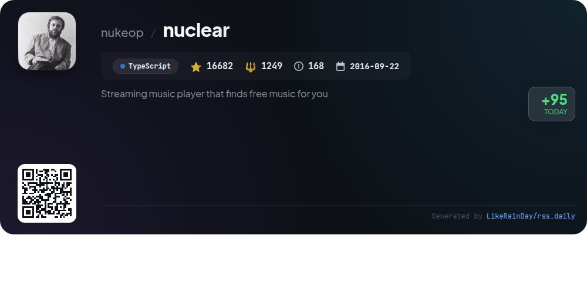

# 📊 🌟 GitHub Trending Daily - 2026-01-03

> > 📅 每日精选 GitHub 热门仓库 | 基于智能算法推荐

## 📋 Overview

**10** 个项目 | **214173** ⭐ | **24628** 🍴

**热门语言:** `TypeScript` (5) · `Rust` (2) · `Go` (2)

**更新时间:** 2026-01-03 15:21 UTC

**分类分布:**

- 🌟 每日 Top 10 精选 (10 项)

---

## 🌟 每日 Top 10 精选

### 1. [memos](https://github.com/usememos/memos)

> 🤖 **推荐理由**  
> *Memos is an open-source, self-hosted note-taking service prioritizing user privacy with no ads or subscriptions. Enjoy full control over your data, with easy demo access and comprehensive documentation.*

- ⭐ 49564 stars
- 💻 Go
- 📅 Updated: 2026-01-03

### 2. [vibe-kanban](https://github.com/BloopAI/vibe-kanban)

> 🤖 **推荐理由**  
> *Vibe Kanban enhances productivity with coding agents like Claude Code and Codex. Built in Rust, it offers efficient project management and seamless integration. Join 11,753 stars on GitHub!*

- ⭐ 11753 stars
- 💻 Rust
- 📅 Updated: 2026-01-03

### 3. [newsnow](https://github.com/ourongxing/newsnow)

> 🤖 **推荐理由**  
> *NewsNow offers an elegant UI for real-time trending news, GitHub OAuth login, adaptive scraping, and customizable MCP server support, ensuring an optimized reading experience.*

- ⭐ 16208 stars
- 💻 TypeScript
- 📅 Updated: 2026-01-03

### 4. [nocodb](https://github.com/nocodb/nocodb)

> 🤖 **推荐理由**  
> *NocoDB is an open-source Airtable alternative, enabling easy online database creation. Key features include a user-friendly interface, community support, and extensive documentation.*

- ⭐ 60141 stars
- 💻 TypeScript
- 📅 Updated: 2026-01-03

### 5. [cc-switch](https://github.com/farion1231/cc-switch)

> 🤖 **推荐理由**  
> *cc-switch is a cross-platform assistant tool for Claude Code, Codex & Gemini CLI, built with Rust and Tauri. It supports Windows, macOS, and Linux, offering seamless code assistance and integration.*

- ⭐ 8748 stars
- 💻 Rust
- 📅 Updated: 2026-01-03

### 6. [qui](https://github.com/autobrr/qui)

> 🤖 **推荐理由**  
> *
## qui

**Description:** A fast, single-binary qBittorrent web UI: manage multiple instances, automate torrent workflows, and cross-seed across trackers. Go + React.

**Key Metrics:**
- ⭐ Stars: 1717
- 🍴 Forks: 47
- 💻 Language: Go
- 📅 Updated: 2026-01-03
- 🔗 [View Repository](https://github.com/autobrr/qui)

**Highlights:**
🔥 Popular project (1000+ stars)
✨ Recently updated (within 7 days)

**Topics:** cross-seed, cross-seeding, go, golang, libtorrent, qbit, qbittorrent, workflows
*

- ⭐ 1717 stars
- 🍴 47 forks
- 💻 Go
- 📅 Updated: 2026-01-03

### 7. [thingsboard](https://github.com/thingsboard/thingsboard)

> 🤖 **推荐理由**  
> *ThingsBoard is an open-source IoT platform for device management, data collection, processing, and visualization, offering on-premise, cloud, and live demo options.*

- ⭐ 20860 stars
- 💻 Java
- 📅 Updated: 2026-01-03

### 8. [agents.md](https://github.com/agentsmd/agents.md)

> 🤖 **推荐理由**  
> *AGENTS.md is an open format for guiding AI coding agents, offering structured context and instructions for projects. It simplifies setup and testing with clear environmental tips and commands.*

- ⭐ 13961 stars
- 💻 TypeScript
- 📅 Updated: 2026-01-03

### 9. [zigbee2mqtt](https://github.com/Koenkk/zigbee2mqtt)

> 🤖 **推荐理由**  
> *Zigbee2MQTT bridges Zigbee devices to MQTT, eliminating proprietary hubs. Key features include extensive device support, easy configuration, and active community contributions. Stars: 14,539.*

- ⭐ 14539 stars
- 💻 TypeScript
- 📅 Updated: 2026-01-03

### 10. [nuclear](https://github.com/nukeop/nuclear)

> 🤖 **推荐理由**  
> *Nuclear is a streaming music player that sources free music, featuring a powerful plugin system, theming support, and a transition to Tauri for improved performance. Auto-update will enhance usability.*

- ⭐ 16682 stars
- 💻 TypeScript
- 📅 Updated: 2026-01-03

---

## 📡 RSS订阅

通过 RSS 订阅，第一时间获取每日精选项目：

- 🔔 [RSS 订阅源] (../../daily-top.xml)
- 🔔 [每日简报] (../../GITHUB_TODAY_CN.md)
- 🔔 [每日 Top 10 精选](../../daily-top.xml)

---

*⚡ Powered by Smart Trending Algorithm | Generated at 2026-01-03 15:21:52 UTC
