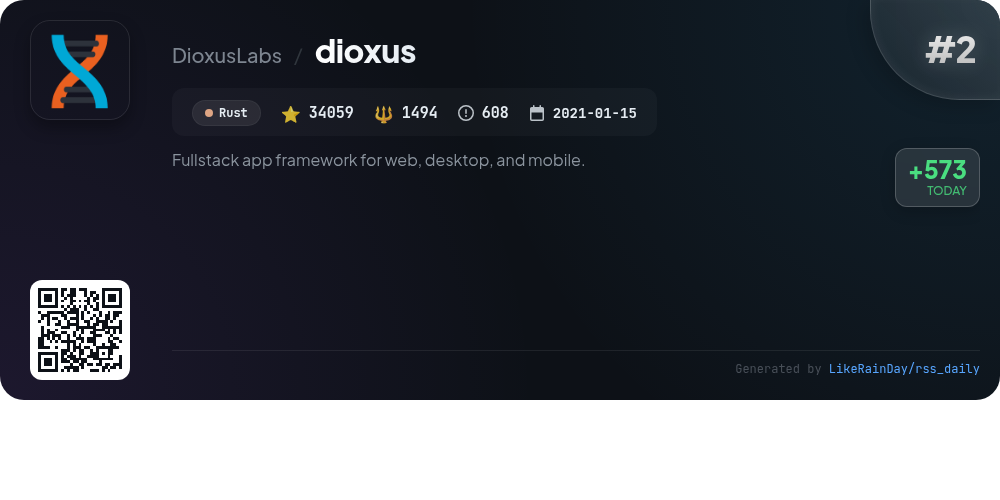
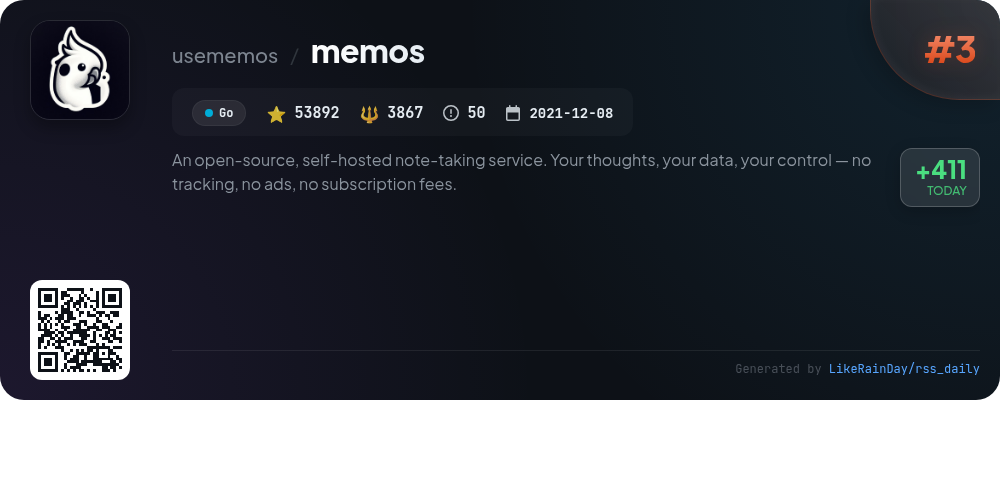
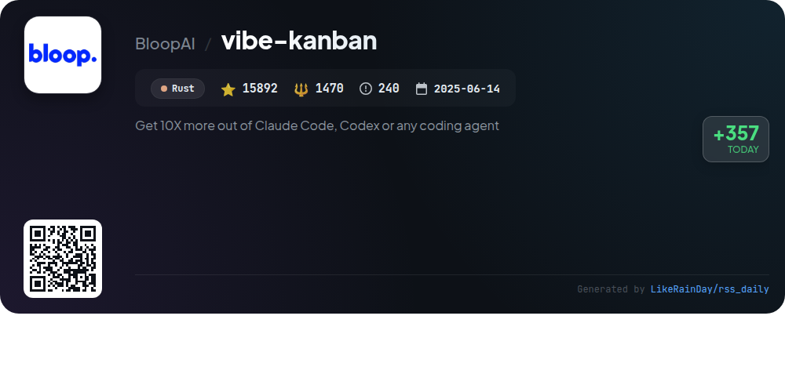
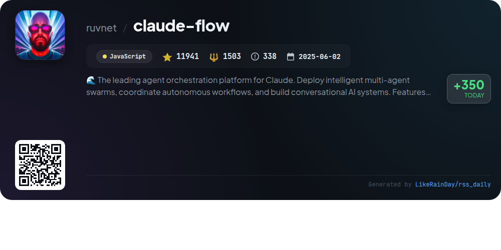
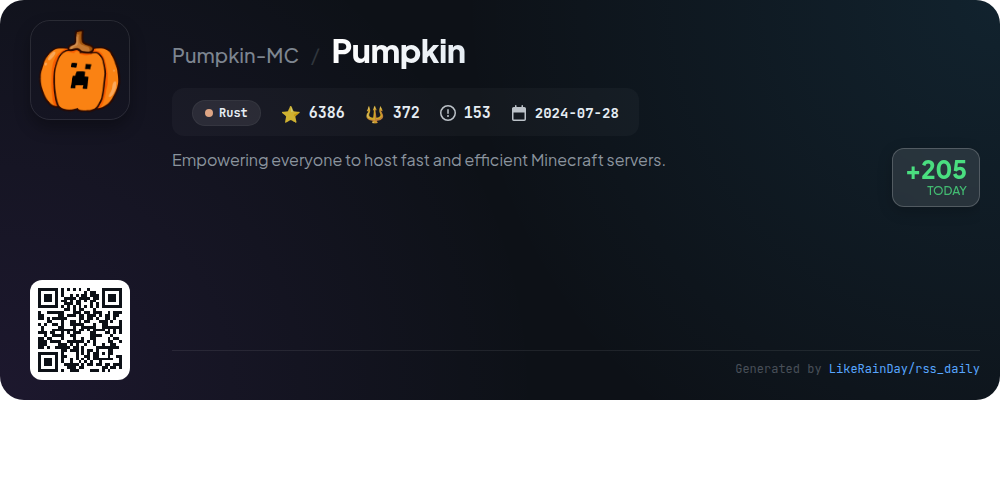
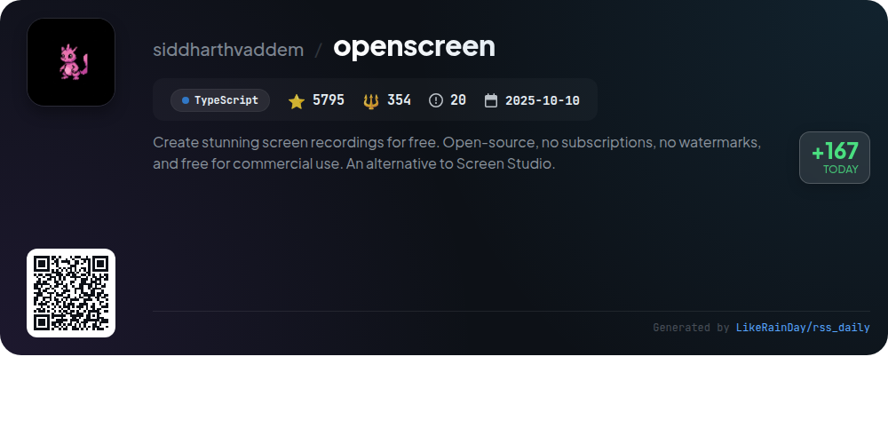
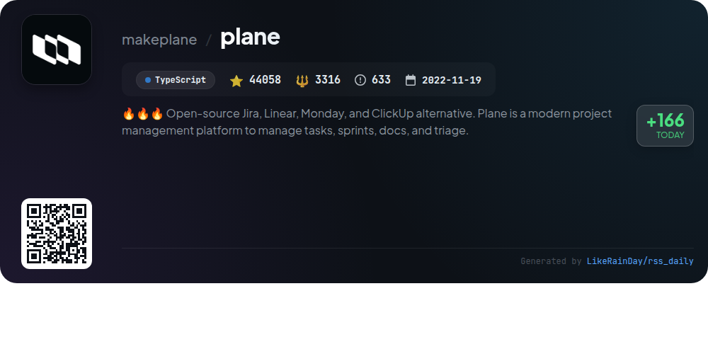
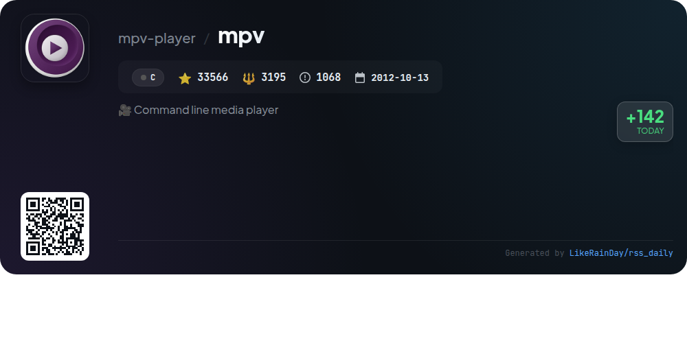
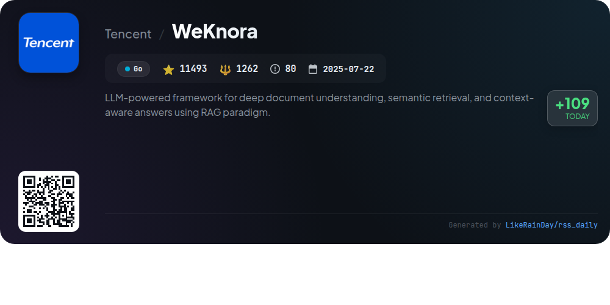

# 📊 🌟 GitHub Trending Daily - 2026-01-14

> > 📅 每日精选 GitHub 热门仓库 | 基于智能算法推荐

## 📋 Overview

**10** 个项目 | **283845** ⭐ | **22619** 🍴

**热门语言:** `TypeScript` (3) · `Rust` (3) · `Go` (2)

**更新时间:** 2026-01-14 01:09 UTC

**分类分布:**

- 🌟 每日 Top 10 精选 (10 项)

---

## 🌟 每日 Top 10 精选

### 1. [opencode](https://github.com/anomalyco/opencode)

> 🤖 **推荐理由**  
> *OpenCode is an open-source AI coding agent designed for developers, built in TypeScript, with over 67,000 stars on GitHub. It features two built-in agents: the "build" agent for full development access and the "plan" agent for read-only code exploration. OpenCode supports various installation methods, including desktop applications for macOS, Windows, and Linux. Key highlights include being provider-agnostic, offering out-of-the-box LSP support, and a focus on terminal user interface (TUI). Join the community on Discord for collaboration and support.*

- ⭐ 67179 stars
- 💻 TypeScript
- 📅 Updated: 2026-01-14

### 2. [dioxus](https://github.com/DioxusLabs/dioxus)

> 🤖 **推荐理由**  
> *Dioxus is a fullstack app framework built in Rust, enabling developers to create cross-platform applications for web, desktop, and mobile from a single codebase. Key features include ergonomic state management, integrated hot-reloading, and a robust CLI for deployment. It supports server-side rendering, WebSockets, and customizable components, making it ideal for both frontend and backend development. With a focus on performance, Dioxus ensures minimal app sizes and quick iterations. Its community-driven approach and extensive documentation foster collaboration and ease of use.*

- ⭐ 34004 stars
- 💻 Rust
- 📅 Updated: 2026-01-14

### 3. [memos](https://github.com/usememos/memos)

> 🤖 **推荐理由**  
> *Memos is an open-source, self-hosted note-taking service prioritizing privacy and data ownership. With no tracking, ads, or subscription fees, it offers users full control over their information. Key features include full markdown support, blazing-fast performance powered by Go and React, and simple deployment via Docker. Memos provides a clean, responsive interface, extensive REST and gRPC APIs for integration, and supports various databases. Ideal for personal notes or team wikis, Memos ensures your data remains secure and accessible on your own infrastructure.*

- ⭐ 53892 stars
- 💻 Go
- 📅 Updated: 2026-01-14

### 4. [vibe-kanban](https://github.com/BloopAI/vibe-kanban)

> 🤖 **推荐理由**  
> *Vibe Kanban is a powerful Rust-based tool designed to optimize the use of AI coding agents like Claude Code and Codex, enabling developers to enhance productivity by 10X. Key features include seamless switching between coding agents, task orchestration in parallel or sequence, easy work review, and remote project access via SSH. It centralizes configuration for multiple agents while providing real-time task tracking. With strong community support via GitHub Discussions and detailed documentation, Vibe Kanban simplifies the coding workflow for modern developers.*

- ⭐ 15655 stars
- 💻 Rust
- 📅 Updated: 2026-01-14

### 5. [claude-flow](https://github.com/ruvnet/claude-flow)

> 🤖 **推荐理由**  
> *Claude-Flow v2.7.0 is a leading enterprise AI orchestration platform that enables the deployment of intelligent multi-agent swarms and autonomous workflows. Key features include 25 Claude Skills for natural language activation, AgentDB v1.3.9 for enhanced vector search performance (96x-164x faster), a hybrid memory system, and a comprehensive toolkit of 100 MCP tools for automation. With persistent memory, dynamic agent architecture, and seamless GitHub integration, Claude-Flow streamlines AI-powered development, making it the top choice for agent-based frameworks.*

- ⭐ 11909 stars
- 💻 JavaScript
- 📅 Updated: 2026-01-14

### 6. [Pumpkin](https://github.com/Pumpkin-MC/Pumpkin)

> 🤖 **推荐理由**  
> *Pumpkin is a Rust-based Minecraft server designed for speed, efficiency, and customization, garnering over 6,300 stars. Key features include multi-threaded performance, compatibility with the latest Java and Bedrock versions, robust security measures, and extensive configurability. It supports essential server functions like world loading, player management, and entity interactions while allowing plugin development. Currently in active development, Pumpkin aims to enhance player experience while adhering to Vanilla mechanics. For more information, visit the documentation at pumpkinmc.org.*

- ⭐ 6386 stars
- 💻 Rust
- 📅 Updated: 2026-01-14

### 7. [openscreen](https://github.com/siddharthvaddem/openscreen)

> 🤖 **推荐理由**  
> *OpenScreen is a free, open-source screen recording tool, offering an accessible alternative to Screen Studio without subscriptions or watermarks. Key features include whole-screen or app-specific recording, customizable manual zooms, video cropping, background personalization, motion blur, annotations, and various export options. Designed for personal and commercial use, OpenScreen is user-friendly and focuses on essential functionality. Built with Electron and TypeScript, it is currently in beta, inviting contributions and feedback from the community.*

- ⭐ 5752 stars
- 💻 TypeScript
- 📅 Updated: 2026-01-14

### 8. [plane](https://github.com/makeplane/plane)

> 🤖 **推荐理由**  
> *Plane is an open-source project management platform designed as an alternative to Jira, Linear, Monday, and ClickUp, boasting over 44,000 stars on GitHub. It enables teams to efficiently manage tasks, sprints, and documentation. Key features include customizable work items, cycle tracking with burn-down charts, modular project organization, tailored views, and real-time analytics. Users can choose between a cloud-based solution or self-hosting options using Docker or Kubernetes. Engage with the community through Discord and GitHub discussions for support and collaboration.*

- ⭐ 44009 stars
- 💻 TypeScript
- 📅 Updated: 2026-01-14

### 9. [mpv](https://github.com/mpv-player/mpv)

> 🤖 **推荐理由**  
> *mpv is a powerful command-line media player that supports a wide range of media formats, audio/video codecs, and subtitles. With over 33,000 stars on GitHub, it emphasizes performance and flexibility, allowing users to enable hardware decoding and customize playback options. Key features include a robust API, user script support, and detailed documentation through a comprehensive wiki and manual. Developed from the MPlayer project, mpv maintains regular releases and encourages community contributions via GitHub and IRC channels.*

- ⭐ 33566 stars
- 💻 C
- 📅 Updated: 2026-01-14

### 10. [WeKnora](https://github.com/Tencent/WeKnora)

> 🤖 **推荐理由**  
> *WeKnora is a powerful LLM-driven framework for deep document understanding and semantic retrieval, utilizing the Retrieval-Augmented Generation (RAG) paradigm. It features a modular architecture with multimodal preprocessing, intelligent retrieval, and context-aware Q&A capabilities. Key highlights include Agent Mode for enhanced summary reporting, support for various knowledge base types, flexible document parsing (PDF, Word, images), and integration with web search tools. WeKnora is designed for applications in enterprise knowledge management, academic research, technical support, and more, ensuring secure and efficient data handling.*

- ⭐ 11493 stars
- 💻 Go
- 📅 Updated: 2026-01-14

---

## 📡 RSS订阅

通过 RSS 订阅，第一时间获取每日精选项目：

- 🔔 [RSS 订阅源] (../../daily-top.xml)
- 🔔 [每日简报] (../../GITHUB_TODAY_CN.md)
- 🔔 [每日 Top 10 精选](../../daily-top.xml)

---

*⚡ Powered by Smart Trending Algorithm | Generated at 2026-01-14 01:09:09 UTC
