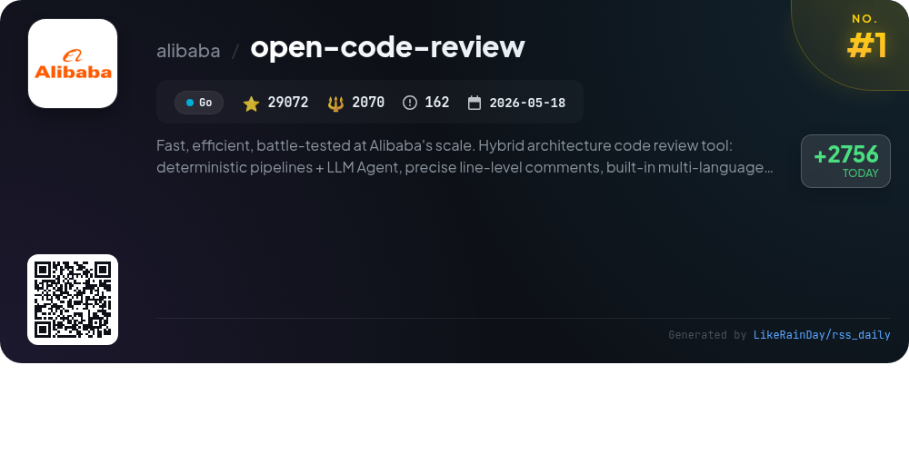
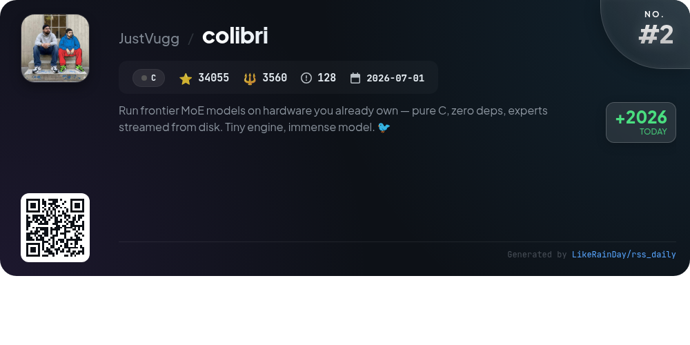
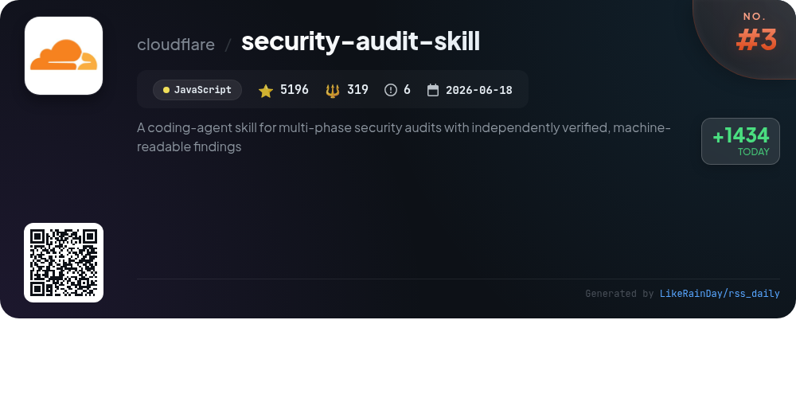
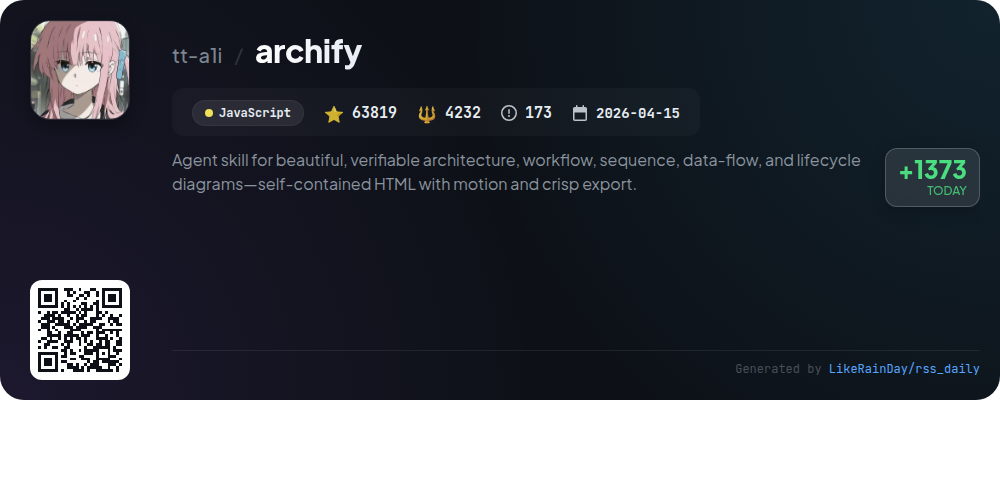
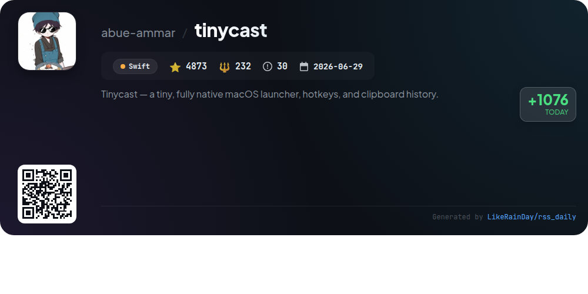
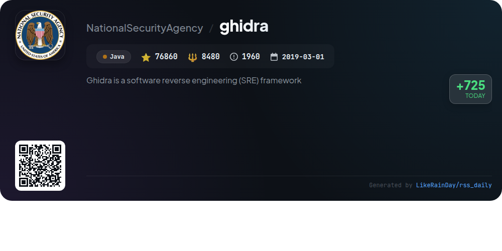
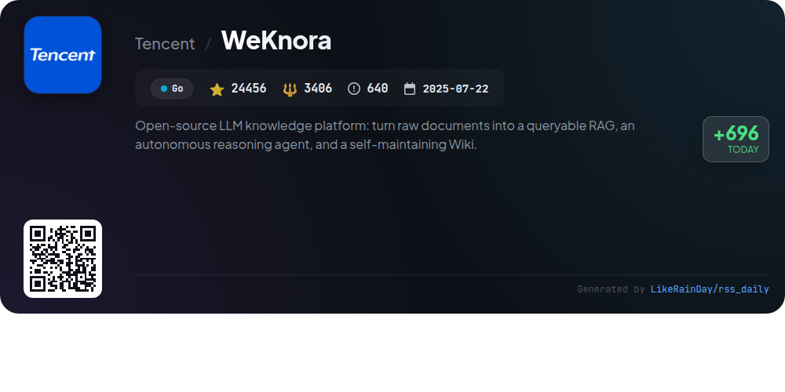
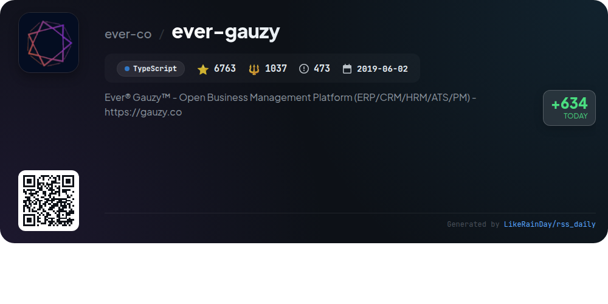
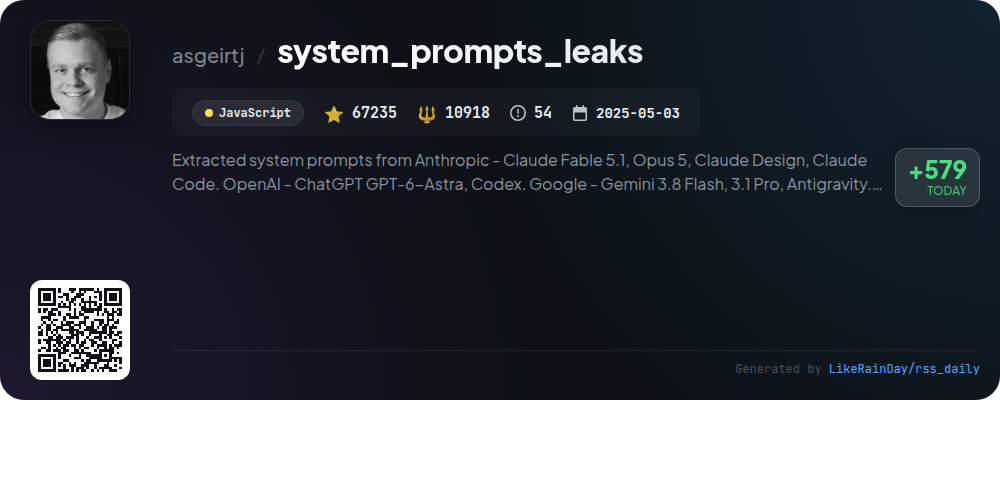

# 📊 🌟 GitHub Trending Daily - 2026-09-16

> > 📅 每日精选 GitHub 热门仓库 | 基于智能算法推荐

## 📋 Overview

**10** 个项目 | **325366** ⭐ | **35822** 🍴

**热门语言:** `JavaScript` (3) · `Go` (2) · `Swift` (2)

**更新时间:** 2026-09-16 04:22 UTC

**分类分布:**

- 🌟 每日 Top 10 精选 (10 项)

---

## 🌟 每日 Top 10 精选

### 1. [open-code-review](https://github.com/alibaba/open-code-review)

> 🤖 **推荐理由**  
> *Open Code Review is an AI-powered code review tool developed by Alibaba, designed for efficiency and precision. It features deterministic pipelines combined with an LLM agent for generating detailed line-level comments. Supporting multiple languages and built-in rules for issues like NPE and SQL injection, it provides both diff and full-file reviews. Open Code Review excels in precision, consuming fewer tokens while delivering faster results compared to general-purpose agents. With CLI integration and comprehensive documentation, it's ideal for developers seeking robust code quality assurance.*

- ⭐ 29072 stars
- 💻 Go
- 📅 Updated: 2026-09-16

### 2. [colibri](https://github.com/JustVugg/colibri)

> 🤖 **推荐理由**  
> *Colibri is a lightweight inference engine designed to run cutting-edge Mixture-of-Experts (MoE) models, ranging from 744B to 2.8T parameters, on existing hardware with zero dependencies. Built in pure C, it optimizes memory usage by treating VRAM, RAM, and storage as a multitier hierarchy, enabling efficient model loading and execution. Key features include support for multiple MoE families, real-time expert routing, a web dashboard for live metrics, and an open research platform for experimentation. Colibri emphasizes accessibility, allowing users to run large models without relying on expensive hardware.*

- ⭐ 34055 stars
- 💻 C
- 📅 Updated: 2026-09-16

### 3. [security-audit-skill](https://github.com/cloudflare/security-audit-skill)

> 🤖 **推荐理由**  
> *A coding-agent skill for multi-phase security audits with independently verified, machine-readable findings. popular project, actively maintained, recently updated*

- ⭐ 5196 stars
- 🍴 319 forks
- 💻 JavaScript
- 📅 Updated: 2026-09-16

### 4. [archify](https://github.com/tt-a1i/archify)

> 🤖 **推荐理由**  
> *Archify is a powerful Node.js agent skill designed for creating interactive, polished architecture diagrams directly within chat interfaces. Its core features include support for five diagram types, snapshot comparisons of architecture changes, and a self-contained HTML output for easy sharing. Archify utilizes typed JSON IR for deterministic rendering and validation, ensuring accuracy and trust in generated artifacts. Key highlights include built-in brand marks, dark/light themes, and detailed tracing of system interactions. Ideal for visualizing workflows, sequences, data flows, and lifecycles, Archify enhances communication around system architectures.*

- ⭐ 63819 stars
- 💻 JavaScript
- 📅 Updated: 2026-09-16

### 5. [tinycast](https://github.com/abue-ammar/tinycast)

> 🤖 **推荐理由**  
> *Tinycast is a lightweight, native macOS launcher that offers powerful features under 100 MB of RAM. With over 4,800 stars on GitHub, it provides a global hotkey for quick access, fuzzy-search for launching apps, and clipboard history for text and images. Additional functionalities include file search, customizable snippets, window management, calendar integration, and AI chat capabilities. Built using SwiftUI with no third-party dependencies, Tinycast ensures privacy and efficiency. It supports native Raycast extensions and is free and open source.*

- ⭐ 4873 stars
- 💻 Swift
- 📅 Updated: 2026-09-16

### 6. [vphone-cli](https://github.com/Lakr233/vphone-cli)

> 🤖 **推荐理由**  
> *vphone-cli is a Swift-based project that allows users to boot a virtual iPhone using Apple's Virtualization.framework, primarily on Apple Silicon Macs running macOS 15+. It offers an end-to-end command to create and launch VMs with various firmware variants, including jailbreak options. Key features include VM management commands, downloading and patching firmware, and SSH/VNC connectivity for interaction. The project supports extensive automation through a control socket for programmatic actions, making it ideal for developers and researchers in iOS virtualization. With over 13,000 stars, it has gained significant community interest.*

- ⭐ 13037 stars
- 💻 Swift
- 📅 Updated: 2026-09-16

### 7. [ghidra](https://github.com/NationalSecurityAgency/ghidra)

> 🤖 **推荐理由**  
> *Ghidra is a powerful software reverse engineering (SRE) framework developed by the NSA, designed for analyzing compiled code across multiple platforms, including Windows, macOS, and Linux. With features like disassembly, decompilation, graphing, and scripting in Java or Python, Ghidra supports various processor instruction sets and executable formats. It enables both interactive and automated analysis and allows users to create custom extensions. Ghidra is open-source and aims to enhance cybersecurity efforts by providing deep insights into vulnerabilities and malicious code.*

- ⭐ 76860 stars
- 💻 Java
- 📅 Updated: 2026-09-16

### 8. [WeKnora](https://github.com/Tencent/WeKnora)

> 🤖 **推荐理由**  
> *WeKnora is an open-source LLM-powered knowledge platform designed for enterprise document understanding and autonomous reasoning. It features RAG-based quick Q&A, a ReAct agent for complex task orchestration, and a self-maintaining Wiki mode that distills documents into interlinked markdown entries. Key highlights include cross-session long-term memory, multi-source ingestion, and support for over 10 document formats. It integrates with 20+ LLM providers, offers extensive API capabilities, and allows for local/private deployment, ensuring data sovereignty and flexibility for users.*

- ⭐ 24456 stars
- 💻 Go
- 📅 Updated: 2026-09-16

### 9. [ever-gauzy](https://github.com/ever-co/ever-gauzy)

> 🤖 **推荐理由**  
> *Ever® Gauzy™ is an open-source Business Management Platform designed for collaborative economies. It offers comprehensive features including Enterprise Resource Planning (ERP), Customer Relationship Management (CRM), Human Resource Management (HRM), Applicant Tracking System (ATS), and Project Management (PM). Key highlights include time tracking, financial management, inventory control, and analytics. With headless APIs and a user-friendly dashboard, it supports multiple organizations and integrates with tools like Upwork and Hubstaff. Explore more at https://gauzy.co.*

- ⭐ 6763 stars
- 💻 TypeScript
- 📅 Updated: 2026-09-16

### 10. [system_prompts_leaks](https://github.com/asgeirtj/system_prompts_leaks)

> 🤖 **推荐理由**  
> *The system_prompts_leaks GitHub project compiles verbatim system prompts from various AI models, including Anthropic's Claude, OpenAI's ChatGPT, and Google's Gemini. With over 67,000 stars, it serves as a valuable repository for understanding the hidden instructions guiding AI interactions. Regular updates ensure access to the latest prompts from multiple platforms, including Codex and Grok. Notable applications of the project include interactive stories and live data dashboards, making it a crucial resource for AI developers and researchers.*

- ⭐ 67235 stars
- 💻 JavaScript
- 📅 Updated: 2026-09-16

---

## 📡 RSS订阅

通过 RSS 订阅，第一时间获取每日精选项目：

- 🔔 [RSS 订阅源] (../../daily-top.xml)
- 🔔 [每日简报] (../../GITHUB_TODAY_CN.md)
- 🔔 [每日 Top 10 精选](../../daily-top.xml)

---

*⚡ Powered by Smart Trending Algorithm | Generated at 2026-09-16 04:22:56 UTC
