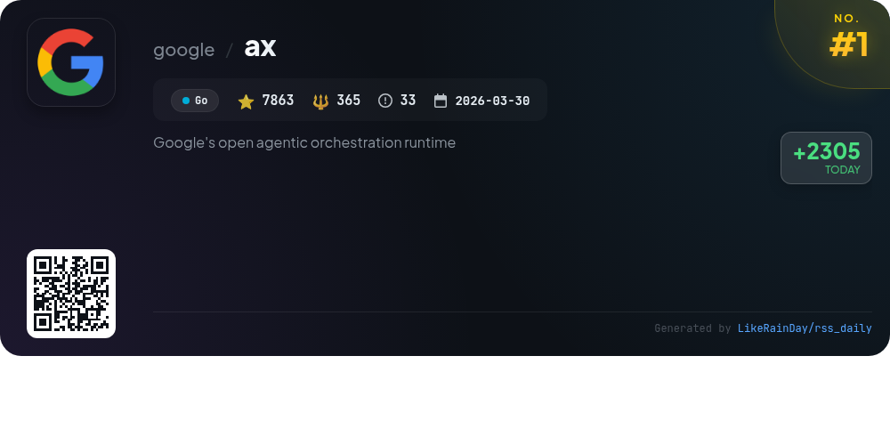
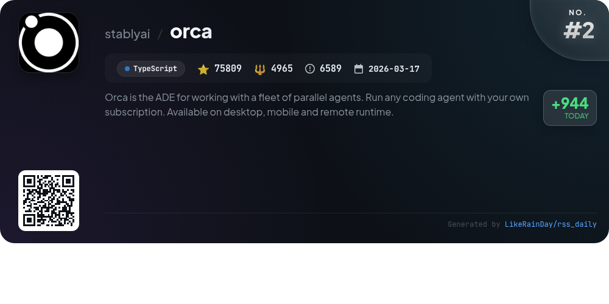
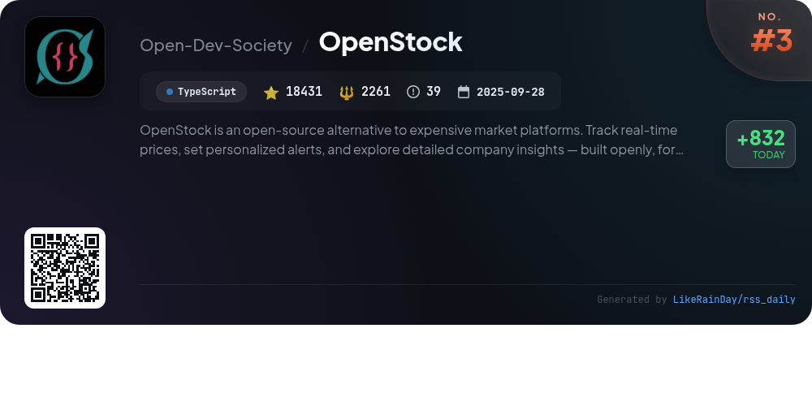
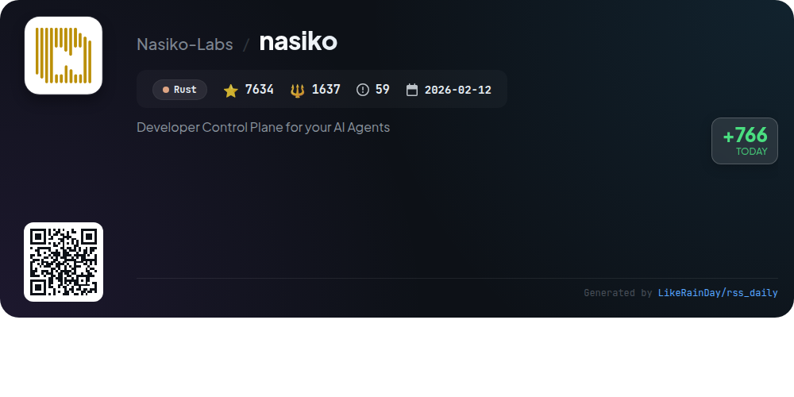
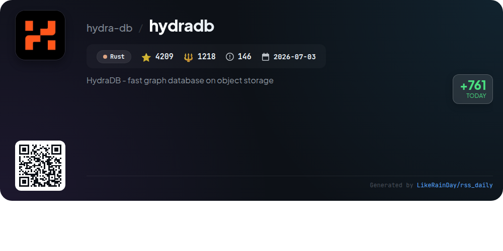
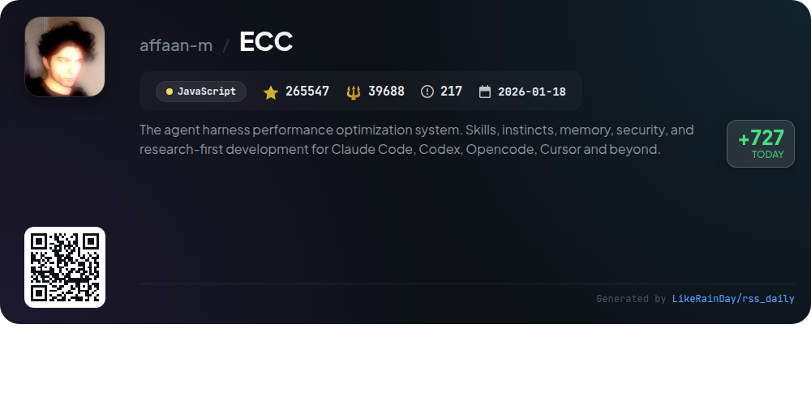
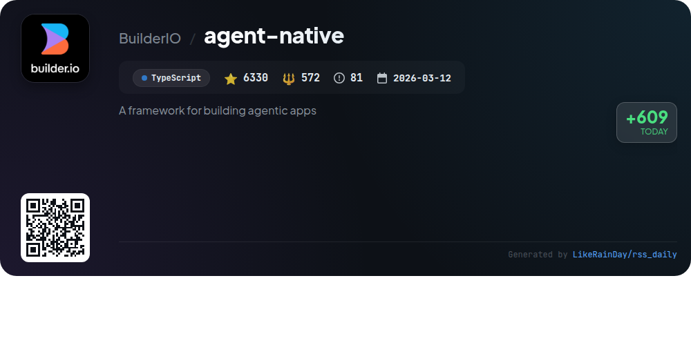
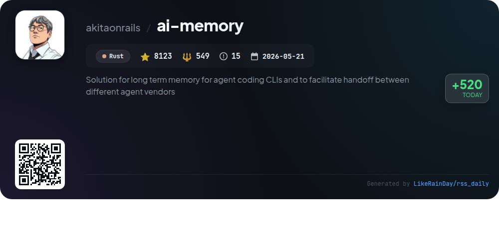
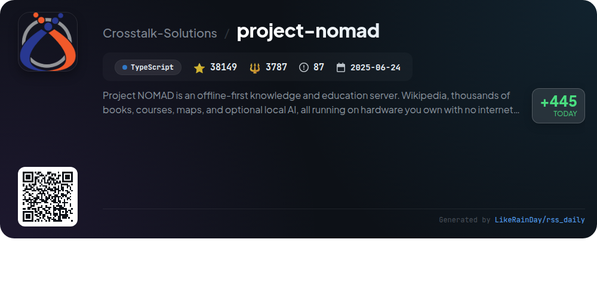
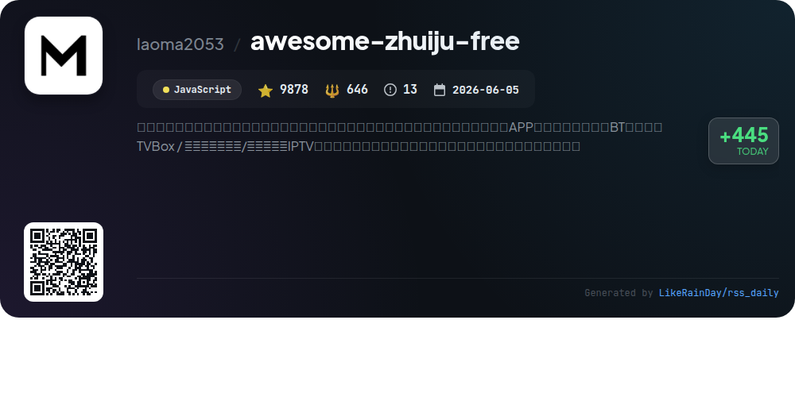

# 📊 🌟 GitHub Trending Daily - 2026-09-23

> > 📅 每日精选 GitHub 热门仓库 | 基于智能算法推荐

## 📋 Overview

**10** 个项目 | **441973** ⭐ | **55688** 🍴

**热门语言:** `TypeScript` (4) · `Rust` (3) · `JavaScript` (2)

**更新时间:** 2026-09-23 04:21 UTC

**分类分布:**

- 🌟 每日 Top 10 精选 (10 项)

---

## 🌟 每日 Top 10 精选

### 1. [ax](https://github.com/google/ax)

> 🤖 **推荐理由**  
> *AX is Google's open orchestration runtime designed for high-throughput management of autonomous agent workloads in a cluster. Key features include the ability to declare agentic tasks with specifications for workspaces, gateways, and models, enabling sandboxed execution and isolation. It supports running billions of tasks per cluster, akin to Kubernetes, with commands for applying manifests, monitoring tasks, and interactive debugging. AX facilitates resource management, traffic control, and state persistence, making it ideal for complex agent-based applications.*

- ⭐ 7863 stars
- 💻 Go
- 📅 Updated: 2026-09-23

### 2. [orca](https://github.com/stablyai/orca)

> 🤖 **推荐理由**  
> *Orca is a powerful AI development environment designed for managing parallel agents across desktop, mobile, and remote runtimes. With over 75,000 stars on GitHub, its core features include parallel worktrees for running multiple agents simultaneously, a mobile companion app for on-the-go management, and advanced terminal capabilities with infinite splits. Additional highlights include native integration with GitHub and Linear, SSH worktrees for remote operations, and a robust CLI for scripting workflows. Orca is versatile, supporting any CLI agent, making it ideal for efficient AI-driven development.*

- ⭐ 75809 stars
- 💻 TypeScript
- 📅 Updated: 2026-09-23

### 3. [OpenStock](https://github.com/Open-Dev-Society/OpenStock)

> 🤖 **推荐理由**  
> *OpenStock is a free, open-source stock market platform designed to provide users with real-time price tracking, personalized alerts, and detailed company insights. Built with Next.js and TypeScript, it features email/password authentication, a user-specific watchlist, and TradingView widgets for advanced charting. The platform integrates with Finnhub for market data and supports over 30 international exchanges. OpenStock emphasizes accessibility and community contribution, ensuring that financial tools remain open and free for all.*

- ⭐ 18431 stars
- 💻 TypeScript
- 📅 Updated: 2026-09-23

### 4. [nasiko](https://github.com/Nasiko-Labs/nasiko)

> 🤖 **推荐理由**  
> *Nasiko is a developer control plane for AI agents, enabling easy deployment, routing, and observability of A2A-speaking agents through a single command. Key features include intelligent routing, a single ingress point for secure agent-to-agent communication, embedded OCI registry, and full observability with auto-collected token usage and costs. It supports various programming languages and ensures no public exposure for agents. With a robust CLI and dashboard, Nasiko simplifies the management of AI operations while enhancing security and efficiency.*

- ⭐ 7634 stars
- 💻 Rust
- 📅 Updated: 2026-09-23

### 5. [hydradb](https://github.com/hydra-db/hydradb)

> 🤖 **推荐理由**  
> *HydraDB is a fast, object-store-native distributed graph database built in Rust, designed for high performance and scalability. Key features include durable graph storage on S3-compatible object storage, snapshot-consistent OpenCypher queries, and Neo4j-compatible Bolt connectivity. Its architecture separates storage and compute, enabling independent scaling of data nodes and indexers. HydraDB supports robust querying with a practical OpenCypher subset, advanced path procedures, and offers observability through metrics and tracing. Ideal for modern applications requiring efficient graph data management.*

- ⭐ 4209 stars
- 💻 Rust
- 📅 Updated: 2026-09-23

### 6. [ECC](https://github.com/affaan-m/ECC)

> 🤖 **推荐理由**  
> *ECC is an advanced agent harness performance optimization system designed for coding environments like Claude Code, Codex, and others. It offers 68 specialized agents, 292 reusable skills, and 94 command shims, enabling workflows such as test-driven development, code reviews, and security audits. Key features include memory persistence, continuous learning, and AgentShield for security scanning. ECC supports integration with various platforms, ensuring a seamless coding experience while maintaining project standards and enhancing productivity.*

- ⭐ 265547 stars
- 💻 JavaScript
- 📅 Updated: 2026-09-23

### 7. [agent-native](https://github.com/BuilderIO/agent-native)

> 🤖 **推荐理由**  
> *Agent-Native is an open-source TypeScript framework designed for building agentic applications with a seamless user interface. It allows developers to define capabilities as shared actions, enabling both agents and UIs to interact with the same tools and data. Key features include agent chat for delegating tasks, authentication and permissions management, skills and memory for agents, automation capabilities, and PostgreSQL integration. The framework supports various app types, from analytics to content management, promoting collaborative and efficient workflows.*

- ⭐ 6330 stars
- 💻 TypeScript
- 📅 Updated: 2026-09-23

### 8. [ai-memory](https://github.com/akitaonrails/ai-memory)

> 🤖 **推荐理由**  
> *ai-memory is a Rust-based solution for long-term memory management across various AI coding agents, enabling seamless handoffs between tools like Claude Code and OpenAI Codex. With over 8,000 stars, it centralizes knowledge in a git-backed markdown wiki, allowing users to capture, search, and recall project histories without LLM calls. Key features include cross-agent and cross-machine continuity, team collaboration with multi-user support, and automatic lifecycle capture. Its architecture is designed for transparency and ease of use, ensuring efficient memory management for developers.*

- ⭐ 8123 stars
- 💻 Rust
- 📅 Updated: 2026-09-23

### 9. [project-nomad](https://github.com/Crosstalk-Solutions/project-nomad)

> 🤖 **推荐理由**  
> *Project NOMAD is an offline-first knowledge and education server designed for accessibility and privacy. It hosts a wealth of resources, including offline Wikipedia, eBooks, AI chat capabilities, and educational courses from Khan Academy. Key features include a management UI for easy installation via Docker, automatic updates, and a local note-taking system. Users can access offline maps, data analysis tools, and a community leaderboard for benchmarking hardware. NOMAD is ideal for users seeking a self-contained, internet-independent learning environment.*

- ⭐ 38149 stars
- 💻 TypeScript
- 📅 Updated: 2026-09-23

### 10. [awesome-zhuiju-free](https://github.com/laoma2053/awesome-zhuiju-free)

> 🤖 **推荐理由**  
> *Awesome Zhuiju Free is an open-source ad-free resource guide for streaming media, featuring manually curated links with daily validity checks. It includes a variety of services such as online films, streaming apps, cloud resource searches, BT magnet links, subtitles, TVBox configurations, and IPTV live sources. The project boasts over 11,000 starred contributions and emphasizes community maintenance, making it a reliable choice for viewers seeking safe and effective streaming options without intrusive ads.*

- ⭐ 9878 stars
- 💻 JavaScript
- 📅 Updated: 2026-09-23

---

## 📡 RSS订阅

通过 RSS 订阅，第一时间获取每日精选项目：

- 🔔 [RSS 订阅源] (../../daily-top.xml)
- 🔔 [每日简报] (../../GITHUB_TODAY_CN.md)
- 🔔 [每日 Top 10 精选](../../daily-top.xml)

---

*⚡ Powered by Smart Trending Algorithm | Generated at 2026-09-23 04:21:04 UTC
