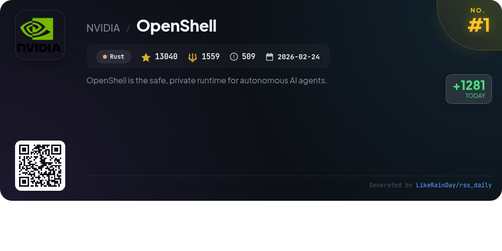
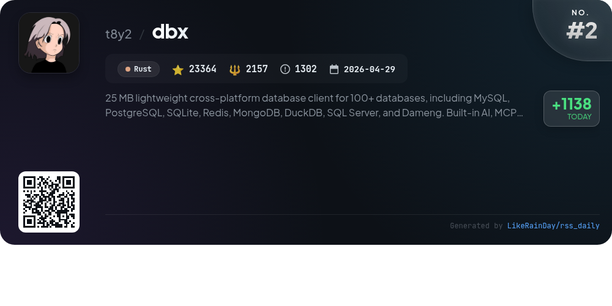
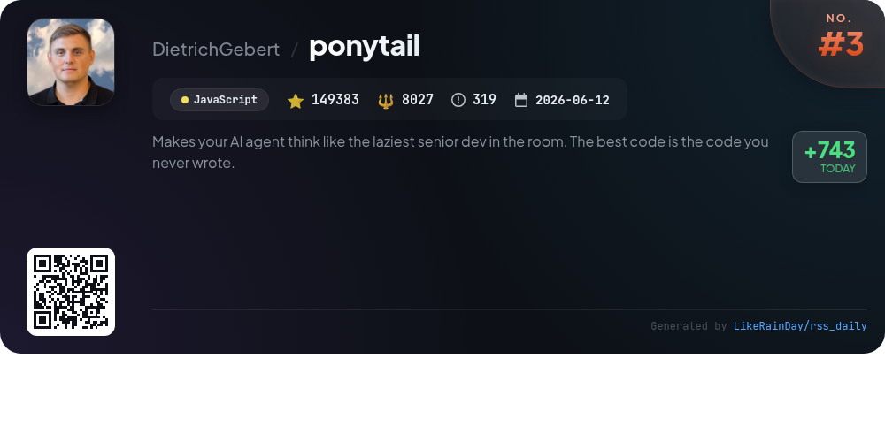
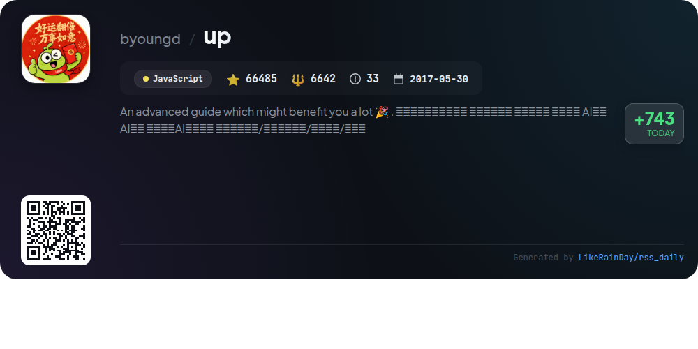
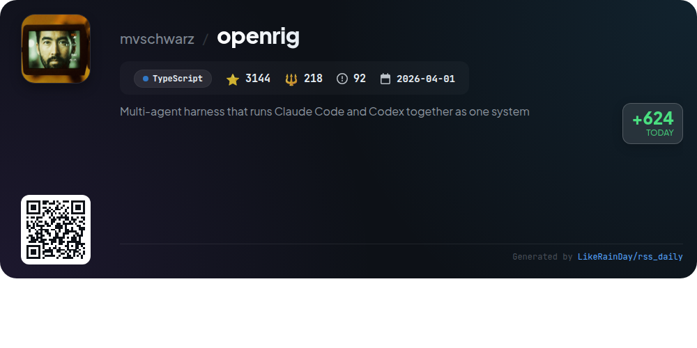
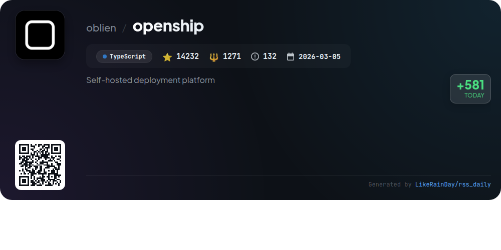
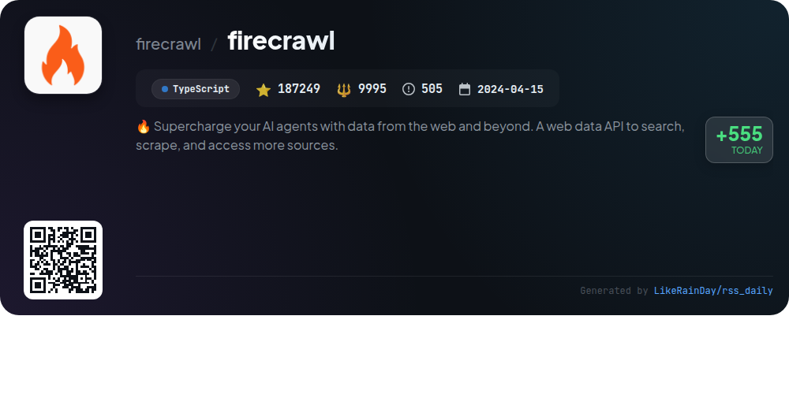

# 📊 🌟 GitHub Trending Daily - 2026-10-01

> > 📅 每日精选 GitHub 热门仓库 | 基于智能算法推荐

## 📋 Overview

**10** 个项目 | **855164** ⭐ | **79668** 🍴

**热门语言:** `JavaScript` (4) · `TypeScript` (4) · `Rust` (2)

**更新时间:** 2026-10-01 05:21 UTC

**分类分布:**

- 🌟 每日 Top 10 精选 (10 项)

---

## 🌟 每日 Top 10 精选

### 1. [OpenShell](https://github.com/NVIDIA/OpenShell)

> 🤖 **推荐理由**  
> *OpenShell is a secure runtime for managing fleets of autonomous AI agents, enabling them to perform tasks like file access and API calls without compromising data security. Key features include kernel-level enforcement of access policies, formal verification of policy changes, and isolated sandboxes for each agent. OpenShell supports Docker, Podman, and host virtualization, with a focus on extensibility and integration through SDKs in multiple languages. With over 13,000 stars, it emphasizes safety, privacy, and agent-driven workflows while providing tools for policy management and monitoring.*

- ⭐ 13040 stars
- 💻 Rust
- 📅 Updated: 2026-10-01

### 2. [dbx](https://github.com/t8y2/dbx)

> 🤖 **推荐理由**  
> *dbx is a lightweight, 25 MB cross-platform database client supporting over 100 databases, such as MySQL, PostgreSQL, and MongoDB. Key features include a built-in AI SQL assistant, MCP server for AI integration, and a versatile query editor with syntax highlighting and smart autocomplete. It offers desktop, Docker, and CLI interfaces, along with rich data management tools like schema browsing, data import/export, and message queue consoles. dbx is designed for efficiency without runtime bloat, making it ideal for developers and data professionals.*

- ⭐ 23364 stars
- 💻 Rust
- 📅 Updated: 2026-10-01

### 3. [ponytail](https://github.com/DietrichGebert/ponytail)

> 🤖 **推荐理由**  
> *Ponytail is a JavaScript GitHub project designed to enhance AI agents by enabling them to generate minimal and efficient code, akin to a seasoned senior developer. With over 149,000 stars, it emphasizes reducing unnecessary code—averaging 54% less, while maintaining functionality and safety. Key features include one-liner code generation, integration with multiple AI platforms (Claude Code, Codex, GitHub Copilot), and commands for code review and auditing. Ponytail streamlines development, making it faster and cheaper without compromising quality.*

- ⭐ 149383 stars
- 💻 JavaScript
- 📅 Updated: 2026-10-01

### 4. [up](https://github.com/byoungd/up)

> 🤖 **推荐理由**  
> *The "up" project, authored by 韩先凯, serves as a comprehensive guide for lifelong learning in the AI era. It emphasizes a systematic approach to problem discovery, active learning, and collaboration with AI to achieve real-life tasks. Key features include resources for English language learning, project development, and personal recovery strategies. The guide promotes evidence-based practices and encourages users to document their progress. With over 66,000 stars on GitHub, it offers downloadable content in both Chinese and English, fostering continuous growth and practical application of knowledge.*

- ⭐ 66485 stars
- 💻 JavaScript
- 📅 Updated: 2026-10-01

### 5. [ECC](https://github.com/affaan-m/ECC)

> 🤖 **推荐理由**  
> *ECC is a powerful performance optimization system designed for coding agents like Claude Code and Codex. It features 68 specialized agents and 293 skills, enabling enhanced workflows such as TDD, code review, and security auditing. ECC integrates hooks for automation, a memory vault for context preservation, and AgentShield for security scanning. Its guided setup supports multiple environments, including Claude Code, Codex, and Kimi Code, ensuring a streamlined development process. With strong community support and a focus on continuous learning, ECC is ideal for optimizing code quality and efficiency.*

- ⭐ 270287 stars
- 💻 JavaScript
- 📅 Updated: 2026-10-01

### 6. [openrig](https://github.com/mvschwarz/openrig)

> 🤖 **推荐理由**  
> *OpenRig is a multi-agent harness that integrates Claude Code and Codex into a cohesive system, allowing users to manage AI coding agents efficiently. Key features include YAML-defined agent topologies, tmux session management, a terminal UI for real-time coordination, and communication across agents. Users can create starter rigs, snapshot and restore topologies, and connect to Slack for enhanced collaboration. OpenRig is open-source, requires Node.js and tmux, and is designed to simplify the orchestration of coding tasks, making it an invaluable tool for developers.*

- ⭐ 3144 stars
- 💻 TypeScript
- 📅 Updated: 2026-10-01

### 7. [openship](https://github.com/oblien/openship)

> 🤖 **推荐理由**  
> *Self-hosted deployment platform. popular project, actively maintained, recently updated*

- ⭐ 14232 stars
- 🍴 1271 forks
- 💻 TypeScript
- 📅 Updated: 2026-10-01

### 8. [firecrawl](https://github.com/firecrawl/firecrawl)

> 🤖 **推荐理由**  
> *Firecrawl is a powerful web data API designed to enhance AI agents by enabling them to search, scrape, and interact with web content effortlessly. Key features include 96% web coverage, fast response times, and LLM-ready outputs like clean Markdown and structured JSON. It simplifies complex tasks with zero configuration, handling proxies and JS-blocked sites. Core services include searching and scraping URLs, batch scraping, and automated data gathering through an intuitive agent system. Open source and available as a hosted service, Firecrawl supports seamless integration with various AI tools.*

- ⭐ 187249 stars
- 💻 TypeScript
- 📅 Updated: 2026-10-01

### 9. [impeccable](https://github.com/pbakaus/impeccable)

> 🤖 **推荐理由**  
> *Impeccable is a JavaScript design language tool for AI coding agents, featuring 24 commands and 61 deterministic detector rules to enhance AI-generated frontend design. Users can quickly set up with `/impeccable init`, which documents project context in `PRODUCT.md`. Key commands include `audit`, `critique`, and `polish`, enabling thorough design reviews and optimizations. The tool integrates seamlessly with platforms like GitHub Copilot and Claude Code, ensuring high-quality design outputs by avoiding common anti-patterns. Visit [impeccable.style](https://impeccable.style) for more.*

- ⭐ 73134 stars
- 💻 JavaScript
- 📅 Updated: 2026-10-01

### 10. [hyperframes](https://github.com/heygen-com/hyperframes)

> 🤖 **推荐理由**  
> *HyperFrames is an open-source framework for converting HTML, CSS, and media into deterministic MP4 videos, enabling seamless video creation with AI coding agents. Key features include a user-friendly CLI, 21 agent skills for various video tasks (e.g., product launches, explainer videos), and support for seekable animations using popular libraries like GSAP and Lottie. It offers a library of reusable components, cloud rendering via AWS, and a design system for video production. HyperFrames is built for both teams and individual creators, ensuring a flexible and efficient workflow.*

- ⭐ 54846 stars
- 💻 TypeScript
- 📅 Updated: 2026-10-01

---

## 📡 RSS订阅

通过 RSS 订阅，第一时间获取每日精选项目：

- 🔔 [RSS 订阅源] (../../daily-top.xml)
- 🔔 [每日简报] (../../GITHUB_TODAY_CN.md)
- 🔔 [每日 Top 10 精选](../../daily-top.xml)

---

*⚡ Powered by Smart Trending Algorithm | Generated at 2026-10-01 05:21:07 UTC
