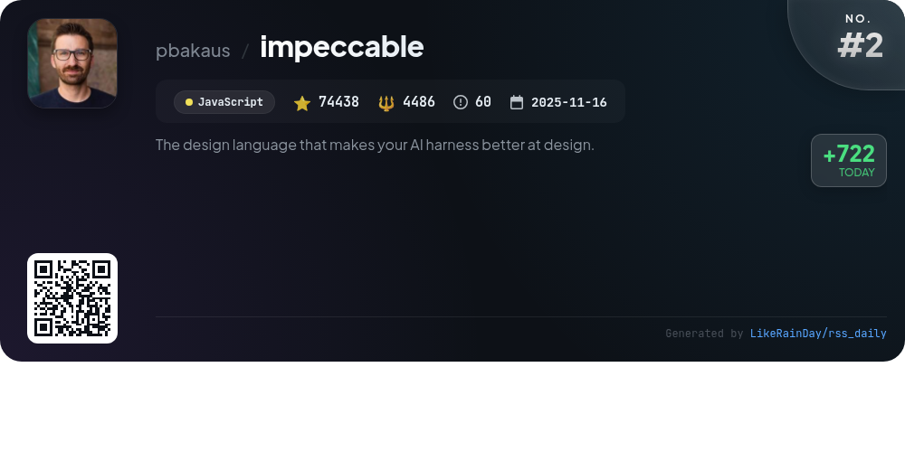
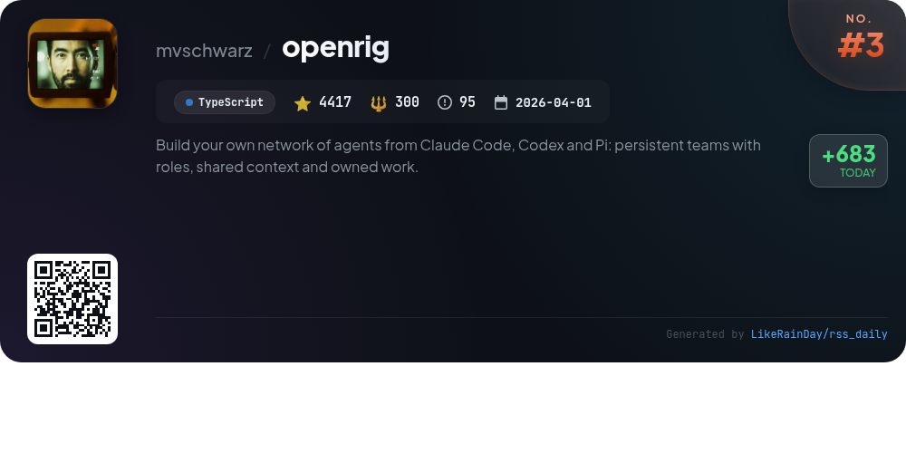
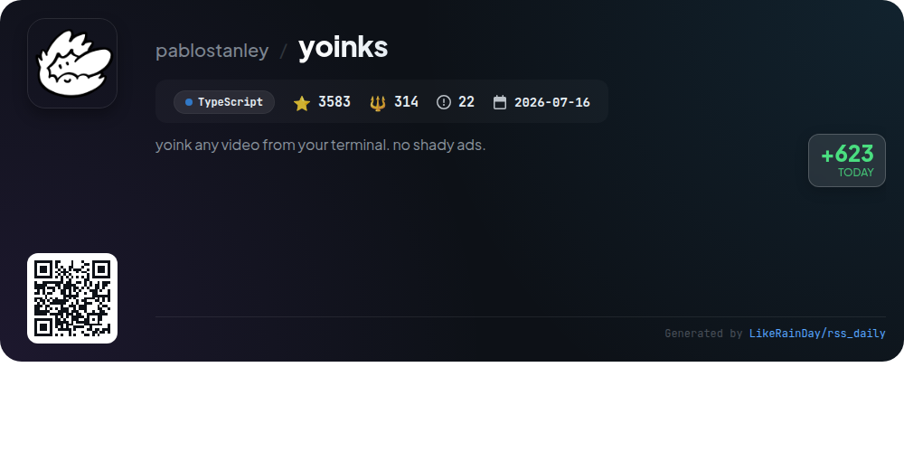
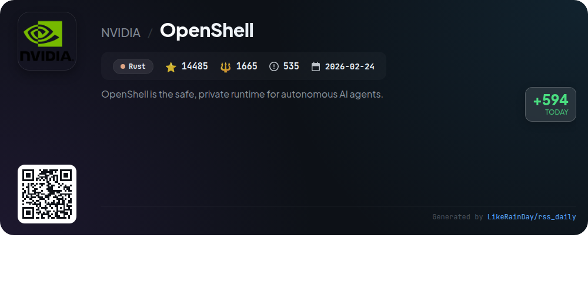
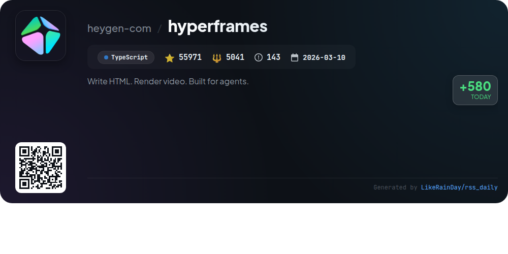
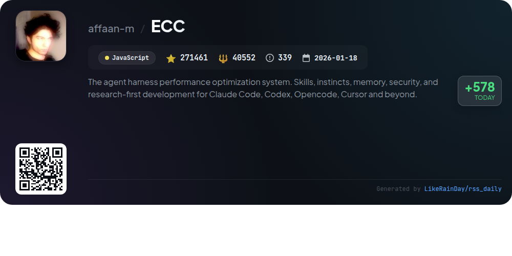
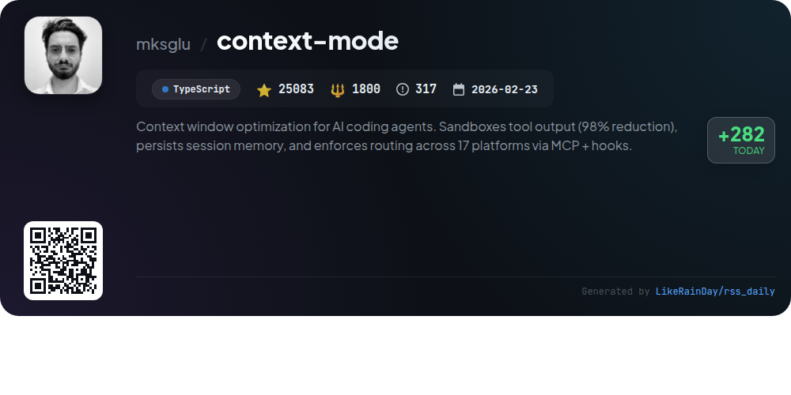
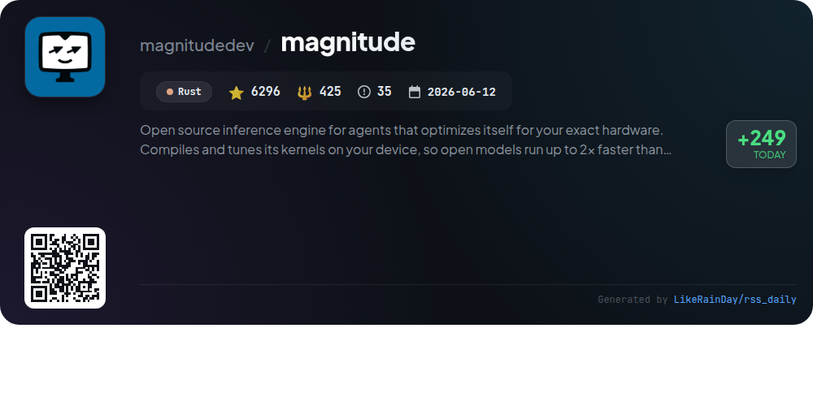
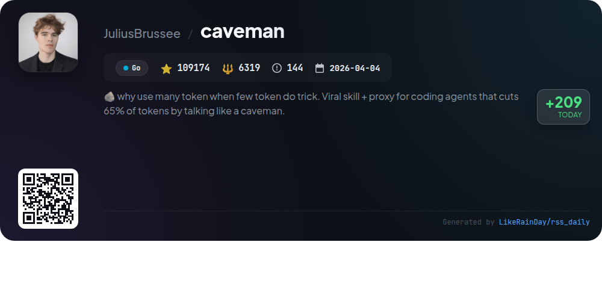

# 📊 🌟 GitHub Trending Daily - 2026-10-03

> > 📅 每日精选 GitHub 热门仓库 | 基于智能算法推荐

## 📋 Overview

**10** 个项目 | **716897** ⭐ | **69054** 🍴

**热门语言:** `TypeScript` (4) · `JavaScript` (3) · `Rust` (2)

**更新时间:** 2026-10-03 04:52 UTC

**分类分布:**

- 🌟 每日 Top 10 精选 (10 项)

---

## 🌟 每日 Top 10 精选

### 1. [ponytail](https://github.com/DietrichGebert/ponytail)

> 🤖 **推荐理由**  
> *Ponytail is a JavaScript GitHub project designed to enhance AI agent performance by promoting minimalistic coding practices, mimicking the approach of a seasoned developer. With 151,989 stars, it emphasizes writing efficient code by reducing unnecessary lines, achieving up to 94% less code, 20% cost savings, and 27% faster execution, all while maintaining 100% safety. Key features include mode switching commands, code reviews for over-engineering, and comprehensive audits. Ponytail integrates seamlessly with various coding platforms and tools, making it versatile for developers seeking efficiency.*

- ⭐ 151989 stars
- 💻 JavaScript
- 📅 Updated: 2026-10-03

### 2. [impeccable](https://github.com/pbakaus/impeccable)

> 🤖 **推荐理由**  
> *Impeccable is a design language tool for enhancing AI-generated frontend design, featuring a streamlined setup with 24 commands for various design tasks and 61 deterministic detector rules. Key functionalities include project initialization, UX/UI planning, technical audits, and design critiques, all accessible via the `/impeccable` command. It supports tools like GitHub Copilot, Claude Code, and Codex, allowing for live browser iterations and automated quality checks. Impeccable aims to improve design consistency and quality across AI projects, making it a valuable asset for developers and designers alike.*

- ⭐ 74438 stars
- 💻 JavaScript
- 📅 Updated: 2026-10-03

### 3. [openrig](https://github.com/mvschwarz/openrig)

> 🤖 **推荐理由**  
> *OpenRig is an open-source framework for building and managing a network of AI coding agents, including Claude Code and Codex, allowing for persistent teams with defined roles and shared context. Key features include YAML-based agent topology definition, seamless booting and management of agents via a CLI and TUI interface, and communication capabilities across agents. Users can adopt existing sessions, manage workflows, and connect to services like Slack. OpenRig enhances collaboration among AI agents, streamlining coding processes and project management.*

- ⭐ 4417 stars
- 💻 TypeScript
- 📅 Updated: 2026-10-03

### 4. [yoinks](https://github.com/pablostanley/yoinks)

> 🤖 **推荐理由**  
> *yoink any video from your terminal. no shady ads.. popular project, actively maintained, recently updated*

- ⭐ 3583 stars
- 🍴 314 forks
- 💻 TypeScript
- 📅 Updated: 2026-10-03

### 5. [OpenShell](https://github.com/NVIDIA/OpenShell)

> 🤖 **推荐理由**  
> *OpenShell is a secure, private runtime designed for managing fleets of autonomous AI agents, built in Rust and boasting over 14,000 stars on GitHub. It enforces strict access controls via kernel-level sandboxing and formal verification of policy changes, ensuring agents can interact with files, APIs, and credentials safely. Key features include customizable policies, isolated environments, and extensive SDK support across multiple languages. OpenShell supports Linux, macOS, and Windows with WSL 2, making it versatile for developers seeking robust AI agent management.*

- ⭐ 14485 stars
- 💻 Rust
- 📅 Updated: 2026-10-03

### 6. [hyperframes](https://github.com/heygen-com/hyperframes)

> 🤖 **推荐理由**  
> *HyperFrames is an open-source framework that transforms HTML and CSS into deterministic MP4 videos, designed for coding agents and media production. Key features include a CLI for local use, integration with AI coding agents, and a robust catalog of 21 skills for video creation, from product launches to motion graphics. It supports various animation libraries like GSAP and CSS, ensuring seamless animations. Built for both deterministic and CI-friendly rendering, HyperFrames allows immediate previewing and direct browser playback without a build step. Explore more at hyperframes.dev.*

- ⭐ 55971 stars
- 💻 TypeScript
- 📅 Updated: 2026-10-03

### 7. [ECC](https://github.com/affaan-m/ECC)

> 🤖 **推荐理由**  
> *ECC is an advanced agent harness performance optimization system designed for coding environments like Claude Code, Codex, and Cursor. With 68 specialized agents, 293 skills, and 94 commands, ECC streamlines workflows through features such as automated planning, security scanning via AgentShield, and memory persistence. It provides a guided setup for easy installation, supports multiple programming languages, and enhances collaboration with tools like GitHub Copilot. ECC's architecture promotes continuous learning and efficient context management, making it a powerful tool for developers.*

- ⭐ 271461 stars
- 💻 JavaScript
- 📅 Updated: 2026-10-03

### 8. [context-mode](https://github.com/mksglu/context-mode)

> 🤖 **推荐理由**  
> *Context Mode is an advanced context window optimization tool for AI coding agents, enabling a remarkable 98% reduction in context size while preserving session memory. Key features include sandboxing tool outputs, session continuity through SQLite event tracking, and efficient routing across 17 platforms using MCP and hooks. It supports various programming languages for code execution and indexing, ensuring relevant data is retrieved without clutter. With over 25,000 stars on GitHub, it streamlines AI interactions, enhancing performance in coding tasks by efficiently managing context and state.*

- ⭐ 25083 stars
- 💻 TypeScript
- 📅 Updated: 2026-10-03

### 9. [magnitude](https://github.com/magnitudedev/magnitude)

> 🤖 **推荐理由**  
> *Magnitude is an open-source inference engine that optimizes performance based on your hardware, running open models up to 2x faster than llama.cpp. It compiles and tunes kernels directly on your device, supporting Apple Silicon, NVIDIA, AMD, and CPU-only setups. Key features include memory efficiency, fast concurrent sessions, and seamless integration with popular agents like Pi and Codex. With no token costs and complete privacy, Magnitude is available for macOS, Windows, and Linux. Join the community and enhance your AI experience with Magnitude's powerful capabilities.*

- ⭐ 6296 stars
- 💻 Rust
- 📅 Updated: 2026-10-03

### 10. [caveman](https://github.com/JuliusBrussee/caveman)

> 🤖 **推荐理由**  
> *Caveman is a Go-based project designed to optimize AI coding agents by significantly reducing token usage. It employs a unique "caveman" communication style that cuts output verbosity, achieving cost savings of up to 65% without compromising response quality. Key features include a skill that modifies agent responses, a local proxy that compresses input reading, and middleware for custom applications. With support for over 30 agents and an easy installation process, Caveman enhances efficiency in coding tasks while maintaining functionality.*

- ⭐ 109174 stars
- 💻 Go
- 📅 Updated: 2026-10-03

---

## 📡 RSS订阅

通过 RSS 订阅，第一时间获取每日精选项目：

- 🔔 [RSS 订阅源] (../../daily-top.xml)
- 🔔 [每日简报] (../../GITHUB_TODAY_CN.md)
- 🔔 [每日 Top 10 精选](../../daily-top.xml)

---

*⚡ Powered by Smart Trending Algorithm | Generated at 2026-10-03 04:52:21 UTC
