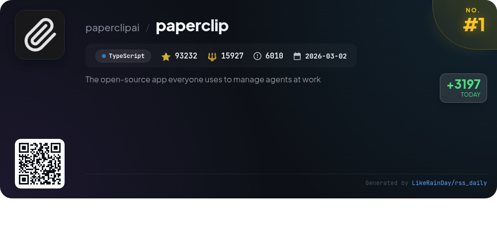
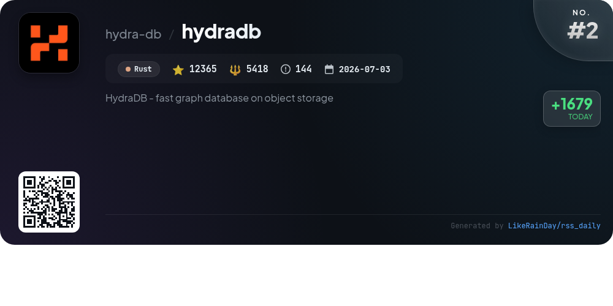
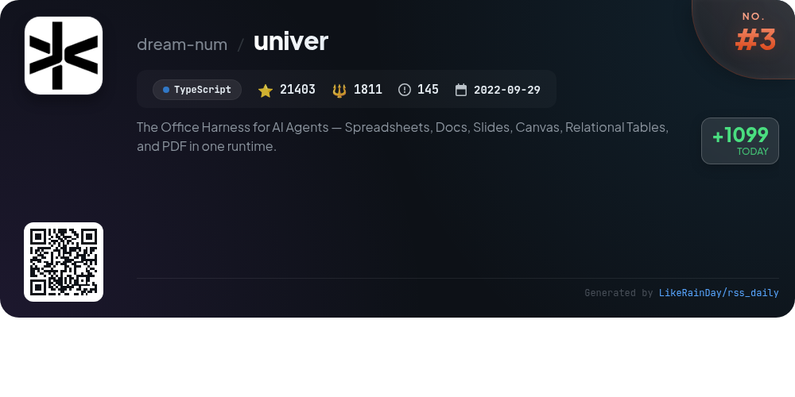
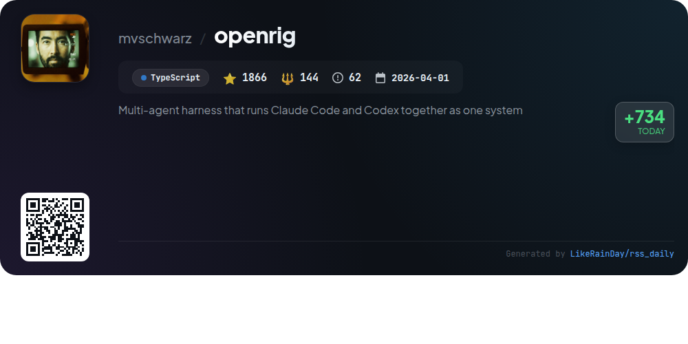
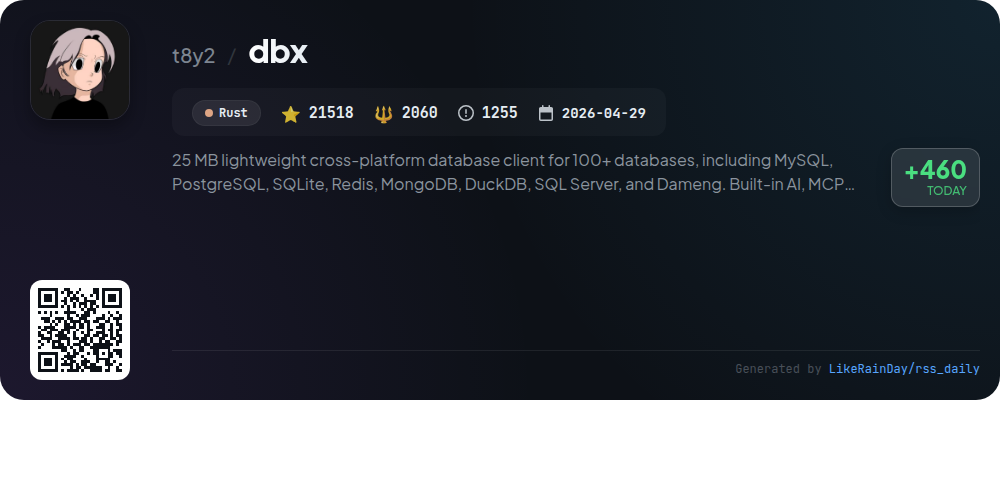
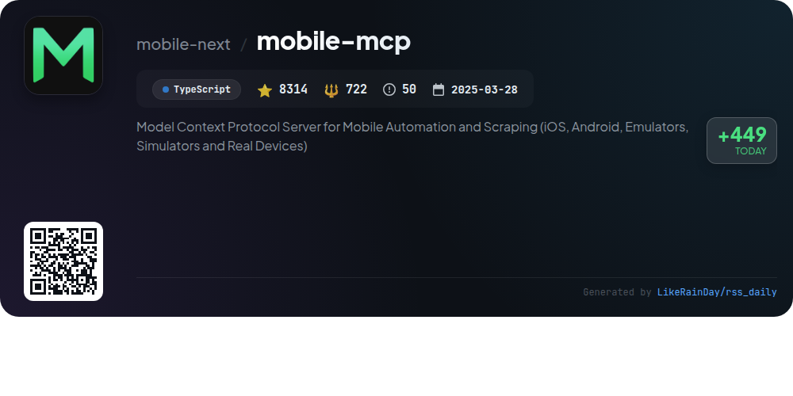
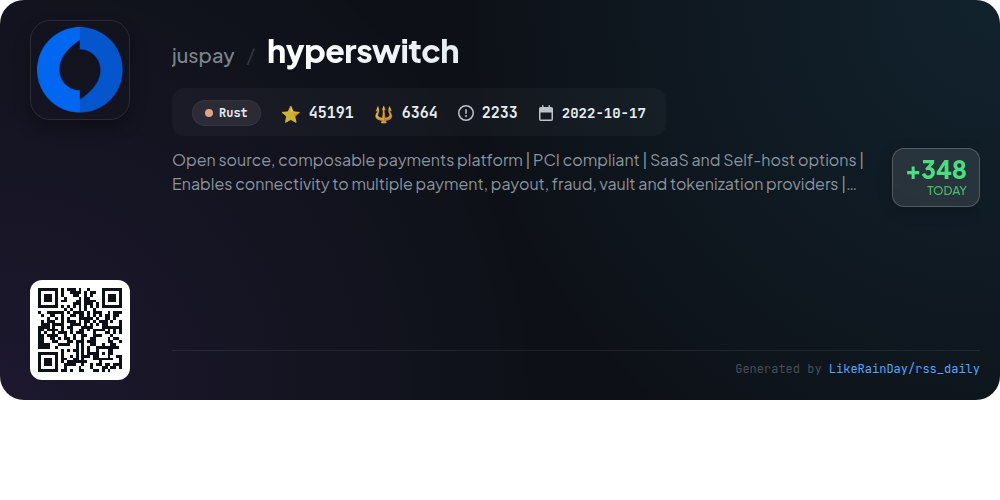
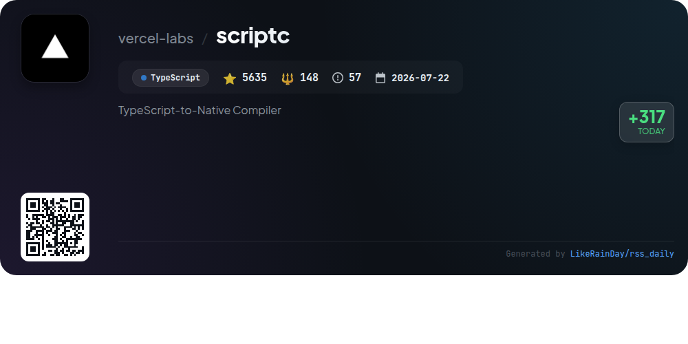
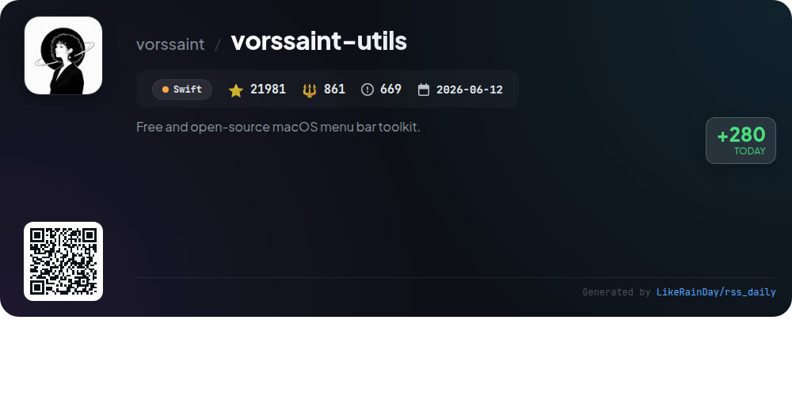

# 📊 🌟 GitHub Trending Daily - 2026-09-29

> > 📅 每日精选 GitHub 热门仓库 | 基于智能算法推荐

## 📋 Overview

**10** 个项目 | **296440** ⭐ | **39983** 🍴

**热门语言:** `TypeScript` (5) · `Rust` (3) · `JavaScript` (1)

**更新时间:** 2026-09-29 05:19 UTC

**分类分布:**

- 🌟 每日 Top 10 精选 (10 项)

---

## 🌟 每日 Top 10 精选

### 1. [paperclip](https://github.com/paperclipai/paperclip)

> 🤖 **推荐理由**  
> *Paperclip is an open-source application designed for managing teams of AI agents in a business environment. With over 93,000 stars on GitHub, it offers features such as goal alignment, cost control, and governance through a user-friendly dashboard. Users can bring their own agents, track tasks and budgets, and audit work seamlessly. Key highlights include persistent agent states, atomic execution for tasks, and a robust org chart for agent roles. Paperclip facilitates autonomous AI organizations, making it ideal for teams managing multiple agents across various projects.*

- ⭐ 93232 stars
- 💻 TypeScript
- 📅 Updated: 2026-09-29

### 2. [hydradb](https://github.com/hydra-db/hydradb)

> 🤖 **推荐理由**  
> *HydraDB is a fast, distributed graph database built in Rust, leveraging S3-compatible object storage for durable graph records. It supports snapshot-consistent OpenCypher queries, GraphBLAS traversal, and Neo4j-compatible Bolt connectivity. Key features include independent scaling of data nodes and indexers, safe writer handoff, and consistent reads against a pinned SlateDB snapshot. The system offers an HTTPS query API and integrates seamlessly with Kubernetes for deployment. HydraDB emphasizes observability with metrics and tracing, making it ideal for scalable graph applications.*

- ⭐ 12365 stars
- 💻 Rust
- 📅 Updated: 2026-09-29

### 3. [univer](https://github.com/dream-num/univer)

> 🤖 **推荐理由**  
> *Univer is an open-source Office SDK enabling the integration of advanced productivity tools like spreadsheets, documents, and presentations into applications. It features a plugin-based architecture, allowing developers to customize functionalities, embed editing capabilities, and operate seamlessly in both browser and Node.js environments. Key highlights include high-performance canvas rendering, a unified Facade API, and support for AI-driven workflows. With extensive documentation and examples, Univer supports the creation of collaborative tools, making it an ideal choice for developers seeking to enhance their products with office functionalities.*

- ⭐ 21403 stars
- 💻 TypeScript
- 📅 Updated: 2026-09-29

### 4. [openrig](https://github.com/mvschwarz/openrig)

> 🤖 **推荐理由**  
> *OpenRig is a multi-agent harness that integrates Claude Code and Codex, enabling organized collaboration of AI coding agents. Key features include YAML-defined agent teams, easy booting with a single command, and real-time communication across agents. Users can visualize team dynamics through a terminal UI, manage sessions in tmux, and evolve topologies with commands like `rig grow` and `rig shrink`. OpenRig supports collaborative workflows, snapshots for state restoration, and integrates with Slack for notifications, all while prioritizing user permissions and workspace trust.*

- ⭐ 1866 stars
- 💻 TypeScript
- 📅 Updated: 2026-09-29

### 5. [dbx](https://github.com/t8y2/dbx)

> 🤖 **推荐理由**  
> *dbx is a lightweight, 25 MB cross-platform database client supporting over 100 databases, including MySQL, PostgreSQL, SQLite, and MongoDB. Key features include a built-in AI assistant for SQL generation, a versatile query editor, and support for Docker, CLI, and desktop environments. Users benefit from a plugin ecosystem for extended functionalities and integrated message queue management. With strong focus on security and ease of use, dbx facilitates seamless database management across various platforms, making it ideal for developers and data professionals.*

- ⭐ 21518 stars
- 💻 Rust
- 📅 Updated: 2026-09-29

### 6. [mobile-mcp](https://github.com/mobile-next/mobile-mcp)

> 🤖 **推荐理由**  
> *Mobile MCP is a scalable Model Context Protocol Server for mobile automation and scraping, supporting iOS and Android devices, simulators, and emulators. It offers a unified API for seamless interaction with mobile applications, enabling native app automation, scripted flows, and complex user journeys without platform-specific expertise. Key features include accessibility-driven interactions, device management tools, and cloud device support via Mobile Next Cloud. With 8314 stars on GitHub, it integrates easily with various AI models and tools, streamlining mobile development workflows.*

- ⭐ 8314 stars
- 💻 TypeScript
- 📅 Updated: 2026-09-29

### 7. [hyperswitch](https://github.com/juspay/hyperswitch)

> 🤖 **推荐理由**  
> *Hyperswitch is an open-source, composable payments platform designed for flexibility and scalability, built in Rust. It offers both SaaS and self-hosted options, ensuring PCI compliance. Key features include intelligent routing for better transaction authorization, cost observability to monitor and optimize payment expenses, and automated reconciliation to streamline operations. Hyperswitch connects to over 120 payment processors, supports alternate payment methods, and provides a modular architecture that allows businesses to integrate only the necessary components without vendor lock-in.*

- ⭐ 45191 stars
- 💻 Rust
- 📅 Updated: 2026-09-29

### 8. [up](https://github.com/byoungd/up)

> 🤖 **推荐理由**  
> *The "up" project, authored by 韩先凯, is an evolving guide designed for lifelong learning in the AI era. It emphasizes practical skills in AI learning, project development, and personal growth through real-world tasks. Key features include structured pathways for mastering English, leveraging AI tools, and personal recovery strategies. The project provides downloadable resources in both Chinese and English, along with templates for tracking progress and reflections. It encourages users to engage actively with their learning journey, fostering a culture of continuous improvement and accountability.*

- ⭐ 64935 stars
- 💻 JavaScript
- 📅 Updated: 2026-09-29

### 9. [scriptc](https://github.com/vercel-labs/scriptc)

> 🤖 **推荐理由**  
> *scriptc is an experimental TypeScript-to-Native Compiler that converts TypeScript and JavaScript into typed IR, C, LLVM IR, native executables, and WebAssembly modules. It leverages the TypeScript compiler for parsing and type-checking, enabling seamless static builds with a small native runtime, without requiring Node.js at runtime. Key features include support for npm packages, static coverage diagnostics, and the ability to build WebAssembly targets. It targets macOS, Linux, Windows, and WASI Preview 1, making it versatile for cross-platform development.*

- ⭐ 5635 stars
- 💻 TypeScript
- 📅 Updated: 2026-09-29

### 10. [vorssaint-utils](https://github.com/vorssaint/vorssaint-utils)

> 🤖 **推荐理由**  
> *Vorssaint is a free, open-source macOS menu bar toolkit designed to replace multiple paid apps with a single icon. It offers core features like a per-app volume mixer, system monitoring, advanced window management, clipboard history, and customizable keyboard shortcuts. Users can install only the features they need and enjoy privacy with no tracking or accounts required. With support for various languages and a local-first approach, Vorssaint integrates utilities such as file management, screen capturing, and app updates, making it a comprehensive solution for Mac users.*

- ⭐ 21981 stars
- 💻 Swift
- 📅 Updated: 2026-09-29

---

## 📡 RSS订阅

通过 RSS 订阅，第一时间获取每日精选项目：

- 🔔 [RSS 订阅源] (../../daily-top.xml)
- 🔔 [每日简报] (../../GITHUB_TODAY_CN.md)
- 🔔 [每日 Top 10 精选](../../daily-top.xml)

---

*⚡ Powered by Smart Trending Algorithm | Generated at 2026-09-29 05:19:54 UTC
