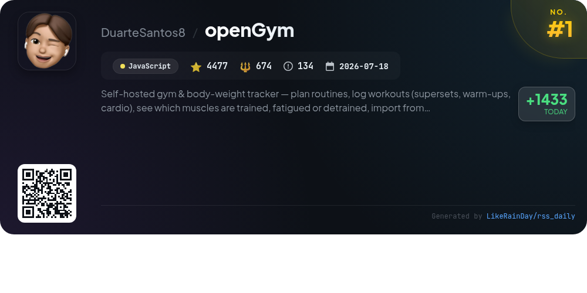
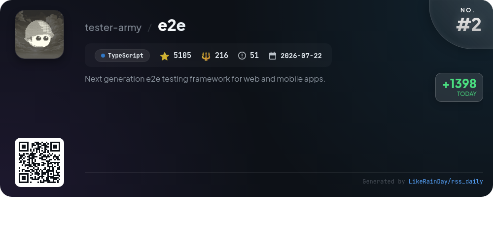
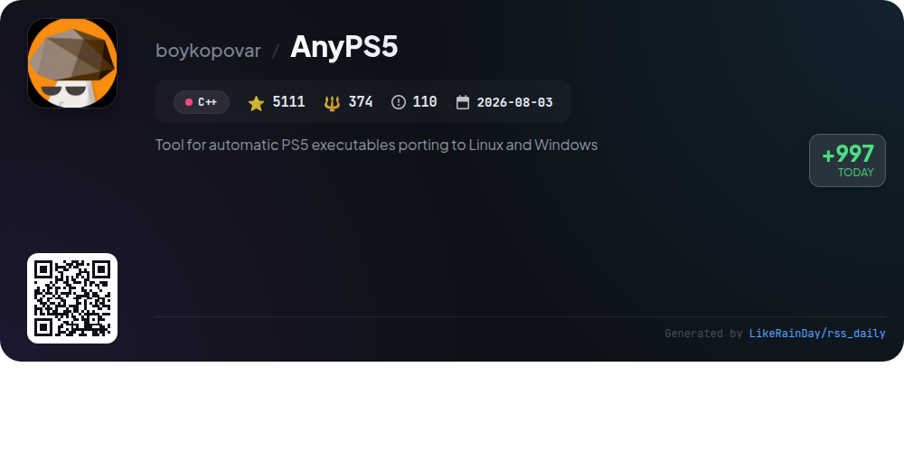
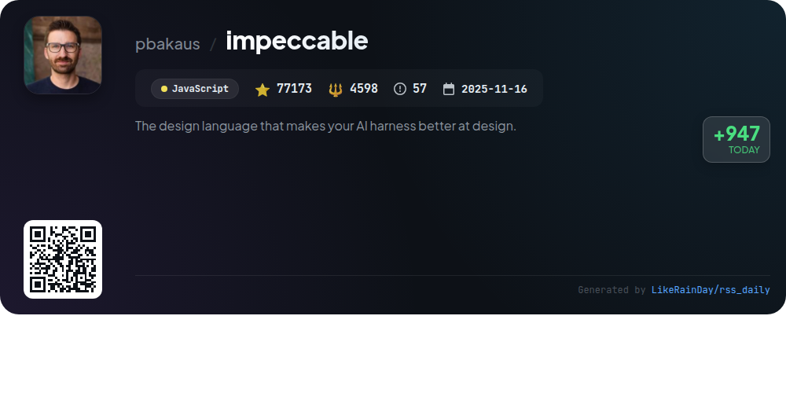
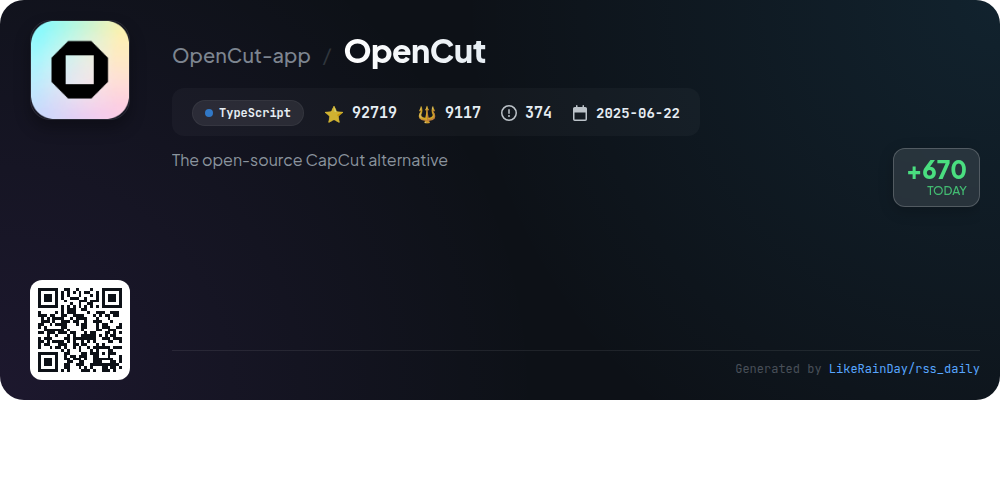
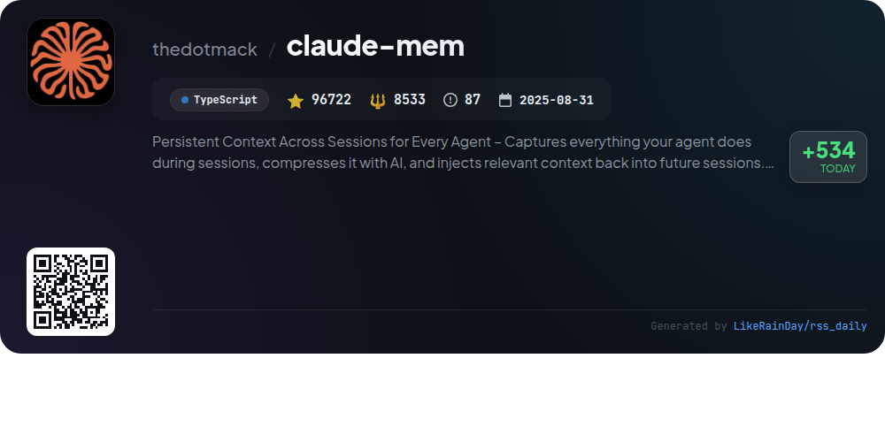
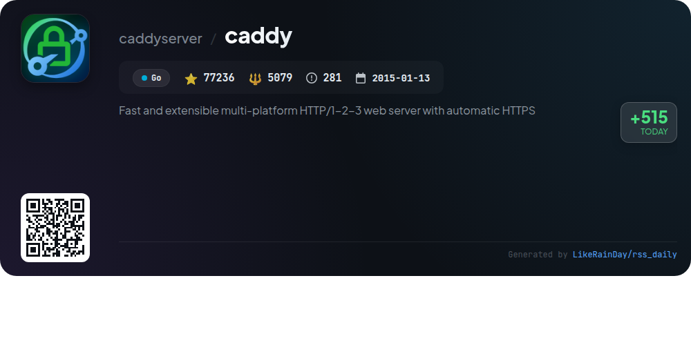
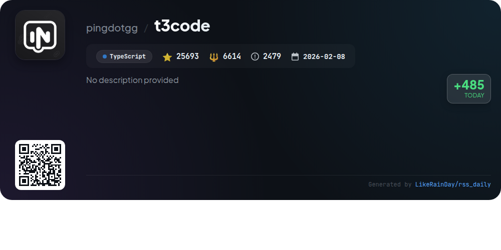

# 📊 🌟 GitHub Trending Daily - 2026-10-06

> > 📅 每日精选 GitHub 热门仓库 | 基于智能算法推荐

## 📋 Overview

**10** 个项目 | **814138** ⭐ | **84445** 🍴

**热门语言:** `JavaScript` (4) · `TypeScript` (4) · `Go` (1)

**更新时间:** 2026-10-06 05:55 UTC

**分类分布:**

- 🌟 每日 Top 10 精选 (10 项)

---

## 🌟 每日 Top 10 精选

### 1. [openGym](https://github.com/DuarteSantos8/openGym)

> 🤖 **推荐理由**  
> *openGym is a self-hosted gym and body-weight tracker that empowers users to plan routines, log workouts, and track muscle fatigue—all while keeping data secure on their own servers. Key features include a library of 1,324 exercises, guided workouts, customizable routines, and detailed progress tracking with progressions and muscle maps. Users can import data from FitNotes or Strong, utilize passkey login for security, and sync data across devices. With no subscriptions or ads, openGym offers complete control over personal fitness data.*

- ⭐ 4477 stars
- 💻 JavaScript
- 📅 Updated: 2026-10-06

### 2. [e2e](https://github.com/tester-army/e2e)

> 🤖 **推荐理由**  
> *e2e is an advanced end-to-end testing framework for web and mobile applications, developed by TesterArmy. With over 5,100 stars on GitHub, it allows users to write tests in natural language, leveraging an intelligent agent to navigate apps and verify outcomes. Key features include support for both web (via Playwright) and mobile (iOS/Android simulators), customizable test setups, and an easy initialization process. The framework includes various packages for different functionalities, such as reporting and decision models, making it a comprehensive solution for automated testing.*

- ⭐ 5105 stars
- 💻 TypeScript
- 📅 Updated: 2026-10-06

### 3. [ponytail](https://github.com/DietrichGebert/ponytail)

> 🤖 **推荐理由**  
> *Ponytail is a JavaScript project designed to optimize AI code generation, emulating the efficiency of a seasoned developer who prioritizes minimalism. With 156,147 stars, it reduces code by up to 94%, cuts costs by 20%, and enhances speed by 27%, all while ensuring safety. The core functionality includes a singular prompt that guides AI agents to avoid unnecessary code by reusing existing solutions and leveraging standard libraries. Commands like `/ponytail-review` and `/ponytail-audit` help maintain code quality, making it a powerful tool for developers seeking efficiency.*

- ⭐ 156147 stars
- 💻 JavaScript
- 📅 Updated: 2026-10-06

### 4. [AnyPS5](https://github.com/boykopovar/AnyPS5)

> 🤖 **推荐理由**  
> *AnyPS5 is a tool designed for the automatic porting of PS5 executables to Linux and Windows. With a robust relinker, it converts executables to the native format of the target system without emulation. Key features include implementations of system PRX libraries for dynamic linking, a shader recompiler that produces validated SPIR-V, and support for SDL-mapped controllers. The project emphasizes interoperability and compatibility, providing a list of verified games and input mapping options. Licensed under GPL v2, it aims for research and preservation without distributing copyrighted material.*

- ⭐ 5111 stars
- 💻 C++
- 📅 Updated: 2026-10-06

### 5. [impeccable](https://github.com/pbakaus/impeccable)

> 🤖 **推荐理由**  
> *Impeccable is a JavaScript-based design language that enhances AI coding agents' frontend design capabilities. With 24 commands and 60 deterministic detector rules, it provides design guidance and technical quality checks. Key features include a streamlined setup with `/impeccable init`, a comprehensive command vocabulary (e.g., `audit`, `polish`, `critique`), and live browser iteration for immediate feedback. Compatible with tools like GitHub Copilot and Claude Code, Impeccable aims to improve the quality and efficiency of AI-generated designs. For detailed usage, visit impeccable.style.*

- ⭐ 77173 stars
- 💻 JavaScript
- 📅 Updated: 2026-10-06

### 6. [ECC](https://github.com/affaan-m/ECC)

> 🤖 **推荐理由**  
> *ECC is a performance optimization system that enhances coding agents like Claude Code, Codex, and Cursor. It features 68 specialized agents, 293 skills for various workflows, and 94 command shims for seamless integration. Key highlights include TDD workflows, security scanning via AgentShield, and a memory vault for context management. ECC supports diverse platforms, offering guided setup and extensive hooks for automation. With a focus on efficient coding practices, it promotes continuous learning and reusable skills, making it a robust tool for developers.*

- ⭐ 273755 stars
- 💻 JavaScript
- 📅 Updated: 2026-10-06

### 7. [OpenCut](https://github.com/OpenCut-app/OpenCut)

> 🤖 **推荐理由**  
> *OpenCut is a free and open-source video editor designed for web, desktop, and mobile platforms, currently undergoing a complete rewrite. Key features in development include an Editor API, support for third-party plugins, a unified codebase using Rust, AI agent integration via an MCP server, headless mode for automation, and an in-editor scripting tab. The classic version remains available at opencut.app, while the new iteration can be tracked at new.opencut.app. Join the community on Discord for updates and support.*

- ⭐ 92719 stars
- 💻 TypeScript
- 📅 Updated: 2026-10-06

### 8. [claude-mem](https://github.com/thedotmack/claude-mem)

> 🤖 **推荐理由**  
> *Claude-Mem is a TypeScript-based project designed to provide persistent context across sessions for AI agents like Claude Code, OpenClaw, and Codex. With over 96,000 stars, it captures agent interactions, compresses them using AI, and reintegrates relevant context into future sessions. Key features include automatic memory retention, skill-based search, real-time memory streaming, and privacy controls. It supports multiple integrations and offers a user-friendly web interface. Claude-Mem enhances continuity in knowledge, ensuring agents maintain project awareness even after sessions conclude.*

- ⭐ 96722 stars
- 💻 TypeScript
- 📅 Updated: 2026-10-06

### 9. [caddy](https://github.com/caddyserver/caddy)

> 🤖 **推荐理由**  
> *Caddy is a fast, extensible, multi-platform web server written in Go, renowned for its automatic HTTPS feature. With over 77,000 stars on GitHub, it supports HTTP/1, 2, and 3, and offers dynamic configuration via a JSON API or an easy-to-use Caddyfile. Key features include built-in TLS management, a modular architecture for extensibility, and robust performance, capable of scaling to hundreds of thousands of sites. Caddy is designed for simplicity and efficiency, making it suitable for both beginners and seasoned developers. Comprehensive documentation is available online.*

- ⭐ 77236 stars
- 💻 Go
- 📅 Updated: 2026-10-06

### 10. [t3code](https://github.com/pingdotgg/t3code)

> 🤖 **推荐理由**  
> *T3 Code is an innovative agent harness control surface designed for seamless management of various AI agents on your machine. With a mobile app for iOS and Android, a web app, and an Electron-based desktop app, it supports services like Claude Code, Codex, Cursor, Grok Build, OpenCode, and Google Antigravity. Built for optimal performance and remote access, T3 Code is open-source, ensuring users can customize their experience. Installation is straightforward, with support for multiple platforms, and comprehensive documentation is available for users.*

- ⭐ 25693 stars
- 💻 TypeScript
- 📅 Updated: 2026-10-06

---

## 📡 RSS订阅

通过 RSS 订阅，第一时间获取每日精选项目：

- 🔔 [RSS 订阅源] (../../daily-top.xml)
- 🔔 [每日简报] (../../GITHUB_TODAY_CN.md)
- 🔔 [每日 Top 10 精选](../../daily-top.xml)

---

*⚡ Powered by Smart Trending Algorithm | Generated at 2026-10-06 05:55:17 UTC
